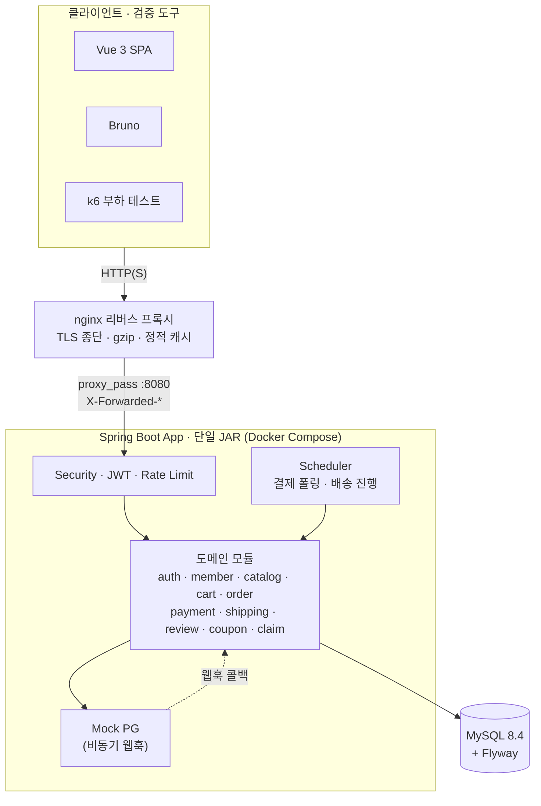

<div align="center">

# Groove

**LP(바이닐) 음반을 파는 온라인 셀렉트샵 백엔드**

[](https://github.com/heygw44/groove/actions/workflows/ci.yml)

</div>

---

## 소개

LP(바이닐) 음반을 다루는 온라인 셀렉트샵입니다. 회원가입과 상품 탐색, 장바구니, 주문, 결제, 배송, 리뷰까지 이커머스의 한 흐름을 실제로 이어 붙였습니다.

LP라는 소재를 고른 데는 이유가 있습니다. 한정반, 단일 재고, 음반마다 따라붙는 메타데이터 같은 특성이 동시성이나 검색 같은 주제를 자연스럽게 불러옵니다. 한정반 한 장에 주문이 몰릴 때 재고가 어떻게 어긋나는지, 5만 장짜리 카탈로그에서 키워드 검색이 왜 느려지는지 같은 문제를 일부러 찾지 않아도 마주치게 됩니다.

그래서 화면에 보이는 기능만큼이나 그 아래에서 벌어지는 일에 초점을 뒀습니다. 동작하는 흐름을 먼저 만든 뒤, 부하를 줘서 깨지는 곳을 찾고 수치로 확인하며 고쳤습니다.

## 기술 스택

**Backend**


**Infra / Quality**


**Frontend (시연용)**


## 주요 기능

- **회원 / 인증** — JWT 로그인(Access + Refresh Token Rotation), 탈퇴 시 개인정보 익명화
- **카탈로그 / 검색** — 동적 검색, FULLTEXT 키워드 검색, keyset(커서) 페이징
- **주문 / 결제** — 회원·게스트 주문, 재고 비관적 락, Mock PG 비동기 결제 + 멱등성 처리
- **배송 / 리뷰** — 결제 완료 후 배송 자동 진행, 배송 완료 후 리뷰 작성
- **취소 / 반품** — 주문 취소·반품 클레임, 부분 환불, 역물류 상태머신
- **쿠폰** — 선착순 원자적 발급, 할인 적용/복원
- **관리자** — 상품·주문·쿠폰·클레임 관리, 재고 조정

## 시스템 구조

외부 의존(PG·메일·운송장)을 모두 in-process Mock으로 처리하는 단일 인스턴스 구조이며, 앞단에 nginx 리버스 프록시가 TLS 종단·gzip·정적 캐시를 담당합니다.



## 실행 방법

```bash
git clone https://github.com/heygw44/groove.git
cd groove

# .env 의 비밀번호·시크릿을 고유값으로 교체
# (플레이스홀더 그대로면 기동이 거부됩니다)
cp .env.example .env

# MySQL + 앱(단일 JAR) + nginx 리버스 프록시 기동 — Docker 필요
docker-compose up -d

# 헬스체크 (외부 접근은 nginx :80 을 통해서만 — app 8080 은 미발행)
curl http://localhost/actuator/health

# 데모 데이터 시드 — docker 프로파일은 LocalDataSeeder 가 동작하지 않으므로
# 시연 흐름(상품 탐색 → 주문 → 결제 → 배송)을 재현하려면 카탈로그·계정을 적재한다 (Python3 필요)
# 규모는 ALBUM_COUNT·MEMBER_COUNT 로 조절 (자세한 내용: db/seed/README.md)
ALBUM_COUNT=200 MEMBER_COUNT=50 ./scripts/seed.sh --docker --yes

# API 문서 (Swagger UI)
# docker 프로파일은 기본 비공개 — .env 에 SPRINGDOC_ENABLED=true 설정 시 노출
open http://localhost/swagger-ui.html
```

### 리버스 프록시 / 배포 (#265)

`app` 앞단에 nginx(`docker/nginx/nginx.conf`)를 두어 횡단 관심사를 일괄 처리합니다. `app` 컨테이너는 호스트 포트를 발행하지 않고 nginx를 통해서만 노출됩니다.

| 관심사 | 담당 | 비고 |
|---|---|---|
| TLS 종단 | nginx | 로컬 `:80`(http), 운영 `:443`(https) — `nginx.conf`의 443 블록 + `./certs` 마운트 활성화 |
| gzip 압축 | nginx | `gzip_proxied any`(프록시 응답은 기본 미압축) |
| 정적 자산 캐시 | nginx | 자산 location에서 Spring의 `no-store`를 제거하고 `public, immutable`로 교체 |
| `Referrer-Policy` | nginx | Spring 기본 헤더에 없는 유일한 보안 헤더 |
| `X-Frame-Options`·`X-Content-Type-Options`·HSTS | **Spring Security** | 기본값으로 이미 발급 — nginx 중복 추가 안 함(HSTS는 `X-Forwarded-Proto: https`일 때 발급) |

- **로컬**: nginx `:80`(http) + `AUTH_REFRESH_COOKIE_SECURE=false`.
- **운영**: nginx `:443`(self-signed 또는 Let's Encrypt/certbot) + `X-Forwarded-Proto: https` + `AUTH_REFRESH_COOKIE_SECURE=true`. `app`은 `forward-headers-strategy: native`로 이 헤더를 인식해 Secure 쿠키와 HSTS를 발급합니다.
- Bruno 검증은 compose(nginx) 대상의 **Groove Compose** 환경(`http://localhost`)을 사용합니다. `./gradlew bootRun`(직접 `:8080`)에는 기존 **Groove Local** 환경을 그대로 씁니다. 단, 웹훅 폴더를 compose 대상으로 돌릴 때는 **Groove Compose** 의 `webhookSecret` 변수를 실행 중인 `.env` 의 `PAYMENT_MOCK_WEBHOOK_SECRET` 와 같은 값으로 맞춰야 서명 검증이 통과합니다.
