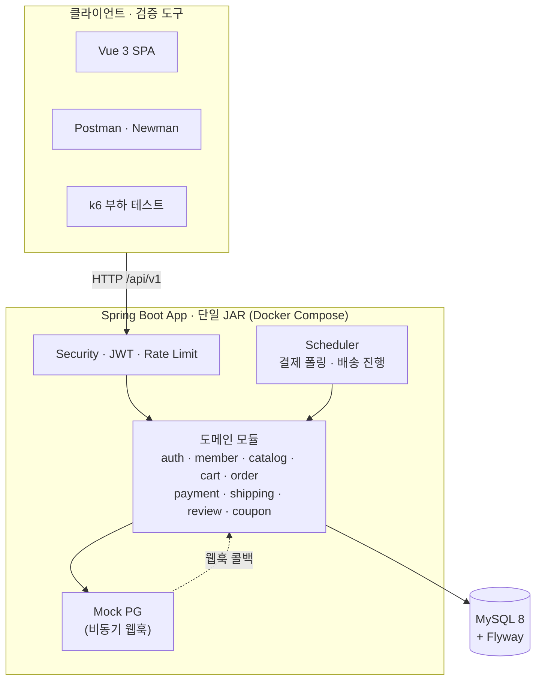
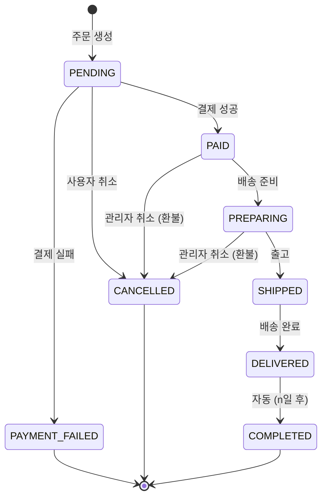
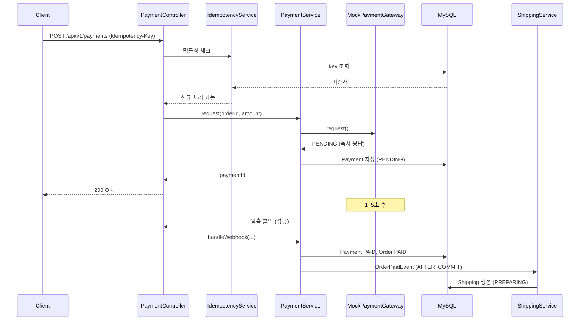

# Groove

[](https://github.com/heygw44/groove/actions/workflows/ci.yml)

LP 전문 이커머스 백엔드 — 인증, 카탈로그, 주문/결제/배송 전 흐름을 담은 Spring Boot 포트폴리오 프로젝트.

> 핵심 흐름(W1~W7)과 확장(쿠폰 M13 · Vue 프론트 M15) 완료. 종합 측정·문서화(W8~W12)는 진행 예정.

## 기술 스택

| 분류 | 사용 |
|------|------|
| Language | Java 21 |
| Framework | Spring Boot 4.0 |
| Security | Spring Security + JWT ([JJWT](docs/decisions/jwt-library.md)) |
| DB | MySQL 8 + Flyway |
| ORM | Spring Data JPA (Hibernate) |
| Build | Gradle (Kotlin DSL) |
| Infra | Docker Compose |
| Test | JUnit 5, Testcontainers, JaCoCo |

## 빠른 시작

```bash
# 1. 환경변수 설정
cp .env.example .env
# .env 파일에서 DB_PASSWORD, JWT_SECRET 수정

# 2. 실행 (Docker 필요)
docker-compose up -d

# 3. 헬스체크
curl http://localhost:8080/actuator/health

# 4. API 문서 (Swagger UI) — 코드 자동 생성, Authorize 에 accessToken 입력 후 try-out
#    docker(배포) 프로파일은 기본 비공개(#162) — .env 에 SPRINGDOC_ENABLED=true 설정 시 노출된다.
open http://localhost:8080/swagger-ui.html
```

> `docker-compose`(docker 프로파일) 배포에서는 API 표면 익명 노출을 막기 위해 Swagger UI/OpenAPI 가 **기본 비공개**(404)다.
> 데모로 노출하려면 `.env` 에 `SPRINGDOC_ENABLED=true` 를 추가하고 재기동한다. `./gradlew bootRun`(local 프로파일)은 항상 노출된다.

> IDE / 터미널에서 `./gradlew bootRun`(백엔드는 `backend/` 하위, #131)으로 직접 실행하면 **local 프로파일이 자동 주입**된다(`build.gradle.kts`):
> ```bash
> cd backend
> cp src/main/resources/application-local.yaml.example src/main/resources/application-local.yaml
> ./gradlew bootRun   # SPRING_PROFILES_ACTIVE 미설정 시 자동으로 local
> ```
> 그러면 `DB_PASSWORD` / `JWT_SECRET` 환경 변수가 없어도 dev fallback 으로 부팅된다. 다른 프로파일로 띄우려면
> `SPRING_PROFILES_ACTIVE=docker ./gradlew bootRun` 또는 `./gradlew bootRun --args='--spring.profiles.active=docker'`.
> 운영(docker) 프로파일은 환경 변수가 반드시 주입되어야 기동된다 — 부팅 시 누락은 의도된 fail-fast.
> 또한 application.yaml 에 프로파일 기본값 폴백이 없어 미설정 시 `default`(데모 시드 비활성)로 뜨며, 비-local
> 프로파일로 기동 중 DB 에서 데모 계정이 감지되면 `ProductionSeedGuard` 가 기동을 중단한다(이슈 #128).
>
> ⚠️ IDE 에서 `GrooveApplication` 의 main() 을 bootRun 없이 직접 실행할 때는 폴백이 없으므로 run config 의
> 활성 프로파일을 `local` 로 지정해야 한다 — 미지정 시 `default` 로 떠 Mock PG 빈 부재로 부팅에 실패한다.

> **측정용 시드 데이터** — 앱을 1회 부팅(스키마 마이그레이션 적용)한 뒤 `./scripts/seed.sh --yes`(또는
> docker 환경은 `./scripts/seed.sh --docker --yes`)로 대규모 데이터셋(앨범 5만, 테스트 회원 80 + ADMIN)을
> 적재한다. 데모 시더 `LocalDataSeeder`(로컬 12장)와 별개 경로이며 W9 측정(검색 슬로우 쿼리·flash-sale)용이다.
> 규모/계정/검증은 [`db/seed/README.md`](db/seed/README.md) 참고.

## API 테스트 (Postman / Newman)

전체 엔드포인트 요청·응답 검증 스크립트·시연용 엣지 케이스를 담은 Postman 컬렉션을 제공한다.

| 파일 | 내용 |
|------|------|
| [postman/groove.collection.json](postman/groove.collection.json) | 전체 엔드포인트 + `pm.test` 응답 검증 + 환경변수 자동 저장 |
| [postman/groove.environment.json](postman/groove.environment.json) | `Groove Local` 환경(baseUrl·토큰·관리자 계정 등) |

> **사전 조건**: 백엔드가 `localhost:8080` 에 떠 있고 데모 시드가 적재돼 있어야 한다. `local` 프로파일로
> 기동하면 `LocalDataSeeder` 가 앨범 12장·데모 회원(`demo@groove.dev`)·**관리자(`admin@groove.dev` / `admin1234`)**
> 를 자동 생성한다. 관리자 폴더는 이 시드 계정으로 로그인한다(환경변수 `adminEmail`/`adminPassword`).

### Postman GUI

1. 컬렉션·환경 JSON 두 파일을 import 하고 우상단에서 `Groove Local` 환경 선택.
2. `1. Auth > Login` 실행 → `accessToken`/`refreshToken` 자동 저장.
3. `6. Member Flow (E2E) ★` 폴더를 위에서부터 순서대로 실행하면 장바구니→주문→결제→배송→리뷰 흐름이 1클릭 시연된다.
   - 리뷰 작성(`8) Write Review`)은 주문이 `DELIVERED` 이상이어야 201이다. 결제 PAID(Mock 웹훅/폴링 자동) 후
     `8. Admin > Change Order Status` 에서 `target` 을 `PREPARING`→`SHIPPED`→`DELIVERED` 로 순차 전환해야 통과한다(그 전에는 422).

### Newman (헤드리스 / CLI)

```bash
npm install              # newman 설치 (루트 devDependency)
npm run test:postman     # 결정론적 happy-path 폴더만 실행 (Health/Auth/Catalog/Cart/MemberFlow/Guest/EdgeCases)
npm run test:postman:admin   # 8. Admin 폴더 (시드 관리자 계정 필요)
npm run test:postman:full    # 파괴적 제외 전체(폴더 0~9) — 재실행 가능
npm run test:postman:cleanup # 10. Cleanup (비밀번호 변경·회원 탈퇴, 파괴적 — 마지막에만)
npm run test:postman:ratelimit # 11. Rate Limit (429 검증, 로그인 버킷 소진 — 격리 실행)
npm run test:postman:report  # test:postman 과 동일 범위 + JUnit 리포트(reports/postman-junit.xml)
```

- **`test:postman`** 은 외부(DB 시드) 상태에만 의존하는 폴더를 collection 순서대로 골라 실행한다(Member Flow → Edge Cases 순서가 보장되어 결제 멱등 등 직전 단계 상태를 그대로 사용). 데모 시드가 있으면 전부 통과하고, 로그인 버킷을 소진하지 않으므로 1분 내 반복 실행해도 깨지지 않는다.
- **`test:postman:full`** 은 파괴적 폴더(`10. Cleanup`)와 격리 폴더(`11. Rate Limit`)를 제외한 0~9 폴더를 실행하므로 같은 시드 DB 에서 반복 실행해도 깨지지 않는다. 비밀번호 변경·회원 탈퇴는 `test:postman:cleanup` 으로 따로 돌린다(실행하면 고정 회원 계정이 변경/삭제되므로 이후 재실행 전 DB 재시드 필요).
- **Rate Limit 검증**(`11. Rate Limit`)은 `POST /auth/login` IP당 분당 10회 제한을 쓴다. 요청의 pre-request 가 본 호출 전 10회 선요청으로 버킷을 소진시키므로 **이 요청 1회 실행으로 429 + `Retry-After` 가 반드시 반환된다**(테스트가 429 를 강제 — 미발동 시 실패). 단, **로그인 버킷을 비우므로 happy-path 와 섞지 말고** `npm run test:postman:ratelimit` 로 격리 실행한다(버킷은 1분 뒤 리필).
- `5. Coupons > Issue Coupon` 은 발급 가능한 ACTIVE 쿠폰(환경변수 `couponId` 기본값 `1`, 데모 시드 또는 `8. Admin > Create Coupon Policy`)이 선행돼야 하고, `Sign Up` 은 분당 3회 제한이라 1분 내 4회 이상 연속 재실행 시 429 가 날 수 있다(테스트는 429 도 허용).

자세한 엔드포인트 계약은 [docs/API.md](docs/API.md) 참고.

## 아키텍처

### 시스템 구성도



> 모든 외부 의존(PG·메일·운송장)은 in-process Mock 으로 처리하는 단일 인스턴스 구조.
> 조건부 확장(Redis·Prometheus·메시지 큐)은 W9 부하 측정 후 트리거 발생 시 도입 — [docs/ARCHITECTURE.md](docs/ARCHITECTURE.md) §11.

### 주문 상태 머신



### 결제 처리 시퀀스 (Mock PG 비동기 웹훅)



> 전체 시퀀스·상태 전이 상세와 ADR 은 [docs/ARCHITECTURE.md](docs/ARCHITECTURE.md) 참고.

## 프로젝트 문서

| 문서 | 내용 |
|------|------|
| [docs/PRD.md](docs/PRD.md) | 제품 요구사항 |
| [docs/ARCHITECTURE.md](docs/ARCHITECTURE.md) | 시스템 아키텍처 |
| [docs/ERD.md](docs/ERD.md) | 데이터 모델 |
| [docs/API.md](docs/API.md) | API 명세 |
| [docs/MILESTONE.md](docs/MILESTONE.md) | 마일스톤 & 이슈 가이드 |

## 성능·동시성 개선 사례

단일 행 동시 갱신의 **lost-update** 를 도메인 특성에 맞는 제어로 해소한 사례.

- **선착순 쿠폰 발급 — Before→After 완료 (#90·#93)**: 락 없는 베이스라인은 lost-update(`issued_count 24 ≠ 발급 48`) + 락 경합 실패 84%(`CannotAcquireLockException`)로 붕괴. **원자적 조건부 UPDATE**(`WHERE issued_count < total_quantity`)로 전환해 250 VU 스파이크(6,500+ 요청)에도 **정확히 100장, 초과발급 0**(k6 HTTP 실측). → [트러블슈팅](docs/troubleshooting/coupon-issuance-concurrency.md) · [loadtest/](loadtest/)
- **재고 차감 오버셀 — Before 박제 (#46)**: 락 없는 재고 차감의 동형(同型) 결함을 baseline 으로 보존. 비관적 락 적용(After)은 W10 예정. → [트러블슈팅](docs/troubleshooting/overselling-baseline.md)

> **같은 lost-update, 두 도메인, 두 제어** — 재고는 비관적 락, 쿠폰은 원자적 조건부 UPDATE 로 해소해 제어 기법 선택의 트레이드오프를 대비시킨다.

## 진행 현황

```
핵심 로드맵: ▓▓▓▓▓▓▓░░░░░ W1~W7 완료 (G2 통과)
확장:        쿠폰(M13) · Vue 프론트(M15) 완료
```

**현재 단계**: 핵심 흐름(회원가입~결제~배송~리뷰) 완료 + 확장(쿠폰·프론트) 완료. 다음은 **W8~W12 — 시드·k6 측정(G3)·CS 개선·문서화(G4)**.

- W3: 인프라/스켈레톤 (G1 게이트 통과)
- W4: 인증/회원 (회원가입·로그인·JWT·Refresh Rotation·Rate Limit·JaCoCo 80% 게이트)
- W5: 카탈로그 (관리자 CRUD + Public 목록/상세/검색 + 의도적 N+1 보존 — W10 시연 자료)
- W6: 장바구니 + 주문 (회원/게스트, 재고 차감 — 오버셀 baseline 박제)
- W7: 결제 + 배송 + 리뷰 (Mock PG·멱등성·관리자 주문 조작 — **G2 게이트 통과**)
- 확장 M13: 쿠폰 (선착순 발급 동시성 + k6 Before/After)
- 확장 M15: Vue 3 데모 프론트엔드 (전 기능 시연 UI)
- 남은: W8 시드/통합 · W9 측정(G3) · W10~W11 개선 · W12 문서화(G4)

GitHub [Milestones](https://github.com/heygw44/groove/milestones) 페이지에서 상세 진행률 확인 가능.
