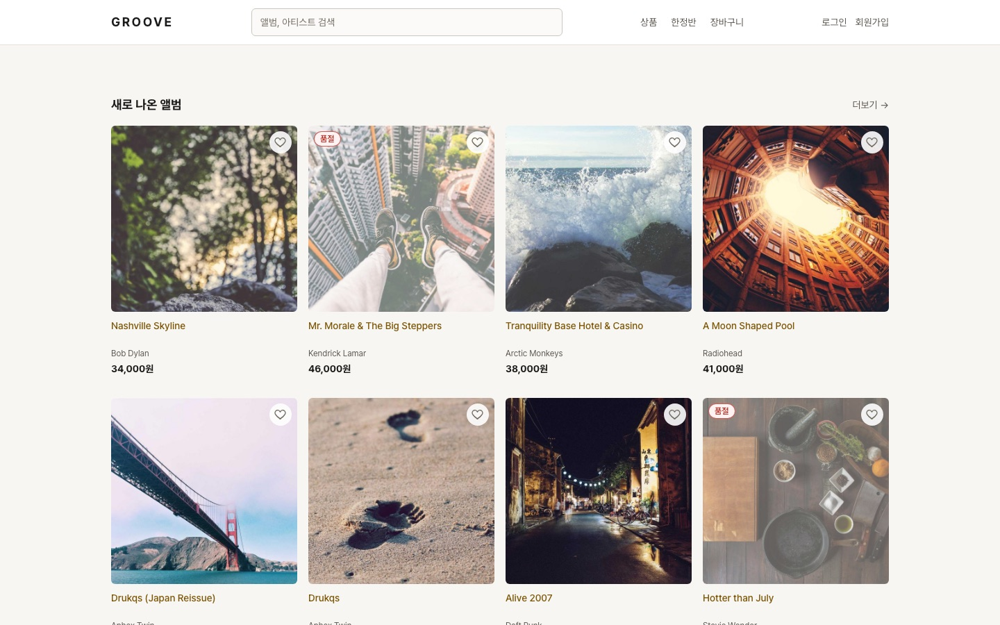
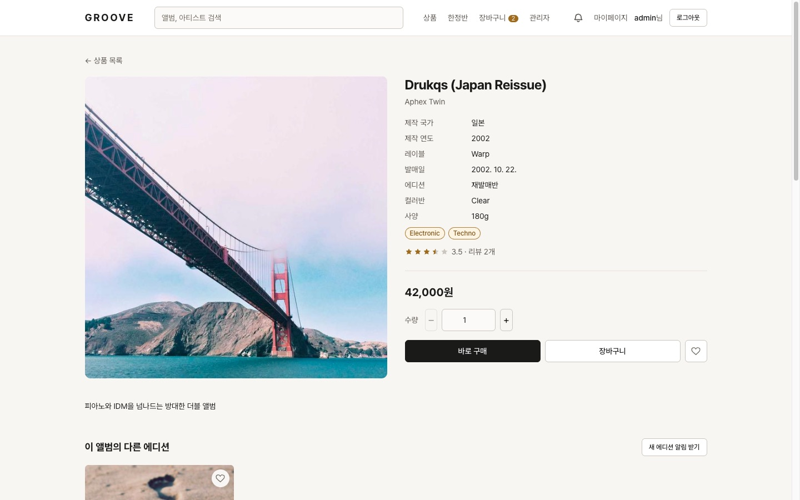
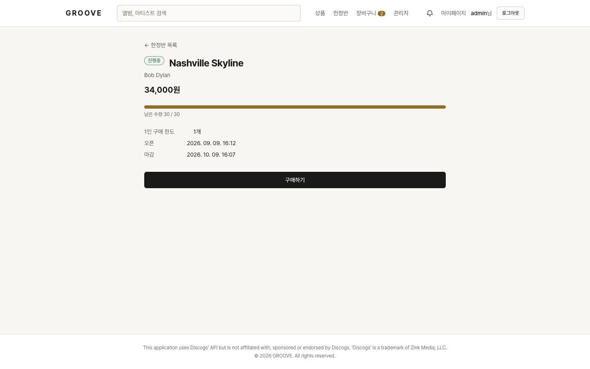
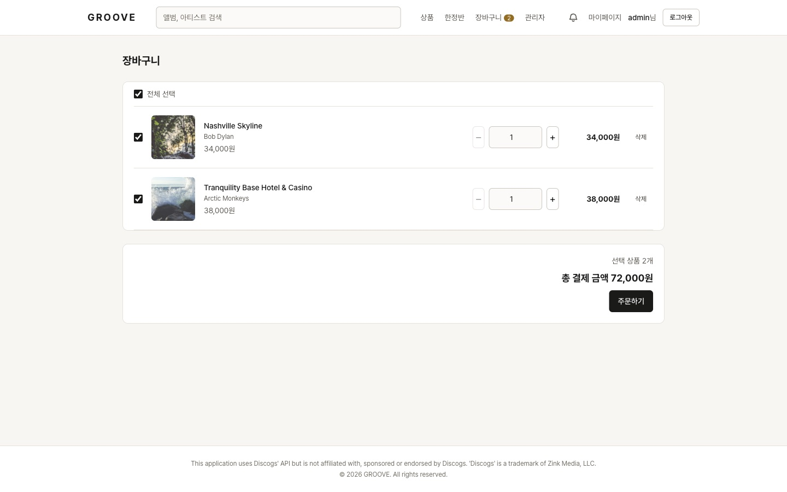
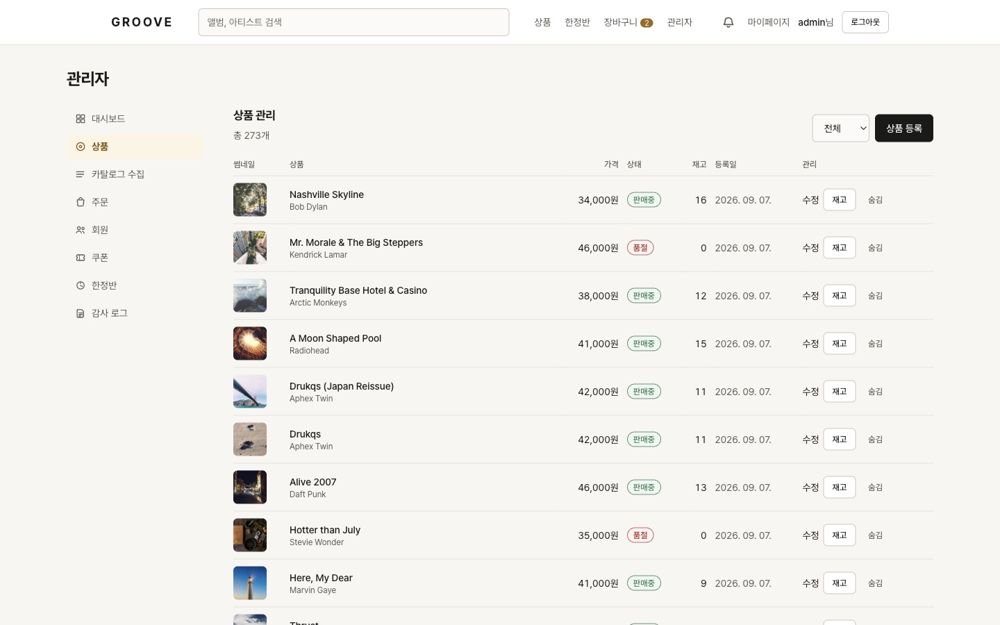
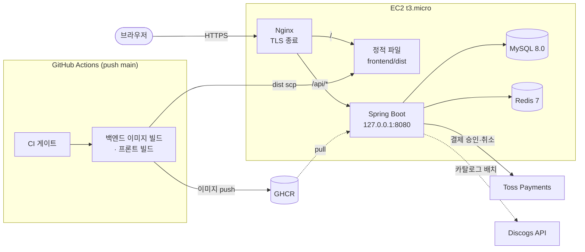

# GROOVE — LP(바이닐) 전문 이커머스

Java 17 / Spring Boot 3.5 + React 18로 만든 LP 이커머스다. 한정반(Limited Drop) 선착순 판매는 Redis Lua 선점과 DB 제약으로 이중 방어하고, 상품 조회는 JPA, 관리자 통계 같은 복잡한 읽기는 MyBatis로 나눠 처리한다. JWT 무상태 인증, Toss Payments 결제, 규칙 기반 추천까지 갖춰 AWS에 올려 실제로 운영 중이다.

## 서비스 주소

**https://groove-lp.duckdns.org**

실제 카탈로그 273건, 리뷰 546건이 올라가 있다.

## 주요 화면

| | |
|---|---|
|  홈 |  상품 상세 |
|  한정반 드롭 |  장바구니 |
|  관리자 · 상품 관리 | |

## 주요 기능

- **상품 탐색** — 장르·아티스트·가격대 필터, 바코드/카탈로그 번호/키워드 검색, 취향·행동 신호를 조합한 규칙 기반 추천
- **한정반(Limited Drop)** — 선착순 구매. Redis Lua로 1차 필터링하고 DB 트랜잭션으로 재확인하는 이중 방어로 초과 판매 0건을 유지한다
- **주문·결제** — 장바구니, Toss Payments 결제 승인/취소, 쿠폰
- **회원** — JWT 무상태 인증(Access는 메모리, Refresh는 HttpOnly 쿠키), 위시리스트, 앨범 재입고 구독과 알림
- **관리자** — 상품·주문·회원·쿠폰·한정반 관리, 매출/인기 상품 통계 대시보드, 감사 로그
- **운영** — GitHub Actions로 빌드부터 배포까지 자동화하고, k6로 실제 부하를 걸어 동시성과 성능을 검증한다

## 기술 스택

| 영역 | 스택 |
|---|---|
| Backend | Java 17, Spring Boot 3.5, Spring Security 6.5, Spring Data JPA, MyBatis 3.0, Spring Data Redis, Spring Batch, Flyway, springdoc-openapi |
| Frontend | React 18, TypeScript, Vite, React Router v6, TanStack Query v5, Zustand, Tailwind CSS, React Hook Form + Zod, Toss Payments SDK |
| Infra | MySQL 8.0, Redis 7, Docker Compose, GitHub Actions, AWS EC2 + DuckDNS + Nginx + Let's Encrypt |
| 품질 | Checkstyle(네이버 캠퍼스 핵데이 규칙), JaCoCo(서비스 계층 라인 85% / 브랜치 75%), Vitest |

## 시스템 구성


```mermaid
flowchart LR
    User(["브라우저"])

    subgraph GA["GitHub Actions (push main)"]
        CIGate["CI 게이트"] --> Build["백엔드 이미지 빌드<br/>· 프론트 빌드"]
    end

    GHCR[("GHCR")]

    subgraph EC2["EC2 t3.micro"]
        Nginx["Nginx<br/>TLS 종료"]
        Static["정적 파일<br/>frontend/dist"]
        Backend["Spring Boot<br/>127.0.0.1:8080"]
        MySQL[("MySQL 8.0")]
        Redis[("Redis 7")]
        Nginx -->|"/"| Static
        Nginx -->|"/api/*"| Backend
        Backend --> MySQL
        Backend --> Redis
    end

    Toss["Toss Payments"]
    Discogs["Discogs API"]

    User -->|HTTPS| Nginx
    Backend -->|결제 승인·취소| Toss
    Backend -. 카탈로그 배치 .-> Discogs
    Build -->|이미지 push| GHCR
    Build -->|dist scp| Static
    GHCR -. pull .-> Backend
```

MySQL·Redis·백엔드가 EC2 한 대에 같이 떠 있고, 백엔드 컨테이너는 루프백에만 바인딩해 외부에서는 Nginx를 거쳐야만 닿는다. 배포는 `main` 푸시 → CI 게이트 → 백엔드 이미지를 GHCR로 push, 프론트는 빌드 산출물을 EC2로 직접 scp하는 두 경로로 나뉜다. 배포 중에는 보안그룹 22번을 GitHub Actions 러너 IP에만 열었다가 끝나면 회수하고, 헬스체크(`/api/v1/health`)가 통과해야 배포가 끝난다.

## 로컬 실행

```bash
# 1. 인프라 (MySQL → localhost:3306, Redis → localhost:6379)
docker compose up -d

# 2. 백엔드 (http://localhost:8080, Swagger: /swagger-ui.html)
cd backend && ./gradlew bootRun

# 3. 프론트엔드 (http://localhost:5173)
cd frontend && npm install && npm run dev
```

백엔드까지 컨테이너로 띄우려면 `docker compose --profile full up --build`.

## 테스트

```bash
cd backend && ./gradlew test    # 통합 테스트는 Testcontainers(MySQL/Redis) 사용, Docker 필요
cd frontend && npm run test     # Vitest
```

## 측정 기록

한정반 선착순 구매는 Redis Lua 스크립트로 중복 구매·재고 초과를 먼저 걸러내고, 살아남은 요청만 DB 트랜잭션(`SELECT ... FOR UPDATE` + unique 제약 + 조건부 재고 갱신)을 태우는 2단계 구조다. 로컬 1,000 VU 동시 요청에서 p95 802ms, 초과 판매 0건이었고, 운영 EC2 t3.micro로 도메인에 직접 부하를 걸었을 때는 1,000 VU에서 Nginx `worker_connections` 한계로 21.7%가 실패했지만 그 상황에서도 초과 판매는 0건이었다. 측정 방법과 원자료는 [`scripts/k6/results/limited-20260908.md`](scripts/k6/results/limited-20260908.md), [`limited-prod-20260909.md`](scripts/k6/results/limited-prod-20260909.md)에 있다.

상품 목록 API(`GET /api/v1/products`)는 50 VU·30초 부하에서 p95 12.0ms로 목표(300ms)를 크게 밑돈다(`k6 run scripts/k6/product-list.js`로 재현). 조회 인덱스는 합성 데이터(상품 5만·주문 20만 규모)로 재현해 튜닝했다 — `backend/scripts/perf/index-explain.sh`가 실행계획을 튜닝 전후로 비교해 보여준다.

추천은 학습 모델 없이 가중치 합산 규칙으로 만들었고, 홀드아웃 방식으로 무작위 대비 8.9배, 인기순 대비 5.6배 recall@10을 확인했다(`cd backend && ./gradlew precisionAt10`).

## 구조

```
groove/
├── backend/                    # Spring Boot (com.groove.{global, member, auth, product, ...})
├── frontend/                   # React + Vite
├── scripts/k6/                 # 부하 테스트 스크립트
├── nginx/                      # 운영 Nginx 설정
├── docker-compose.yml          # 로컬 인프라
├── docker-compose.prod.yml     # 운영(EC2) 컴포즈
└── .github/workflows/          # CI, 배포
```
