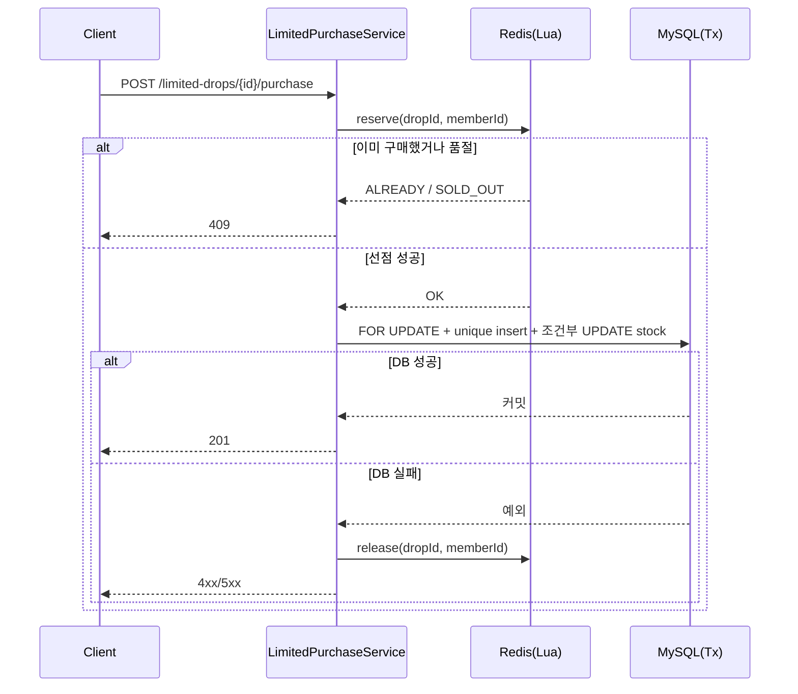

# GROOVE — LP(바이닐) 전문 이커머스

Java 17 / Spring Boot 3.5 + React 18 풀스택 포트폴리오 프로젝트.
한정반(Limited Drop) 선착순 판매의 동시성 제어, JPA + MyBatis 역할 분담, JWT 무상태 인증, Toss Payments 결제, AWS 배포까지 다룬다.

## 기술 스택

| 영역 | 스택 |
|---|---|
| Backend | Java 17, Spring Boot 3.5, Spring Security 6.5, Spring Data JPA, MyBatis 3.0, Spring Data Redis, springdoc-openapi |
| Frontend | React 18, TypeScript, Vite, React Router v6, TanStack Query v5, Zustand, Tailwind CSS |
| Infra | MySQL 8.0, Redis 7, Docker Compose, GitHub Actions, AWS EC2 + DuckDNS + Nginx + Let's Encrypt |

## 로컬 실행

```bash
# 1. 인프라 (MySQL → localhost:3306, Redis → localhost:6379)
docker compose up -d

# 2. 백엔드 (http://localhost:8080, Swagger: /swagger-ui.html)
cd backend && ./gradlew bootRun

# 3. 프론트엔드 (http://localhost:5173)
cd frontend && npm install && npm run dev
```

백엔드까지 컨테이너로 띄우려면 `docker compose --profile full up --build`.

## 테스트

```bash
cd backend && ./gradlew test   # 통합 테스트는 Testcontainers(MySQL/Redis) 사용, Docker 필요
```

## 한정반 동시성

한정반 선착순 구매(`POST /api/v1/limited-drops/{id}/purchase`)는 Redis Lua 스크립트로 경쟁을 먼저 거르고, 그중 살아남은 요청만 DB 트랜잭션을 태우는 2단계 구조다. Redis 단계는 `EXISTS`(드롭 재고 초기화 여부)·`SISMEMBER`(중복 구매 여부)·재고 확인·`SADD`+`DECR`을 하나의 Lua 스크립트로 원자 실행해서, 같은 회원의 중복 요청과 재고 초과 요청을 락 없이 빠르게 걸러낸다.

Redis를 통과한 요청만 DB로 넘어가 `SELECT ... FOR UPDATE`로 드롭 행을 잠그고, `(drop_id, member_id)` unique 제약과 `UPDATE stock ... WHERE quantity >= 1` 조건부 갱신으로 다시 한 번 막는다. Redis는 빠른 1차 필터일 뿐 최종 정합성은 DB 제약이 보장한다는 뜻이다. DB 단계에서 실패하면(배송지 오류 등) 앞서 선점한 Redis 재고/구매자 기록을 되돌린다. 결제 없이 PENDING 상태로 남은 주문은 스케줄러가 만료 처리하면서 `limited_purchase`·`sold_count`를 되돌리고, 커밋 이후에 Redis 재고도 함께 복구한다.


```mermaid
sequenceDiagram
    participant Client
    participant API as LimitedPurchaseService
    participant Redis as Redis(Lua)
    participant DB as MySQL(Tx)

    Client->>API: POST /limited-drops/{id}/purchase
    API->>Redis: reserve(dropId, memberId)
    alt 이미 구매했거나 품절
        Redis-->>API: ALREADY / SOLD_OUT
        API-->>Client: 409
    else 선점 성공
        Redis-->>API: OK
        API->>DB: FOR UPDATE + unique insert + 조건부 UPDATE stock
        alt DB 성공
            DB-->>API: 커밋
            API-->>Client: 201
        else DB 실패
            DB-->>API: 예외
            API->>Redis: release(dropId, memberId)
            API-->>Client: 4xx/5xx
        end
    end
```

측정은 k6로 재현한다.

```bash
docker compose --profile full up --build -d
k6 run scripts/k6/limited-purchase.js

# 판정
docker compose exec mysql mysql -ugroove -pgroove1234 groove -e "SELECT COUNT(*) FROM limited_purchase WHERE drop_id=<dropId>; SELECT quantity FROM stock WHERE product_id=<productId>; SELECT sold_count, status FROM limited_drop WHERE id=<dropId>;"
docker compose exec redis redis-cli GET limited:stock:<dropId>
docker compose exec redis redis-cli SCARD limited:buyers:<dropId>
```

이 엔드포인트의 p95 목표는 1초다. 상품 목록 API의 300ms(NFR-03)와는 별개 기준으로, 동시 경합이 훨씬 크고 쓰기 트랜잭션이 포함되기 때문이다.

측정 조건

| 항목 | 값 |
|---|---|
| 환경 | Apple M4, 16GB, macOS (앱·DB·Redis·k6 동일 머신) |
| 앱 | `docker compose --profile full` 컨테이너, `-Xmx384m` SerialGC, HikariCP 10 |
| DB/Redis | MySQL 8.0 / Redis 7 (Docker) |
| 부하 | 1000 VU × 1회, 오픈 직후 일제 요청. 드롭 재고 100, 1인 1매 |
| 워밍업 | 같은 규모 1회 후 2회 측정 |

결과 (Redis 선점 ON, 2회 중 느린 쪽)

| 지표 | 값 |
|---|---|
| 요청 수 | 1,000 |
| 201 / 409 | 100 / 900 (`LIMITED_SOLD_OUT`), 그 외 0 |
| 초과 판매 | 0건 (`limited_purchase` 100행, `stock.quantity` 0, Redis 재고 0) |
| p50 | 681ms |
| p95 | 802ms |
| p99 | 880ms |
| max | 928ms |
| 1000건 처리 시간 | 1.0s (순간 처리량 약 1,000 req/s) |
| 실패율(5xx·타임아웃) | 0% |

Redis 선점 ON vs DB 락만 (`LIMITED_REDIS_ENABLED=false`)

| 지표 | Redis ON | DB 락만 |
|---|---|---|
| p50 | 526 ~ 681ms | 603 ~ 707ms |
| p95 | 675 ~ 802ms | 718 ~ 833ms |
| p99 | 880 ~ 1,000ms | 759 ~ 885ms |
| 초과 판매 | 0건 | 0건 |

Redis를 꺼도 초과 판매가 없는 것은 DB 제약이 최종 방어라는 설계 그대로다. 이 규모에서는 응답 시간도 두 모드가 같은 수준인데, 실패 요청이 행 락에 줄을 서더라도 락 점유가 짧아서다. Redis 단계의 효과는 DB에 들어가는 트랜잭션 수(900건 차단)이고, 꼬리 지연은 성공 100건이 드롭 행 락에서 직렬화되는 시간(건당 5~8ms)이 만든다. 워밍업 없는 첫 실행은 p95 1.2~1.9초로, JIT 영향이다. 실행별 수치와 HikariCP 50 진단 결과는 [`scripts/k6/results/limited-20260904.md`](scripts/k6/results/limited-20260904.md)에 있다. EC2 t3.micro 측정은 배포 뒤 추가한다.

## 성능

상품 목록 API(`GET /api/v1/products`)를 k6로 50 VU, 30초 동안 부하를 걸어 p95 응답 시간을 측정한다. 목표는 p95 300ms 이하다. `bootRun`은 C1 JIT만 쓰는 옵션(`-XX:TieredStopAtLevel=1`)이 붙어 실제보다 느리게 나오므로 jar로 실행해 측정한다.

```bash
docker compose up -d
cd backend && ./gradlew bootJar -x test
SPRING_PROFILES_ACTIVE=local SPRING_JPA_SHOW_SQL=false LOGGING_LEVEL_COM_GROOVE=INFO LOGGING_LEVEL_ORG_HIBERNATE_SQL=INFO \
  java -jar backend/build/libs/groove-backend-0.0.1-SNAPSHOT.jar
k6 run --summary-export scripts/k6/results/product-list.json scripts/k6/product-list.js
```

측정 조건

| 항목 | 값 |
|---|---|
| 환경 | Apple M4, 16GB, macOS (앱·DB·k6 동일 머신) |
| DB/Redis | MySQL 8.0 / Redis 7 (Docker) |
| 데이터 | local 프로파일 시드 상품 51건 (목록 노출 50건) |
| 로깅 | show-sql·DEBUG OFF |
| 부하 | 50 VU, 30s, 요청 간 sleep 100ms |
| 워밍업 | 10 VU × 10s 1회 후 측정 |

결과

| 지표 | 값 |
|---|---|
| 총 요청 수 | 13,853 (약 461 req/s) |
| 실패율 | 0% |
| p50 | 7.1ms |
| p95 | 15.4ms |
| p99 | 23.4ms |
| 목표 충족 | 충족 (300ms 대비 약 5%) |

요청 변형별 p95

| 요청 | p95 |
|---|---|
| list-default | 15.3ms |
| list-page | 14.9ms |
| list-keyword | 15.3ms |
| list-genre | 15.3ms |
| list-artist | 14.5ms |
| list-price | 15.5ms |
| list-sort | 15.6ms |
| list-combined | 15.8ms |

같은 조건으로 두 번 측정했고 p95는 15.5ms·15.4ms로 차이가 없었다. 데이터가 50건이라 필터 종류에 따른 차이는 드러나지 않았고, 대부분의 시간은 쿼리보다 요청 처리 오버헤드다. 데이터 규모를 키운 재측정은 운영 환경 부하 테스트에서 다룬다.

## 구조

```
groove/
├── backend/      # Spring Boot (com.groove.{global, member, auth, product, ...})
├── frontend/     # React + Vite
├── scripts/k6/   # 부하 테스트 스크립트
├── docker-compose.yml
└── .github/workflows/ci.yml
```
