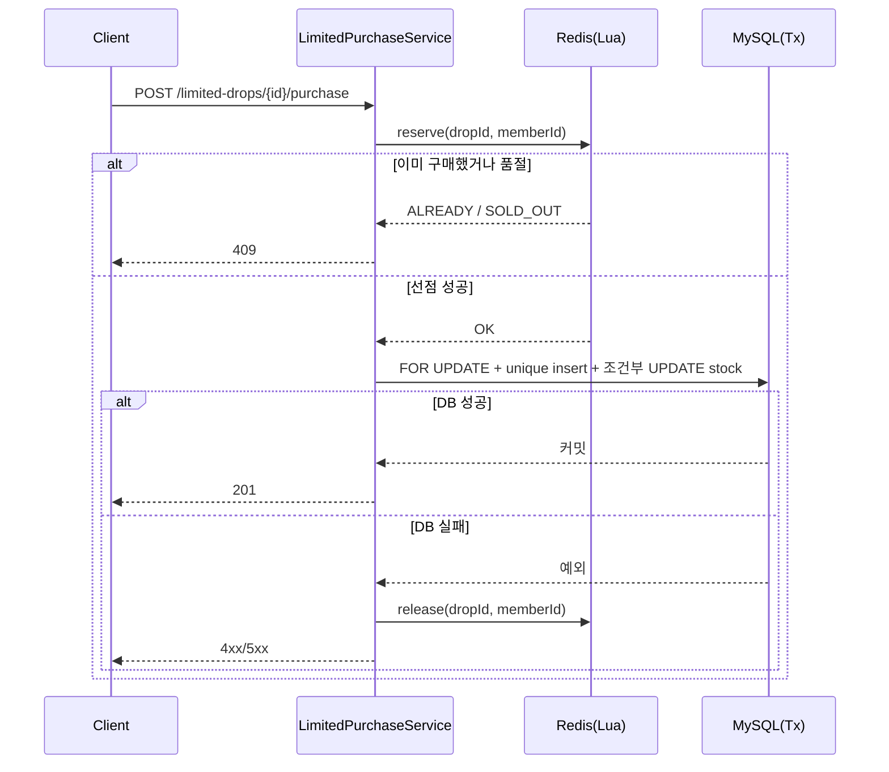

# GROOVE — LP(바이닐) 전문 이커머스

Java 17 / Spring Boot 3.5 + React 18 풀스택 포트폴리오 프로젝트.
한정반(Limited Drop) 선착순 판매의 동시성 제어, JPA + MyBatis 역할 분담, JWT 무상태 인증, Toss Payments 결제, AWS 배포까지 다룬다.

## 기술 스택

| 영역 | 스택 |
|---|---|
| Backend | Java 17, Spring Boot 3.5, Spring Security 6.5, Spring Data JPA, MyBatis 3.0, Spring Data Redis, springdoc-openapi |
| Frontend | React 18, TypeScript, Vite, React Router v6, TanStack Query v5, Zustand, Tailwind CSS |
| Infra | MySQL 8.0, Redis 7, Docker Compose, GitHub Actions, AWS EC2 + DuckDNS + Nginx + Let's Encrypt |

## 로컬 실행

```bash
# 1. 인프라 (MySQL → localhost:3306, Redis → localhost:6379)
docker compose up -d

# 2. 백엔드 (http://localhost:8080, Swagger: /swagger-ui.html)
cd backend && ./gradlew bootRun

# 3. 프론트엔드 (http://localhost:5173)
cd frontend && npm install && npm run dev
```

백엔드까지 컨테이너로 띄우려면 `docker compose --profile full up --build`.

## 테스트

```bash
cd backend && ./gradlew test   # 통합 테스트는 Testcontainers(MySQL/Redis) 사용, Docker 필요
```

## 한정반 동시성

한정반 선착순 구매(`POST /api/v1/limited-drops/{id}/purchase`)는 Redis Lua 스크립트로 경쟁을 먼저 거르고, 그중 살아남은 요청만 DB 트랜잭션을 태우는 2단계 구조다. Redis 단계는 `EXISTS`(드롭 재고 초기화 여부)·`SISMEMBER`(중복 구매 여부)·재고 확인·`SADD`+`DECR`을 하나의 Lua 스크립트로 원자 실행해서, 같은 회원의 중복 요청과 재고 초과 요청을 락 없이 빠르게 걸러낸다.

Redis를 통과한 요청만 DB로 넘어가 `SELECT ... FOR UPDATE`로 드롭 행을 잠그고, `(drop_id, member_id)` unique 제약과 `UPDATE stock ... WHERE quantity >= 1` 조건부 갱신으로 다시 한 번 막는다. Redis는 빠른 1차 필터일 뿐 최종 정합성은 DB 제약이 보장한다는 뜻이다. DB 단계에서 실패하면(배송지 오류 등) 앞서 선점한 Redis 재고/구매자 기록을 되돌린다. 결제 없이 PENDING 상태로 남은 주문은 스케줄러가 만료 처리하면서 `limited_purchase`·`sold_count`를 되돌리고, 커밋 이후에 Redis 재고도 함께 복구한다.


```mermaid
sequenceDiagram
    participant Client
    participant API as LimitedPurchaseService
    participant Redis as Redis(Lua)
    participant DB as MySQL(Tx)

    Client->>API: POST /limited-drops/{id}/purchase
    API->>Redis: reserve(dropId, memberId)
    alt 이미 구매했거나 품절
        Redis-->>API: ALREADY / SOLD_OUT
        API-->>Client: 409
    else 선점 성공
        Redis-->>API: OK
        API->>DB: FOR UPDATE + unique insert + 조건부 UPDATE stock
        alt DB 성공
            DB-->>API: 커밋
            API-->>Client: 201
        else DB 실패
            DB-->>API: 예외
            API->>Redis: release(dropId, memberId)
            API-->>Client: 4xx/5xx
        end
    end
```

측정은 k6로 재현한다.

```bash
docker compose --profile full up --build -d
k6 run scripts/k6/limited-purchase.js

# 판정
docker compose exec mysql mysql -ugroove -pgroove1234 groove -e "SELECT COUNT(*) FROM limited_purchase WHERE drop_id=<dropId>; SELECT quantity FROM stock WHERE product_id=<productId>; SELECT sold_count, status FROM limited_drop WHERE id=<dropId>;"
docker compose exec redis redis-cli GET limited:stock:<dropId>
docker compose exec redis redis-cli SCARD limited:buyers:<dropId>
```

이 엔드포인트의 p95 목표는 1초다. 상품 목록 API의 300ms(NFR-03)와는 별개 기준으로, 동시 경합이 훨씬 크고 쓰기 트랜잭션이 포함되기 때문이다.

측정 조건

| 항목 | 값 |
|---|---|
| 환경 | Apple M4, 16GB, macOS (앱·DB·Redis·k6 동일 머신) |
| 앱 | `docker compose --profile full` 컨테이너, `-Xmx384m` SerialGC, HikariCP 10 |
| DB/Redis | MySQL 8.0 / Redis 7 (Docker) |
| 부하 | 1000 VU × 1회, 오픈 직후 일제 요청. 드롭 재고 100, 1인 1매 |
| 워밍업 | 같은 규모 1회 후 2회 측정 |

결과 (Redis 선점 ON, 2회 중 느린 쪽)

| 지표 | 값 |
|---|---|
| 요청 수 | 1,000 |
| 201 / 409 | 100 / 900 (`LIMITED_SOLD_OUT`), 그 외 0 |
| 초과 판매 | 0건 (`limited_purchase` 100행, `stock.quantity` 0, Redis 재고 0) |
| p50 | 681ms |
| p95 | 802ms |
| p99 | 880ms |
| max | 928ms |
| 1000건 처리 시간 | 1.0s (순간 처리량 약 1,000 req/s) |
| 실패율(5xx·타임아웃) | 0% |

Redis 선점 ON vs DB 락만 (`LIMITED_REDIS_ENABLED=false`)

| 지표 | Redis ON | DB 락만 |
|---|---|---|
| p50 | 526 ~ 681ms | 603 ~ 707ms |
| p95 | 675 ~ 802ms | 718 ~ 833ms |
| p99 | 880 ~ 1,000ms | 759 ~ 885ms |
| 초과 판매 | 0건 | 0건 |

Redis를 꺼도 초과 판매가 없는 것은 DB 제약이 최종 방어라는 설계 그대로다. 이 규모에서는 응답 시간도 두 모드가 같은 수준인데, 실패 요청이 행 락에 줄을 서더라도 락 점유가 짧아서다. Redis 단계의 효과는 DB에 들어가는 트랜잭션 수(900건 차단)이고, 꼬리 지연은 성공 100건이 드롭 행 락에서 직렬화되는 시간(건당 5~8ms)이 만든다. 워밍업 없는 첫 실행은 p95 1.2~1.9초로, JIT 영향이다. 실행별 수치와 HikariCP 50 진단 결과는 [`scripts/k6/results/limited-20260904.md`](scripts/k6/results/limited-20260904.md)에 있다. EC2 t3.micro 측정은 배포 뒤 추가한다.

## 성능

상품 목록 API(`GET /api/v1/products`)를 k6로 50 VU, 30초 동안 부하를 걸어 p95 응답 시간을 측정한다. 목표는 p95 300ms 이하다. `bootRun`은 C1 JIT만 쓰는 옵션(`-XX:TieredStopAtLevel=1`)이 붙어 실제보다 느리게 나오므로 jar로 실행해 측정한다.

```bash
docker compose up -d
cd backend && ./gradlew bootJar -x test
SPRING_PROFILES_ACTIVE=local SPRING_JPA_SHOW_SQL=false LOGGING_LEVEL_COM_GROOVE=INFO LOGGING_LEVEL_ORG_HIBERNATE_SQL=INFO \
  java -jar backend/build/libs/groove-backend-0.0.1-SNAPSHOT.jar
k6 run --summary-export scripts/k6/results/product-list.json scripts/k6/product-list.js
```

측정 조건

| 항목 | 값 |
|---|---|
| 환경 | Apple M4, 16GB, macOS (앱·DB·k6 동일 머신) |
| DB/Redis | MySQL 8.0 / Redis 7 (Docker) |
| 데이터 | local 프로파일 시드 상품 210건 |
| 로깅 | show-sql·DEBUG OFF |
| 부하 | 50 VU, 30s, 요청 간 sleep 100ms |
| 워밍업 | 10 VU × 10s 1회 후 측정 |

결과

| 지표 | 값 |
|---|---|
| 총 요청 수 | 14,160 (약 470 req/s) |
| 실패율 | 0% |
| p50 | 5.2ms |
| p95 | 12.0ms |
| p99 | 18.6ms |
| 목표 충족 | 충족 (300ms 대비 약 4%) |

요청 변형별 p95

| 요청 | p95 |
|---|---|
| list-default | 10.5ms |
| list-page | 10.9ms |
| list-keyword | 10.0ms |
| list-genre | 10.9ms |
| list-artist | 9.0ms |
| list-price | 10.2ms |
| list-sort | 18.5ms |
| list-combined | 8.6ms |

같은 조건으로 두 번 측정했고 p95는 12.0ms·12.4ms로 차이가 없었다. 상품을 210건으로 늘린 뒤 재측정한 수치이고, 50건이던 이전 측정(p95 15.4ms)과 사실상 같다 — 이 규모에서는 쿼리보다 요청 처리 오버헤드가 대부분이라 데이터가 4배가 돼도 응답 시간이 움직이지 않는다. 유일하게 튀는 건 `list-sort`(18.5ms)인데, 데이터가 4배가 되면서 다른 변형과 벌어진 유일한 요청이라 정렬 경로를 따로 볼 여지가 있다. 실서비스 네트워크 경로 기준 재측정은 운영 환경 부하 테스트에서 다룬다.

### 프레싱 검색 인덱스

`GET /products` 의 `keyword` 는 숫자 8~14자리면 바코드 정확일치, 영숫자·하이픈 조합이면 카탈로그 번호 정확일치를 제목/아티스트명 LIKE 와 OR 로 묶는다(`backend/scripts/perf/product-search-p95.sh` 로 시드한 프레싱 50건 기준 `EXPLAIN`).

- 바코드 정확일치(`p.status <> 'HIDDEN' AND p.barcode = ?`): `idx_product_barcode` 를 `ref` 로 탄다. LIKE 를 붙이지 않은 이유가 이 결과다.
- 카탈로그 번호 keyword(`title LIKE ? OR artist.name LIKE ? OR catalog_no_normalized = ?`): OR 로 묶인 조건이 두 테이블에 걸쳐 있어 옵티마이저가 `idx_product_catalog_no` 를 쓰지 못한다. 이 시드 규모에서는 아티스트 테이블을 드라이빙 테이블로 골라 `ALL` 로 스캔한 뒤 `idx_product_artist` 로 조인하는 계획이 나왔고, 카탈로그 번호 인덱스는 실행 계획에 등장하지 않았다. 데이터가 늘어나면 옵티마이저가 다른 드라이빙 테이블을 고르거나 인덱스 병합을 시도할 수 있지만, 카탈로그 번호만으로 단일 인덱스를 타는 경로는 없다 — 필요해지면 OR 대신 `UNION` 으로 분리해야 한다.
- `albumId` 필터(`p.album_id = ?`): `idx_product_album` 을 `ref` 로 탄다.

3,000건 규모의 p95 재측정은 Discogs 배치 적재로 실데이터가 쌓인 뒤 진행한다.

### 조회 인덱스 실행계획

운영 데이터(상품 273건)에서는 옵티마이저가 거의 항상 풀스캔을 고르고 그게 실제로 싸서, 실행계획만으로는 인덱스가 일하는지 노는지 구분되지 않는다. 그래서 버려도 되는 스키마에 마이그레이션으로 운영과 같은 스키마를 세우고 합성 데이터를 채운 뒤 잰다. 아래는 상품 5만·주문 20만·리뷰 30만·알림 50만 규모에서 같은 조건으로 세 번 측정한 중앙값이다.

```bash
docker compose up -d
backend/scripts/perf/index-explain.sh
```

스크립트가 `groove_perf` 스키마를 만들어 `V1`부터 마이그레이션을 적용하고, 시드를 채우고, `V11__query_index_tuning.sql` 적용 전후의 `EXPLAIN ANALYZE` 를 각각 뜬 뒤 스키마를 지운다. 개발 DB `groove` 는 건드리지 않는다. 다른 인덱스를 시험하려면 후보 DDL 을 `--after-ddl` 로 넘긴다.

문제는 전부 같은 모양이었다 — 정렬 키를 선두로 갖는 인덱스가 없어 테이블을 통째로 읽고 `filesort` 로 넘어간 뒤, 정작 20건만 떼어낸다.

| 케이스 | 변경 전 | 변경 후 | 접근 경로 |
|---|---:|---:|---|
| 관리자 주문 목록, 무필터 | 63.3ms | 0.080ms | 풀스캔+filesort → `idx_orders_created` 역순 스캔 |
| 관리자 주문 목록, 키워드 | 64.5ms | 0.834ms | 풀스캔+filesort → `idx_orders_created` 역순 스캔 |
| 관리자 주문 목록, 최근 30일 | 32.0ms | 0.399ms | 풀스캔+filesort → `idx_orders_created` 범위 스캔 |
| 관리자 주문 목록, 상태 필터 | 30.5ms | 0.342ms | 4만 행+filesort → `idx_orders_status_created` |
| 상품 목록, 최신순 | 31.7ms | 0.122ms | 풀스캔+filesort → `idx_product_created` 역순 스캔 |
| 상품 목록, 장르+가격대 | 20.6ms | 0.679ms | 풀스캔+filesort → `idx_product_created` 역순 스캔 |
| 안 읽은 알림 목록 | 0.731ms | 0.091ms | 512행+filesort → `idx_notification_member_read_created` |
| 상품 목록, 인기순 | 2127ms | 0.114ms | `order_item` 42만 행 파생 테이블 집계 → `product.sold_quantity` 비정규화 컬럼, `idx_product_sold_review_created` 역순 스캔 |
| 관리자 통계, 일별 매출 최근 30일 | 23.2ms | 5.34ms | `payment` 15만 행 풀스캔(취소 브랜치) → `idx_payment_canceled_at` range 488행 |
| 관리자 통계, 오늘 가입 회원 수 | 3.9ms | 0.547ms | `member` 45,000행 풀스캔 → `idx_member_created` 커버링 range 5,054행 |

- 상품 목록 기본 정렬이 `idx_product_status_created (status, created_at)` 를 못 타는 건 조건이 `status <> 'HIDDEN'` 이라 선두 컬럼이 비등가이기 때문이다. 등가가 아니면 뒤 컬럼의 정렬 순서를 보장할 수 없어 옵티마이저가 인덱스를 통째로 포기한다.
- 가격순 정렬(`ORDER BY price ASC, id DESC`)과 리뷰 평점순(`ORDER BY rating DESC, created_at DESC, id DESC`)에는 인덱스를 넣지 않았다. 2차 정렬 키의 방향이 반대라 오름차순 인덱스로는 정렬을 받을 수 없다. 실제로 `(price)` 는 옵티마이저가 후보로 올리지도 않았고(18.5 → 18.7ms), `(product_id, rating)` 은 선택은 됐지만 `created_at` 정렬이 남아 시간이 그대로였다(11.2 → 11.7ms). 방향별로 인덱스를 따로 두면 해결되지만 정렬 옵션이 다섯 개라 인덱스도 다섯 개가 된다.
- 지운 인덱스는 셋이다. `idx_product_title_artist` 는 검색과 자동완성이 전부 `title LIKE '%키워드%'` 라 선두 인덱스로 범위를 못 좁히고(앨범 중복 판별의 등가 조회는 `album` 쪽 인덱스가 맡는다), 지워도 계획과 시간이 그대로였다. `idx_notification_member_read` 는 새 3컬럼 인덱스의 좌측 프리픽스다. `idx_orders_status` 는 필터·조인 경로에서 `idx_orders_status_expires` 가 대체하지만, 인기순 정렬의 판매량 집계가 이 인덱스를 커버링 풀스캔하고 있어서 그 구간만 427 → 522ms 로 늘어난다. `status` 는 값이 7개뿐이라 커버링 스캔 말고는 쓸 데가 없고, 손해 보는 쿼리 자체가 아래 이유로 1.5~2.5초짜리라 90ms 는 묻힌다고 보고 지웠다. 그 판매량 집계가 아래처럼 사라지면서 이 손해도 같이 없어졌다.

인기순 정렬(1.5~2.5초)은 인덱스로 못 고치는 문제였다. 상품별 판매 수량을 구하는 파생 테이블(`order_item` 42만 행 집계)을 요청마다 통째로 materialize 하는 게 원인이라, 정렬 키 자체를 `product.sold_quantity` 컬럼으로 비정규화하고(`V12__product_sold_quantity.sql`) 판매량이 바뀌는 시점에만 갱신하는 쪽으로 바꿨다. 정렬 키(`sold_quantity, review_count, created_at, id`)가 전부 DESC 라 인덱스 하나로 정렬까지 끝난다. 관리자 주문 전체 건수(45.7ms)는 여전히 페이지네이션 총 개수라 20만 행을 다 세야 해서 인덱스로 줄일 수 없고, 후속 과제로 남아 있다.

## 추천 품질

추천은 학습 모델 없이 가중치 합산 규칙으로 만든다. 규칙이 무작위 나열보다 낫다는 걸 보이려고 홀드아웃 방식으로 측정한다. 시드 회원의 위시리스트에서 20%를 떼어 없는 것처럼 만들고, 남은 신호(취향 프로필·나머지 위시·구매 이력·공동구매)만으로 추천을 계산한 다음, 떼어놓은 상품이 상위 10개 안에 들어오는지 센다.

```bash
docker compose up -d
cd backend && ./gradlew precisionAt10
```

Testcontainers로 MySQL/Redis를 띄우고 로컬 시드를 그대로 적재한 뒤 `RecommendService.recommendHome()` 을 직접 호출한다. 서버를 따로 기동할 필요가 없고 난수가 고정 시드라 실행마다 같은 값이 나온다. 일반 빌드에서는 `precision` 태그로 제외되어 CI 시간에 영향이 없다.

측정 조건

| 항목 | 값 |
|---|---|
| 대상 회원 | 시드 회원 30명 (`digger01`~`digger30`) |
| 후보 상품 | 210건 |
| 홀드아웃 | 회원별 위시리스트의 20% (id 오름차순 5개마다 1개), 총 66건 |
| 남은 신호 | 취향 프로필, 나머지 위시리스트, 구매 이력, 공동구매 ZSET |
| 제외 규칙 | HIDDEN 상품, 이미 구매·위시한 상품, 최근 본 상품 |
| 대조군 | 개인화 없이 평점 높은 순 10개(인기순), 균등 무작위 |

결과

| 지표 | 값 | 정의 |
|---|---|---|
| recall@10 | 0.424 | 홀드아웃 66건 중 상위 10개 안에 든 28건 |
| precision@10 | 0.093 | 회원별 `적중 수 / 10` 의 평균 |
| hit-rate@10 | 0.767 | 홀드아웃을 하나라도 맞힌 회원 비율 (30명 중 23명) |
| 인기순 대조군 recall@10 | 0.076 | 평점순 10개로는 66건 중 5건 |
| 무작위 기준선 recall@10 | 0.048 | `10 / 210` — 아무 상품이나 10개 고를 때의 기대값 |
| 무작위 대비 | 8.9배 | |
| 인기순 대비 | 5.6배 | |

홀드아웃이 회원당 2~3건이라 precision@10 은 구조적으로 0.3을 넘을 수 없다. 그래서 헤드라인은 recall@10 으로 본다.

무작위 기준선만 두면 수치가 과대평가되기 쉽다. 동점자가 슬롯보다 많으면 정렬 2순위인 `avg_rating` 이 실질 결정권을 갖는데, 그러면 "그냥 평점 높은 순"과 구분이 안 되기 때문이다. 그래서 개인화를 뺀 평점순 10개를 대조군으로 함께 잰다. 인기순은 recall 0.076 에 그쳐 규칙 추천이 5.6배 앞선다 — 이 차이가 취향·행동 신호가 실제로 기여한 몫이다.

다만 합성 시드 기준이라 그대로 실사용 성능으로 읽으면 안 된다. 시드 회원의 위시리스트는 배정된 취향 클러스터에서 70%, 나머지 30%를 전체 상품에서 뽑아 만든 것이다. 노이즈 30%는 측정이 시드 생성 규칙을 그대로 되맞히는 자기충족이 되지 않게 일부러 섞었다. 이 측정이 말해주는 건 "가중치 조합과 제외 규칙이 의도대로 동작한다"까지이고, 실제 취향 예측력은 사용자 로그가 쌓여야 알 수 있다.

가중치를 바꾸거나 제외 규칙을 손보면 이 수치가 먼저 움직인다. 회귀 감지용으로 두 가지를 단언한다 — 무작위 기준선의 3배 이상일 것, 그리고 인기순 대조군보다 나을 것.

## 구조

```
groove/
├── backend/      # Spring Boot (com.groove.{global, member, auth, product, ...})
├── frontend/     # React + Vite
├── scripts/k6/   # 부하 테스트 스크립트
├── docker-compose.yml
└── .github/workflows/ci.yml
```
