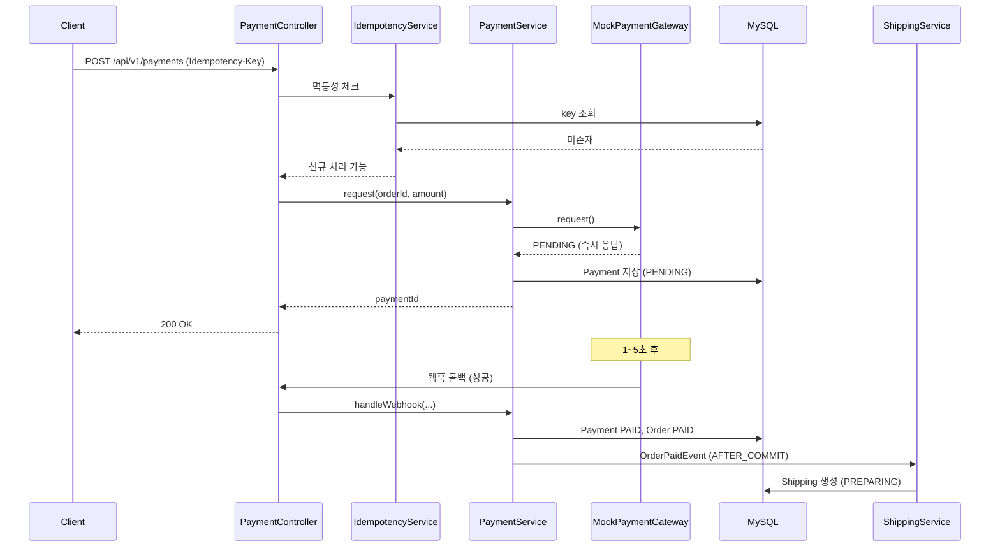
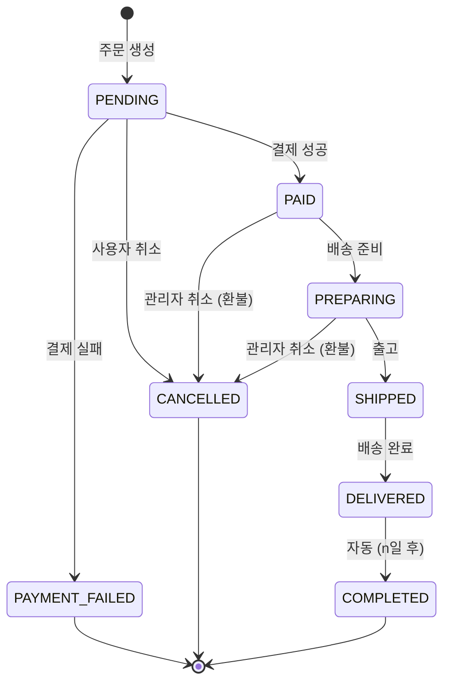
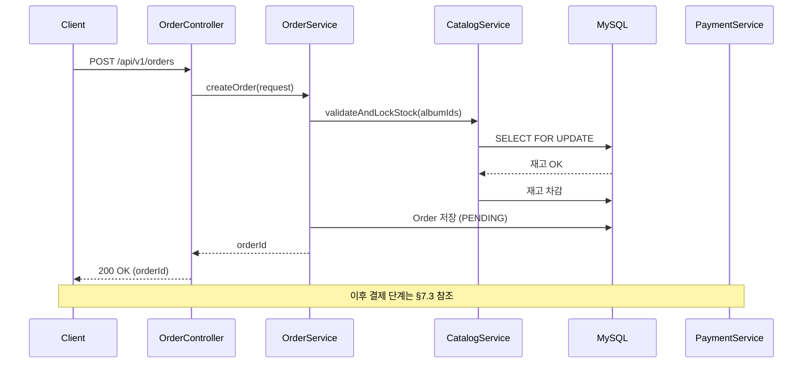

# 아키텍처 문서: Groove (LP 전문 이커머스 백엔드)

| 항목 | 값 |
|---|---|
| 버전 | 1.1 |
| 작성일 | 2026-05-05 |
| 최종 수정일 | 2026-05-07 |
| 변경 내용 | v1.1 (W4 완료 반영): 패키지 내부 레이어 명을 실제 구현(`api/application/domain` + `security`/`exception`) 기준으로 정정. 레이어 책임/의존성 규칙은 동일하나 디렉토리 명명만 controller/service/repository → api/application/domain. |
| 관련 문서 | PRD.md |

---

## 1. 아키텍처 목표

본 프로젝트의 아키텍처는 다음 우선순위로 설계된다:

1. **단순성** — 12주 단독 진행에 적합한 단일 모듈, 단일 인스턴스 구조
2. **측정 가능성** — 부하 테스트로 발견된 문제를 식별·개선할 수 있는 명확한 경계
3. **확장 가능성 (조건부)** — 측정 후 도구 도입이 필요해질 때 최소 변경으로 도입할 수 있는 인터페이스 분리
4. **도메인 응집도** — 도메인 중심 패키지로 비즈니스 로직 응집

### 비목표
- 분산 시스템 (단일 인스턴스 가정)
- 마이크로서비스
- 헥사고날/클린 아키텍처 풀 적용 (학습 비용 대비 시연 효과 낮음)

---

## 2. 아키텍처 결정 사항 (ADR 요약)

| 번호 | 결정 | 근거 | 대안 |
|---|---|---|---|
| ADR-1 | 단일 Gradle 모듈 | 12주 일정, 멀티 모듈 분리 비용 큼 | 멀티 모듈 (api / domain / infra) |
| ADR-2 | 도메인 중심 패키지 구조 | 응집도, 면접 설명 용이 | 레이어드 |
| ADR-3 | API URI 버저닝 (`/api/v1/...`) | 변경 시 라우팅 명확 | 헤더 / 없음 |
| ADR-4 | RFC 7807 ProblemDetail | Spring 6+ 표준, 클라이언트 호환성 | 자체 ErrorResponse |
| ADR-5 | JWT (Access + Refresh Rotation) | 무상태, 확장 용이 | 세션 기반 |
| ADR-6 | Spring Application Event (v1) | 외부 의존 없이 도메인 분리 | Kafka / Redis Stream (조건부 후보) |
| ADR-7 | 결제 PG: Strategy 패턴 + Mock | 확장 포인트 확보 | 직접 호출 |
| ADR-8 | 트랜잭션 경계: Service 레이어 | 표준 관례, 명확 | 도메인 레이어 |
| ADR-9 | DB 마이그레이션: Flyway | 스키마 버저닝 표준 | Liquibase / 수동 |
| ADR-10 | 동시성: 비관적 락 (v1) | 단순·확실, 시연 단계적 개선 시작점 | 낙관적 락 / Redis 분산락 (조건부) |

---

## 3. 시스템 컨텍스트

### 3.1 외부 시스템
**없음.** 모든 외부 의존(PG, 메일, 운송장)은 내부 모킹 컴포넌트로 처리한다. 단, Mock PG는 "외부 시스템처럼 동작"하도록 설계한다 (비동기 콜백, 지연 시뮬레이션 포함).

### 3.2 액터
- **USER** — 인증된 회원
- **GUEST** — 비회원 (주문 가능)
- **ADMIN** — 관리자
- **(시스템) Scheduler** — 배송 상태 자동 진행, 결제 폴링

### 3.3 시스템 구성도

```
┌─────────────────────────────────────────────┐
│         Docker Compose 환경                  │
│                                              │
│   ┌──────────────────┐    ┌─────────────┐   │
│   │   Spring Boot    │───▶│   MySQL 8   │   │
│   │      App         │    └─────────────┘   │
│   │                  │                      │
│   │  ┌────────────┐  │                      │
│   │  │  Mock PG   │  │  (in-process module) │
│   │  └────────────┘  │                      │
│   └──────────────────┘                      │
│           ▲                                  │
└───────────┼──────────────────────────────────┘
            │
            │ HTTP
            │
   ┌────────┴────────┐
   │                 │
┌──┴──┐         ┌────┴─────┐
│ k6  │         │ Postman  │
│(부하)│        │ (검증)   │
└─────┘         └──────────┘
```

**조건부 확장** (측정 후 트리거 발생 시):
- Redis (캐시 / 분산락 / Refresh Token)
- Prometheus + Grafana
- Kafka 또는 Redis Stream

---

## 4. 애플리케이션 내부 구조

### 4.1 패키지 구조

도메인 중심 + 도메인 내 `api / application / domain` 3-레이어 구조. (Controller/Service/Repository 의 역할명을 그대로 유지하되 디렉토리는 책임 단위로 명명)

```
com.groove
├── GrooveApplication.java
│
├── auth/                       (인증/인가) — W4 구현 완료
│   ├── api/
│   │   ├── AuthController.java
│   │   └── dto/                (LoginRequest/Response, RefreshRequest/Response, SignupRequest/Response, LogoutRequest, TokenType)
│   ├── application/            (AuthService, RefreshTokenService, RefreshTokenAdmin, LoginCommand, TokenPair)
│   ├── domain/                 (RefreshToken, RefreshTokenRepository, TokenHasher)
│   └── security/
│       ├── SecurityConfig.java
│       ├── JwtProvider / JwtAuthenticationFilter / JwtClaims / JwtProperties
│       ├── PasswordConfig, CorsProperties, AuthPrincipal
│       ├── RestAuthenticationEntryPoint, RestAccessDeniedHandler
│       └── ratelimit/          (AuthRateLimitProperties, LoginRateLimitPolicy, SignupRateLimitPolicy)
│
├── member/                     (회원) — W4 구현 완료
│   ├── application/            (MemberService, SignupCommand)
│   ├── domain/                 (Member, MemberRepository, MemberRole)
│   └── exception/              (MemberEmailDuplicatedException)
│
├── catalog/                    (LP 카탈로그)
│   ├── album/                  — W5-3 구현 완료 (api/, application/, domain/, exception/)
│   ├── artist/                 — W5-2 구현 완료 (api/, application/, domain/, exception/)
│   ├── genre/                  — W5-1 구현 완료 (api/, application/, domain/, exception/)
│   └── label/                  — W5-1 구현 완료 (api/, application/, domain/, exception/)
│
├── cart/                       (장바구니) — W6 예정
│
├── order/                      (주문) — W6 예정
│   ├── api/, application/, domain/
│   └── (event: OrderPaidEvent, OrderCancelledEvent — W7 도입)
│
├── payment/                    (결제) — W7 예정
│   ├── api/, application/, domain/  (Payment, IdempotencyRecord)
│   └── gateway/
│       ├── PaymentGateway.java         (인터페이스)
│       └── mock/                       (MockPaymentGateway, MockWebhookSimulator)
│
├── shipping/                   (배송) — W7 예정
│   └── (api/, application/, domain/, scheduler/)
│
├── review/                     (리뷰) — W7 예정
│
├── admin/                      (관리자 전용 API 묶음) — W5+ 진행
│
└── common/                     (횡단 관심사) — W3 구현 완료
    ├── exception/              (GlobalExceptionHandler, BusinessException 계층, ErrorCode, ProblemDetailEnricher)
    ├── logging/                (MDC 필터, 비즈니스 이벤트 로거)
    ├── persistence/            (공용 JPA 설정·기반)
    └── ratelimit/              (RateLimitFilter, 정책 인터페이스 — 도메인이 정책 빈 등록)
```

> 도메인별 layout 은 `api / application / domain` 3-레이어로 통일하되, 횡단 보조(`security`, `exception`, `ratelimit`)가 필요한 도메인은 같은 레벨에 추가한다. 이 명명은 W3~W4 구현 시 합의되었으며, 이전 controller/service/repository 명명에서 디렉토리 이름만 정리한 것으로 책임은 동일하다.

### 4.2 레이어 책임

| 레이어 | 책임 | 의존 방향 |
|---|---|---|
| `api` | HTTP 요청/응답, 입력 검증 (`@Valid`), DTO ↔ Application 변환 | → Application |
| `application` | 비즈니스 로직, 트랜잭션 경계, Command·Result 객체, 도메인 호출 | → Domain |
| `domain` | 엔티티·값 객체·Repository 인터페이스·도메인 로직 (상태 전이, 해시 등) | (내부 완결) |
| `security` (도메인 횡단 보조) | 인증·인가·정책 (필터·핸들러·정책 빈) | → Domain·Application |
| `dto` (api 하위) | API 입출력 데이터 구조 (record) | api 레이어 내부에서만 |

### 4.3 의존성 규칙
1. **도메인 객체는 Controller에 노출하지 않는다.** Service에서 DTO로 변환 후 반환한다.
2. **도메인 간 의존은 Service 레이어를 통해서만.** 다른 도메인의 Repository 직접 호출 금지.
3. 다른 도메인 데이터가 필요하면 해당 도메인의 Service를 주입받아 호출한다.
4. `common` 패키지는 모든 도메인에서 참조 가능. 반대 방향(common → 도메인) 금지.

---

## 5. 횡단 관심사

### 5.1 인증/인가 (Spring Security)

요청 처리 필터 체인:

```
[요청]
   │
   ▼
[CorsFilter]
   │
   ▼
[RateLimitFilter]            ← 로그인/회원가입/결제 IP 또는 회원 기준 제한
   │
   ▼
[MdcFilter]                  ← X-Request-Id 발급/추출, MDC 주입
   │
   ▼
[JwtAuthenticationFilter]    ← Access Token 검증, SecurityContext 주입
   │
   ▼
[SecurityFilterChain]        ← URL 패턴별 권한 체크
   │
   ▼
[Controller]
```

**엔드포인트별 권한 정책:**
- `permitAll`: 회원가입, 로그인, 토큰 갱신, 상품 조회, 게스트 주문
- `authenticated`: 장바구니, 회원 주문, 리뷰 작성
- `hasRole("ADMIN")`: `/api/v1/admin/**`

**Refresh Token Rotation 흐름:**
1. 클라이언트 → `/api/v1/auth/refresh` (refreshToken 포함)
2. 서버가 토큰 조회 → 유효성 검증
3. **이미 사용·폐기된 토큰**이면 → 해당 사용자의 모든 토큰 무효화 (탈취 의심으로 간주)
4. 정상이면 → 기존 토큰 폐기 + 새 access/refresh 발급
5. 응답 반환

### 5.2 트랜잭션 관리

- Service 메서드에 `@Transactional` 명시
- 읽기 전용은 `@Transactional(readOnly = true)` (Hibernate 1차 캐시 dirty check 생략)
- 전파(Propagation) 기본 `REQUIRED`. 보상 트랜잭션처럼 분리가 필요한 경우만 `REQUIRES_NEW`
- **재고 차감 등 정합성 민감 영역**:
  - v1 기본: 비관적 락 (`SELECT ... FOR UPDATE`)
  - 단계 (a) 시연: 락 없이 단순 차감 → 오버셀 재현 (의도적 문제 노출)
  - 단계 (b) 시연: 비관적 락 적용 → 정합성 보장, TPS 측정
  - 단계 (c) 조건부: 낙관적 락 또는 Redis 분산락 비교 (시간 여유 시)

### 5.3 에러 처리 (RFC 7807 ProblemDetail)

`@RestControllerAdvice`로 통합 처리. 모든 에러 응답은 `application/problem+json`.

응답 예시:
```json
{
  "type": "https://groove.example/errors/insufficient-stock",
  "title": "재고가 부족합니다",
  "status": 409,
  "detail": "Album ID 123의 재고 부족. 요청 5, 가능 2",
  "instance": "/api/v1/orders",
  "code": "ORDER_INSUFFICIENT_STOCK",
  "timestamp": "2026-05-05T14:23:00Z",
  "traceId": "9f1c..."
}
```

도메인 예외 계층:
```
RuntimeException
  └── BusinessException (추상)
        ├── AuthException
        ├── ValidationException
        ├── DomainException
        └── ExternalException
```

각 예외는 HTTP 상태 코드 + `code` 매핑을 보유한다.

### 5.4 로깅
- Logback + SLF4J
- MDC 키: `requestId`, `userId` (인증 시), `path`, `method`
- 로그 패턴: `%d{ISO8601} %-5level [%X{requestId}] [%X{userId:-anonymous}] %logger{36} - %msg%n`
- 비즈니스 이벤트 표준 포맷 (검색·집계 용이): `BIZ_EVENT type=ORDER_CREATED orderId=... memberId=... amount=...`

### 5.5 Rate Limiting
- 라이브러리: Bucket4j (in-memory, v1)
- 적용 대상 및 정책 (예시):
  - 로그인: IP당 분당 10회
  - 회원가입: IP당 분당 3회
  - 결제 요청: 회원당 분당 5회
- v2: Redis 기반 분산 Rate Limit (Bucket4j-Redis)으로 전환 가능

### 5.6 멱등성 처리 (Idempotency-Key)
- 결제 요청 엔드포인트에 `Idempotency-Key` 헤더 필수
- 처리 컴포넌트: `payment.application.IdempotencyService`
- 저장: `idempotency_record` 테이블 (key + result_snapshot 매핑)
- 동작:
  1. 요청 도착 → key 조회
  2. 존재 + 처리 완료 → 기존 결과 반환 (200)
  3. 존재 + 처리 중 → `409 Conflict`
  4. 미존재 → 락 획득 후 처리 → 결과 저장 후 반환

---

## 6. 도메인 간 통신

### 6.1 원칙
- **동기 + 즉시 정합성 필요** → Service 직접 호출
- **비동기 + 결과 정합성 허용** → Application Event

### 6.2 Application Event 사용 케이스

| 이벤트 | 발행자 | 구독자 | 비고 |
|---|---|---|---|
| `OrderPaidEvent` | OrderService | ShippingService (배송 생성) | 결제 완료 → 배송 엔트리 생성 |
| `OrderCancelledEvent` | OrderService | InventoryService (재고 복원) | 동일 트랜잭션 내 복원 |
| `ShippingDeliveredEvent` | ShippingService | (옵션) ReviewEligibilityService | 리뷰 작성 가능 플래그 |

### 6.3 트랜잭션과 이벤트
- `@TransactionalEventListener(phase = AFTER_COMMIT)` 사용
- 이유: 주문 트랜잭션 롤백 시 배송이 잘못 생성되는 것 방지
- **트레이드오프 (README에 기록)**: 이벤트 발행 후 구독자 처리 실패 시 정합성 깨질 수 있음 → v2에서 Outbox 패턴 도입 후보

---

## 7. 결제 모듈 상세 설계

### 7.1 Strategy 패턴 인터페이스

```java
public interface PaymentGateway {
    PaymentResponse request(PaymentRequest request);
    PaymentStatus query(String pgTransactionId);
    RefundResponse refund(RefundRequest request);
}

@Component
@Profile({"local", "dev", "test", "docker"})
public class MockPaymentGateway implements PaymentGateway { ... }
```

실 PG 도입 시 `@Profile("prod")` 구현체만 추가하면 끝.

### 7.2 Mock 설정 파라미터
- `payment.mock.success-rate=0.95`
- `payment.mock.delay-min-ms=100`
- `payment.mock.delay-max-ms=500`
- `payment.mock.webhook-delay-min-sec=1`
- `payment.mock.webhook-delay-max-sec=5`

### 7.3 결제 처리 시퀀스



### 7.4 실패 / 보상 흐름
- **PG 응답 실패 시**: Payment FAILED 저장 → OrderService 호출 → Order PAYMENT_FAILED 전환 → 재고 복원 (단일 트랜잭션 내)
- **웹훅 미수신 시**: 별도 스케줄러가 PENDING 상태 결제를 N분마다 폴링하여 PG `query()` 호출 → 결과 동기화

---

## 8. 주문 상태 머신



구현:
- `OrderStatus` enum + `canTransitionTo(OrderStatus next)` 메서드
- 전이 위반 시 `IllegalStateTransitionException` 발생 (BusinessException 상속)
- 모든 상태 변경은 `Order.changeStatus(next)`를 통해 일원화

---

## 9. 데이터 흐름 — 주문 생성 시퀀스



---

## 10. 배포 아키텍처

### 10.1 Docker Compose 구성

```yaml
services:
  app:
    image: groove-app
    depends_on: [mysql]
    environment:
      - SPRING_PROFILES_ACTIVE=docker
      - DB_HOST=mysql
      - JWT_SECRET=${JWT_SECRET}
    ports: ["8080:8080"]

  mysql:
    image: mysql:8
    environment:
      - MYSQL_DATABASE=groove
      - MYSQL_ROOT_PASSWORD=${DB_PASSWORD}
    ports: ["3306:3306"]
    volumes: [mysql-data:/var/lib/mysql]

volumes:
  mysql-data:
```

### 10.2 Spring Profiles

| Profile | 용도 | 특징 |
|---|---|---|
| local | 로컬 개발 | 로컬 MySQL 또는 H2, Mock PG 활성 |
| docker | Docker Compose | MySQL 컨테이너 연결, Mock PG 활성 |
| test | 통합 테스트 | Testcontainers MySQL, 시간 가속(스케줄러) |

### 10.3 환경 변수 (`.env`)
- `DB_PASSWORD`
- `JWT_SECRET`
- `JWT_ACCESS_TTL_MINUTES`
- `JWT_REFRESH_TTL_DAYS`
- `PAYMENT_MOCK_SUCCESS_RATE`

→ 저장소 미포함, `.env.example`만 커밋

---

## 11. 확장 포인트 (조건부 도입)

### 11.1 Redis 도입 트리거 및 위치

| 트리거 (측정 결과) | Redis 적용 영역 |
|---|---|
| Refresh Token DB 부하 증가 | `RefreshTokenRepository` → Redis 기반 구현 교체 |
| 인기 상품 조회 응답 지연 | `CatalogService`에 Cache-Aside 적용 |
| 한정반 동시성 시연 강화 | `InventoryService`에 Redisson 분산락 |
| Rate Limit 분산 환경 | Bucket4j-Redis로 전환 |

### 11.2 메시지 큐 도입 트리거

| 트리거 | 적용 영역 |
|---|---|
| 배송 생성 비동기 부하 측정 시 | `OrderPaidEvent` → 외부 큐로 이전 |
| 알림 발송 도입 시 | 별도 Notification 토픽 |

### 11.3 멀티 인스턴스 도입 시 고려사항
- Refresh Token: Redis 또는 DB 공유 (이미 DB 기반이라 영향 적음)
- Rate Limit: 반드시 Redis 기반 필요
- 스케줄러 중복 실행: Quartz 클러스터 모드 또는 ShedLock 도입
- 세션: Stateless JWT 사용으로 영향 없음

---

## 12. 테스트 아키텍처

### 12.1 테스트 피라미드

```
       ┌──────────────┐
       │ E2E (소량)   │  Postman 컬렉션, 시드 후 수동 시연
       ├──────────────┤
       │ 통합 테스트  │  @SpringBootTest + Testcontainers MySQL
       │  (중심축)    │  도메인 흐름, Repository, 트랜잭션, 동시성
       ├──────────────┤
       │ 단위 테스트  │  도메인 로직 (상태 전이, 검증 규칙)
       │   (다수)     │
       └──────────────┘
```

### 12.2 통합 테스트 전략
- Testcontainers MySQL 8 사용 (실 환경 동일)
- `@Sql`로 시드 데이터 주입
- **동시성 테스트**: `CountDownLatch` + `ExecutorService`로 동시 요청 시뮬레이션 → 핵심 시연 포인트
- 기본은 트랜잭션 자동 롤백, 동시성 테스트는 명시적 cleanup

### 12.3 부하 테스트 (k6)
- 폴더: `loadtest/`
- 시나리오:
  - `search.js` — 상품 검색
  - `order.js` — 주문 생성
  - `flash-sale.js` — 한정반 동시 주문 (핵심 시연)
  - `payment.js` — 결제 처리 (멱등성 포함)
- 결과 출력: JSON 결과 + 비교표 (Before/After)

---

## 13. 코드 컨벤션

- 패키지명: 전 소문자, 단수형 (`order`, `payment`)
- 클래스명: PascalCase, 역할 접미사 명확 (`OrderService`, `OrderController`, `OrderRepository`)
- 인터페이스: `Impl` 접미사 사용 안 함. 구현체에 구체적 이름 사용 (`PaymentGateway` ↔ `MockPaymentGateway`)
- DTO: `Request` / `Response` 접미사 (`CreateOrderRequest`, `OrderResponse`)
- 도메인 예외: 도메인 패키지 내 `exception/` 서브패키지

---

## 14. 미해결 결정 / 향후 검토

- **시드 데이터 출처**: 자체 생성 스크립트 vs 공개 데이터 활용 — W7~W8에 결정
- **한정반 시연 시 Redis 도입 여부**: W9 부하 측정 결과에 따라 결정
- **가상 스레드(Virtual Threads) 활성화**: 통합 테스트 안정화 후 옵션으로 시도, 효과 측정 후 채택 여부 결정
