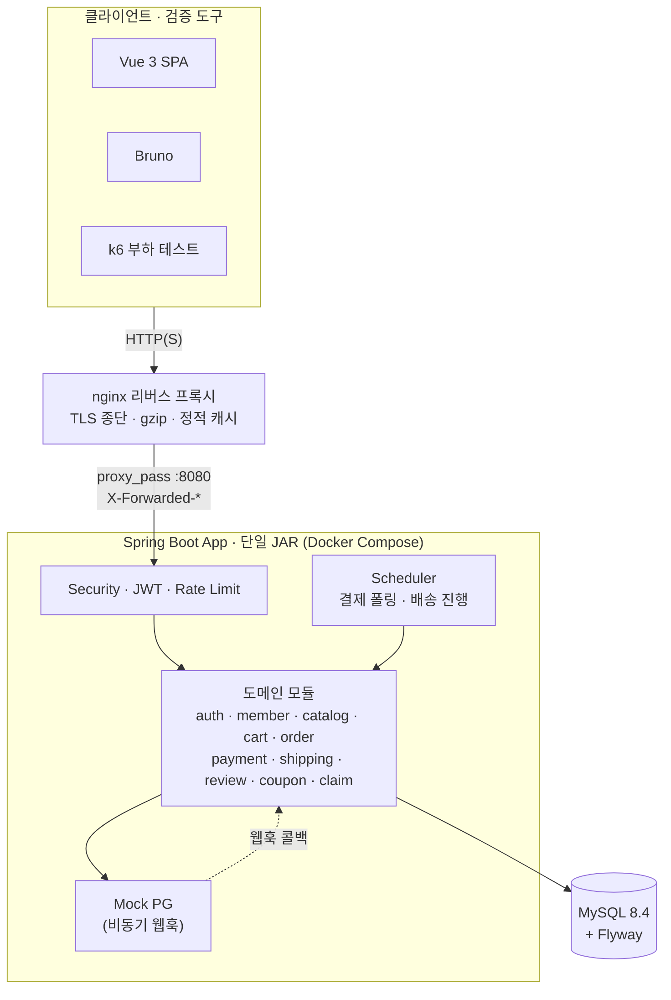
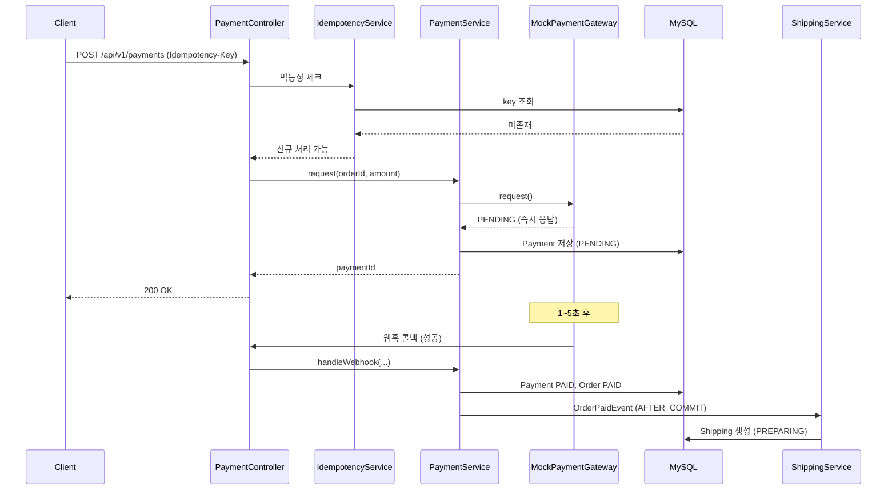
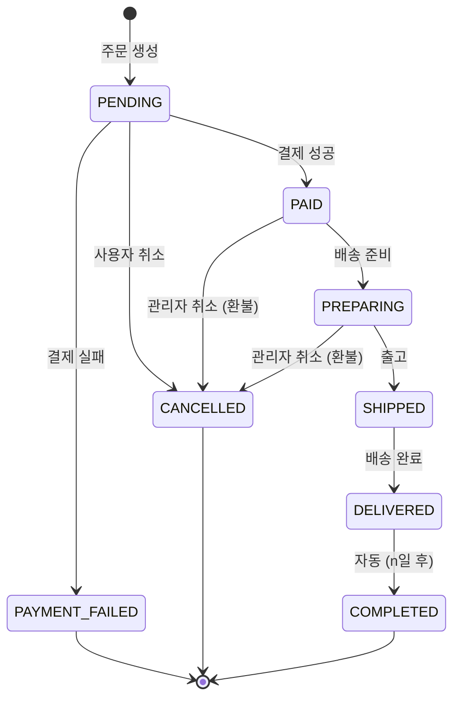
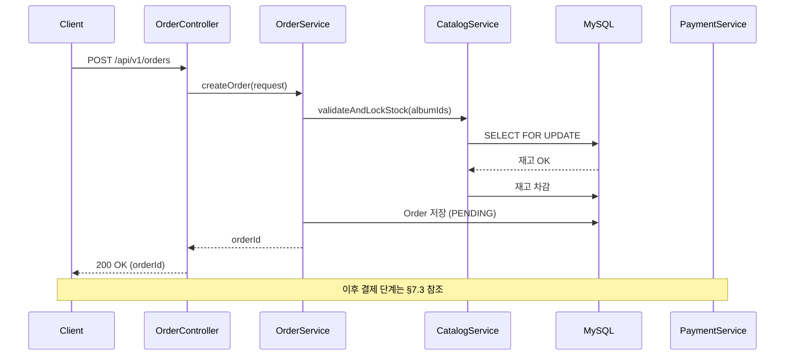

# 아키텍처 문서: Groove (LP 전문 이커머스 백엔드)

| 항목 | 값 |
|---|---|
| 버전 | 2.4 |
| 작성일 | 2026-05-05 |
| 최종 수정일 | 2026-06-25 |
| 변경 내용 | v2.4 (#321, M17 실 PG 배포 게이트): §10.2 에 dev/prod 프로파일 행 추가하고 "운영 프로파일 미도입" 문구를 정정(실 결제는 prod 로 분기). `application-prod.yaml` 신설(운영 하드닝 — Swagger 강제 비공개·root WARN·CORS env 화이트리스트). §10.6 `DB_PASSWORD`·`MYSQL_ROOT_PASSWORD` 행에 **prod 약한값 거부**(`DbSecretGuard`@Profile(prod) → `SecretPlaceholderGuard.rejectWeakDbPassword`, `rootpw` 등 거부) 반영 + "실 결제(prod) 프로파일 배포" 운영 시크릿 주입 런북 신설(docker=Mock 데모는 실 결제 아님을 게이트로 명문화). v2.3 (#269): §12 #6 신설 — 탈퇴 회원 access 토큰 TTL(최대 30분) 잔존을 stateless JWT(ADR-5)의 의도적 트레이드오프로 명시(보충에 노출 범위·refresh 즉시 폐기·공식 가이드·denylist 강화 트리거 정리). 잔존 쓰기 2건(리뷰 삭제 `ReviewService.delete`·반품 접수 `ClaimService.request`)을 서비스단 활성 회원 가드로 보완해 "모든 쓰기는 서비스단 재검사" 서술을 사실화. **배포 전 점검(2026-06-18)**: §3.3 시스템 구성도에 nginx 리버스 프록시 노드와 `claim` 도메인 추가(README 와 일치), §10.1 예시 compose 의 mysql 이미지(`8.4`)·`MYSQL_ROOT_PASSWORD` 인터폴레이션과 §10.3 환경 변수명(`JWT_*_TOKEN_TTL_SECONDS`·`EMAIL_HASH_SECRET`)을 실제 `docker-compose.yml`/`.env.example` 과 일치하도록 정정(본문 변경 없어 버전은 v2.3 유지). v2.2 (M16 확장 반영 — 캐시·아웃박스·클레임): §12 #5 를 "Redis/캐싱 미도입" → **"분산 캐시·Redis 미도입(로컬 캐시는 도입)"** 으로 정정 — 카탈로그 read 는 Caffeine 로컬 캐시(#236)로 도입됐고 분산 캐시·분산락만 부재임을 명확화. ADR-14(Caffeine 카탈로그 캐시)·ADR-15(트랜잭셔널 아웃박스) 추가, §5.8 카탈로그 read 캐시(TTL·무효화·스탬피드) 신설. 결제 후속(배송 생성)이 인프로세스 AFTER_COMMIT 리스너에서 **트랜잭셔널 아웃박스(#237)**로 전환된 것을 §6.2~§6.4 에 반영(`OrderPaidEventListener`·`ShippingCreationListener` 제거, `OrderPaidOutboxHandler`·`OutboxRelayScheduler` 명시). §4.1 패키지에 `claim/`·`common/cache`·`common/outbox` 추가, §11.1/§11.2 트리거를 "도입 완료" 기준으로 갱신. (클레임 본문 §8 보충은 #238/#239 에서 반영됨). v2.1 (W12 문서화): §12 "알려진 한계 및 의도적 트레이드오프" 신설 — 코드 주석에 흩어진 의도적 한계 5종(재고 복원 last-write-wins·스케줄러 단일 인스턴스·rate-limit 인메모리·멱등성 409·Redis 미도입)과 각 도입 트리거를 한곳에 정리, 기존 §10.5·§11·§14와 상호 참조로 중복 제거. 이후 섹션 번호 +1(테스트 §13·컨벤션 §14·미해결 §15) (#226). v2.0 (W6~W7 + 확장 M13 쿠폰 + M14/M15 프론트 반영 — 전면 현행화): §4.1 패키지 구조를 현재 구현 기준으로 갱신(cart/order/payment/shipping/review/admin 구현 완료 + `coupon` 모듈 + `web`(SpaForwardConfig)·`common/scheduling` 추가), `backend/`(Spring Boot) + `frontend/`(Vue3) 형제 구조·node-gradle 통합 빌드 명시. ADR-11(쿠폰 선착순=원자적 조건부 UPDATE)·ADR-12(Vue3 SPA + node-gradle)·ADR-13(Caffeine rate-limit 저장) 추가. §5.5 쿠폰 발급 rate-limit·§5.7 쿠폰 발급 동시성 신설, §6.2 실제 이벤트(`OrderPaidEvent`·`MemberWithdrawnEvent`)로 정정, §10 프론트 빌드·프로파일(`.yaml`) 현행화. v1.2 (W5 완료 반영): catalog 4개 서브도메인 구현 완료 표기, AlbumQueryController + AlbumSpecs 동적 검색, 의도적 N+1 보존 정책(W10 시연용) 명시. v1.1 (W4 완료 반영): 패키지 내부 레이어 명을 실제 구현(`api/application/domain`) 기준으로 정정. |
| 관련 문서 | ERD.md, API.md, glossary.md |

---

## 1. 아키텍처 목표

본 프로젝트의 아키텍처는 다음 우선순위로 설계된다:

1. **단순성** — 12주 단독 진행에 적합한 단일 모듈, 단일 인스턴스 구조
2. **측정 가능성** — 부하 테스트로 발견된 문제를 식별·개선할 수 있는 명확한 경계
3. **확장 가능성 (조건부)** — 측정 후 도구 도입이 필요해질 때 최소 변경으로 도입할 수 있는 인터페이스 분리
4. **도메인 응집도** — 도메인 중심 패키지로 비즈니스 로직 응집

### 비목표
- 분산 시스템 (단일 인스턴스 가정)
- 마이크로서비스
- 헥사고날/클린 아키텍처 풀 적용 (학습 비용 대비 시연 효과 낮음)

---

## 2. 아키텍처 결정 사항 (ADR 요약)

| 번호 | 결정 | 근거 | 대안 |
|---|---|---|---|
| ADR-1 | 단일 Gradle 모듈 | 12주 일정, 멀티 모듈 분리 비용 큼 | 멀티 모듈 (api / domain / infra) |
| ADR-2 | 도메인 중심 패키지 구조 | 응집도, 면접 설명 용이 | 레이어드 |
| ADR-3 | API URI 버저닝 (`/api/v1/...`) | 변경 시 라우팅 명확 | 헤더 / 없음 |
| ADR-4 | RFC 7807 ProblemDetail | Spring 6+ 표준, 클라이언트 호환성 | 자체 ErrorResponse |
| ADR-5 | JWT (Access + Refresh Rotation) | 무상태, 확장 용이 | 세션 기반 |
| ADR-6 | Spring Application Event (v1) | 외부 의존 없이 도메인 분리 | Kafka / Redis Stream (조건부 후보) |
| ADR-7 | 결제 PG: Strategy 패턴 + Mock | 확장 포인트 확보 | 직접 호출 |
| ADR-8 | 트랜잭션 경계: Service 레이어 | 표준 관례, 명확 | 도메인 레이어 |
| ADR-9 | DB 마이그레이션: Flyway | 스키마 버저닝 표준 | Liquibase / 수동 |
| ADR-10 | 동시성(재고): 비관적 락 (v1) | 단순·확실, 시연 단계적 개선 시작점 | 낙관적 락 / Redis 분산락 (조건부) |
| ADR-11 | 동시성(쿠폰 발급): 원자적 조건부 UPDATE | 핫 카운터(`issued_count`)를 행 락 길게 잡지 않고 처리 — 비관적 락 대비 처리량 우위. 베이스라인→비관적 락→원자적 UPDATE 단계적 시연 ([decisions/coupon-concurrency.md](./decisions/coupon-concurrency.md)) | 비관적 락 / Redis 카운터 (조건부) |
| ADR-12 | 프론트엔드: Vue3 SPA + node-gradle 통합 빌드 | 백엔드 시연용 단일 산출물(JAR)로 정적 서빙, `backend/`·`frontend/` 형제 구조 | 별도 배포 / 서버사이드 템플릿 |
| ADR-13 | Rate Limit 저장: Caffeine(in-memory) | 단일 인스턴스에서 외부 의존 없이 버킷 보관·만료 | Redis (멀티 인스턴스 시 전환) |
| ADR-14 | 카탈로그 read 캐시: Caffeine 로컬(M16 #236) | 앨범 상세/랜딩 목록 read 부하를 외부 의존 없이 흡수 — TTL 60s·`@CacheEvict` 무효화·`sync=true` 스탬피드 방지 | Redis 분산 캐시 (멀티 인스턴스 시) / 무캐시 |
| ADR-15 | 결제 후속 발행: 트랜잭셔널 아웃박스(M16 #237) | 상태 변경과 같은 트랜잭션에 이벤트를 기록(원자 커밋)하고 릴레이가 at-least-once 발행 — AFTER_COMMIT 인프로세스 리스너의 커밋-후 유실 제거. 컨슈머 멱등 | 인프로세스 `@TransactionalEventListener` (비핵심 이벤트는 유지) / Kafka |
| ADR-16 | 수평 확장 대비(스케줄러 분산락·rate-limit 분산): 유보 후 **실행 완료** — ShedLock(#365)·Bucket4j-Lettuce(#367) | 트리거(`replicas>1`) 도달 → 실행 설계대로 도입([decisions/horizontal-scaling.md](./decisions/horizontal-scaling.md)) | (대안: rate-limit 게이트웨이·WAF 이관) |

---

## 3. 시스템 컨텍스트

### 3.1 외부 시스템
**없음.** 모든 외부 의존(PG, 메일, 운송장)은 내부 모킹 컴포넌트로 처리한다. 단, Mock PG는 "외부 시스템처럼 동작"하도록 설계한다 (비동기 콜백, 지연 시뮬레이션 포함).

### 3.2 액터
- **USER** — 인증된 회원
- **GUEST** — 비회원 (주문 가능)
- **ADMIN** — 관리자
- **(시스템) Scheduler** — 배송 상태 자동 진행, 결제 폴링

### 3.3 시스템 구성도



**조건부 확장** (측정 후 트리거 발생 시):
- Redis (**분산** 캐시·분산락 / Refresh Token — 카탈로그 read 는 로컬 Caffeine 캐시로 이미 도입, ADR-14)
- Prometheus + Grafana
- Kafka 또는 Redis Stream (결제 후속은 트랜잭셔널 아웃박스로 이미 도입, ADR-15)

---

## 4. 애플리케이션 내부 구조

### 4.1 패키지 구조

**저장소 레이아웃**: 루트 아래 `backend/`(Spring Boot, 본 문서 대상)와 `frontend/`(Vue3 SPA, M15)가 형제로 배치된다. `backend/build.gradle.kts` 가 node-gradle 로 프론트를 빌드해 `backend/src/main/resources/static` 으로 묶어 단일 JAR 산출물을 만든다(§10.4).

도메인 중심 + 도메인 내 `api / application / domain` 3-레이어 구조. (Controller/Service/Repository 의 역할명을 그대로 유지하되 디렉토리는 책임 단위로 명명)

```
backend/src/main/java/com.groove
├── GrooveApplication.java
│
├── auth/                       (인증/인가) — 구현 완료
│   ├── api/                    (AuthController + dto/)
│   ├── application/            (AuthService, RefreshTokenService, RefreshTokenCleanupOnMemberWithdrawnListener)
│   ├── domain/                 (RefreshToken, RefreshTokenRepository, TokenHasher)
│   └── security/               (SecurityConfig, JwtProvider/Filter/Claims/Properties, ratelimit/: Login·SignupRateLimitPolicy)
│
├── member/                     (회원) — 구현 완료
│   ├── api/, application/, domain/  (Member, MemberRole)
│   ├── event/                  (MemberWithdrawnEvent)
│   └── exception/
│
├── catalog/                    (LP 카탈로그) — 구현 완료
│   ├── album/                  (AlbumAdminController·AlbumQueryController, AlbumSpecs(JPA Specification), AlbumStatus·AlbumFormat)
│   ├── artist/ · genre/ · label/   (각 api/·application/·domain/·exception/)
│   │
│   │   ※ 검색: AlbumSpecs.keyword() 는 FULLTEXT MATCH(title, artist_name) AGAINST(... BOOLEAN MODE)
│   │     (V21 ft_album_keyword, artist_name 비정규화), 목록은 @EntityGraph(artist,genre,label) 로 일괄 fetch
│   │     → 옛 풀스캔·N+1 박제는 해제됨. 인덱스 상세는 ERD §5.2.
│
├── cart/                       (장바구니) — 구현 완료
│   └── application/            (CartService, CartCleanupOnMemberWithdrawnListener)
│
├── order/                      (주문) — 구현 완료
│   ├── api/                    (OrderController, MemberOrderController)
│   ├── application/, domain/   (Order, OrderItem, OrderStatus)
│   └── event/                  (OrderPaidEvent — ORDER_PAID 아웃박스 payload)
│
├── payment/                    (결제) — 구현 완료
│   ├── api/, application/      (PaymentService, Idempotency 연동, PaymentReconciliationScheduler)
│   ├── domain/                 (Payment, PaymentStatus, PaymentMethod)
│   └── gateway/                (PaymentGateway 인터페이스 + mock/: MockPaymentGateway)
│
├── shipping/                   (배송) — 구현 완료
│   └── application/            (OrderPaidOutboxHandler(ORDER_PAID 아웃박스 컨슈머)·ShippingProvisioner(배송·운송장 생성),
│                                ShippingProgressScheduler·ShippingReconciliationScheduler·OrderPiiAnonymizationScheduler)
│
├── review/                     (리뷰) — 구현 완료
│
├── coupon/                     (쿠폰 — 확장 M13) — 구현 완료
│   ├── api/                    (CouponController, MyCouponController + dto/, ratelimit/: CouponIssueRateLimitPolicy)
│   ├── application/            (CouponIssueService(원자적 발급), CouponApplicationService(주문 적용/복원), MemberCouponExpirationTask)
│   ├── domain/                 (Coupon, MemberCoupon, *Repository, CouponDiscountType·CouponStatus·MemberCouponStatus)
│   └── exception/
│
├── claim/                      (취소/반품 통합 클레임 — 확장 M16) — 구현 완료
│   ├── api/                    (ClaimController(회원 반품 접수/조회), AdminClaimController(승인·거부·환불·부분취소) + dto/)
│   ├── application/            (ClaimService(cancelPartially·completeRefund), ClaimProgressScheduler(역물류 자동 진행))
│   ├── domain/                 (Claim, ClaimItem, ClaimRepository, ClaimType(CANCEL/RETURN)·ClaimStatus)
│   └── exception/
│
├── admin/                      (관리자 전용 API 묶음) — 구현 완료
│   └── api/                    (AdminOrderController, AdminCouponController + dto/)
│
├── web/                        (SPA 정적 라우팅) — SpaForwardConfig, SpaRoutes (History 라우팅 forward)
│
└── common/                     (횡단 관심사) — 구현 완료
    ├── exception/              (GlobalExceptionHandler, BusinessException 계층, ErrorCode, ProblemDetailEnricher)
    ├── logging/                (MDC 필터, 비즈니스 이벤트 로거)
    ├── persistence/            (공용 JPA 설정·기반)
    ├── idempotency/            (IdempotencyService, IdempotencyRecord, @Idempotent, web/ 인터셉터)
    ├── scheduling/             (SchedulingConfig — @EnableScheduling 단일 진입)
    ├── ratelimit/              (RateLimitFilter, RateLimitRegistry(Caffeine), 정책 인터페이스)
    ├── cache/                  (CacheConfig — @EnableCaching, 카탈로그 read 캐시 활성화, M16 #236)
    └── outbox/                 (OutboxEvent(Publisher/Relay/Cleanup/Handler) — 트랜잭셔널 아웃박스, M16 #237)
```

> 도메인별 layout 은 `api / application / domain` 3-레이어로 통일하되, 횡단 보조(`security`, `exception`, `ratelimit`)가 필요한 도메인은 같은 레벨에 추가한다. 이 명명은 W3~W4 구현 시 합의되었으며, 이전 controller/service/repository 명명에서 디렉토리 이름만 정리한 것으로 책임은 동일하다.

### 4.2 레이어 책임

| 레이어 | 책임 | 의존 방향 |
|---|---|---|
| `api` | HTTP 요청/응답, 입력 검증 (`@Valid`), DTO ↔ Application 변환 | → Application |
| `application` | 비즈니스 로직, 트랜잭션 경계, Command·Result 객체, 도메인 호출 | → Domain |
| `domain` | 엔티티·값 객체·Repository 인터페이스·도메인 로직 (상태 전이, 해시 등) | (내부 완결) |
| `security` (도메인 횡단 보조) | 인증·인가·정책 (필터·핸들러·정책 빈) | → Domain·Application |
| `dto` (api 하위) | API 입출력 데이터 구조 (record) | api 레이어 내부에서만 |

### 4.3 의존성 규칙
1. **도메인 객체는 Controller에 노출하지 않는다.** Service에서 DTO로 변환 후 반환한다.
2. **도메인 간 의존은 Service 레이어를 통해서만.** 다른 도메인의 Repository 직접 호출 금지.
3. 다른 도메인 데이터가 필요하면 해당 도메인의 Service를 주입받아 호출한다.
4. `common` 패키지는 모든 도메인에서 참조 가능. 반대 방향(common → 도메인) 금지.

---

## 5. 횡단 관심사

### 5.1 인증/인가 (Spring Security)

요청 처리 필터 체인:

```
[요청]
   │
   ▼
[CorsFilter]
   │
   ▼
[RateLimitFilter]            ← 로그인/회원가입/결제 IP 또는 회원 기준 제한
   │
   ▼
[MdcFilter]                  ← X-Request-Id 발급/추출, MDC 주입
   │
   ▼
[JwtAuthenticationFilter]    ← Access Token 검증, SecurityContext 주입
   │
   ▼
[SecurityFilterChain]        ← URL 패턴별 권한 체크
   │
   ▼
[Controller]
```

**엔드포인트별 권한 정책:**
- `permitAll`: 회원가입, 로그인, 토큰 갱신, 상품 조회, 게스트 주문
- `authenticated`: 장바구니, 회원 주문, 리뷰 작성
- `hasRole("ADMIN")`: `/api/v1/admin/**`

**Refresh Token Rotation 흐름:**
1. 클라이언트 → `/api/v1/auth/refresh` (refreshToken 포함)
2. 서버가 토큰 조회 → 유효성 검증
3. **이미 사용·폐기된 토큰**이면 → 해당 사용자의 모든 토큰 무효화 (탈취 의심으로 간주)
4. 정상이면 → 기존 토큰 폐기 + 새 access/refresh 발급
5. 응답 반환

### 5.2 트랜잭션 관리

- Service 메서드에 `@Transactional` 명시
- 읽기 전용은 `@Transactional(readOnly = true)` (Hibernate 1차 캐시 dirty check 생략)
- 전파(Propagation) 기본 `REQUIRED`. 보상 트랜잭션처럼 분리가 필요한 경우만 `REQUIRES_NEW`
- **재고 차감 등 정합성 민감 영역**:
  - v1 기본: 비관적 락 (`SELECT ... FOR UPDATE`)
  - 단계 (a) 시연: 락 없이 단순 차감 → 오버셀 재현 (의도적 문제 노출)
  - 단계 (b) 시연: 비관적 락 적용 → 정합성 보장, TPS 측정
  - 단계 (c) 조건부: 낙관적 락 또는 Redis 분산락 비교 (시간 여유 시)

### 5.3 에러 처리 (RFC 7807 ProblemDetail)

`@RestControllerAdvice`로 통합 처리. 모든 에러 응답은 `application/problem+json`.

응답 예시:
```json
{
  "type": "https://groove.example/errors/insufficient-stock",
  "title": "재고가 부족합니다",
  "status": 409,
  "detail": "Album ID 123의 재고 부족. 요청 5, 가능 2",
  "instance": "/api/v1/orders",
  "code": "ORDER_INSUFFICIENT_STOCK",
  "timestamp": "2026-05-05T14:23:00Z",
  "traceId": "9f1c..."
}
```

도메인 예외 계층:
```
RuntimeException
  └── BusinessException (추상)
        ├── AuthException
        ├── ValidationException
        ├── DomainException
        └── ExternalException
```

각 예외는 HTTP 상태 코드 + `code` 매핑을 보유한다.

### 5.4 로깅
- Logback + SLF4J
- MDC 키: `requestId`, `userId` (인증 시), `path`, `method`
- 로그 패턴: `%d{ISO8601} %-5level [%X{requestId}] [%X{userId:-anonymous}] %logger{36} - %msg%n`
- 비즈니스 이벤트 표준 포맷 (검색·집계 용이): `BIZ_EVENT type=ORDER_CREATED orderId=... memberId=... amount=...`

### 5.5 Rate Limiting
- 라이브러리: Bucket4j + `ProxyManager` 저장 추상화(`common.ratelimit.RateLimitRegistry`/`RateLimitStoreConfig` — `groove.rate-limit.store` 토글: base/테스트=Caffeine, docker/prod 다중화=Redis 공유 버킷)
- 정책은 각 도메인이 빈으로 등록(`common.ratelimit` 의 정책 인터페이스 구현):
  - 로그인 / 회원가입: IP당 (`auth.security.ratelimit`)
  - 결제 요청: 회원당
  - **쿠폰 발급**(`POST /coupons/{id}/issue`): 회원당 (`coupon.api.ratelimit.CouponIssueRateLimitPolicy` — 선착순 폭주 시 1인 반복요청 억제)
- 분산: 다중 인스턴스는 `Bucket4jLettuce`(Redis CAS) 공유 버킷으로 노드 간 한도 일관(#367). Redis 원격 장애는 정책별 하이브리드 — auth·결제·주문·웹훅 fail-open, 쿠폰 발급 fail-closed(`RateLimitPolicy.failOpen()`)

### 5.6 멱등성 처리 (Idempotency-Key)
- 결제·쿠폰 발급 요청에 `Idempotency-Key` 헤더 필수 (`@Idempotent` 적용)
- 처리 컴포넌트: `common.idempotency.IdempotencyService` (도메인 공용 — 결제·쿠폰이 재사용)
- 저장: `idempotency_record` 테이블 (key + result_snapshot 매핑)
- 동작:
  1. 요청 도착 → key 조회
  2. 존재 + 처리 완료 → 기존 결과 반환 (200)
  3. 존재 + 처리 중 → `409 Conflict`
  4. 미존재 → 락 획득 후 처리 → 결과 저장 후 반환
- 적용 지점: 결제(`POST /payments`)·쿠폰 발급(`POST /coupons/{id}/issue`) — 둘 다 `@Idempotent`(`common.idempotency`)

### 5.7 쿠폰 선착순 발급 동시성 (확장 M13)
한정수량 쿠폰의 `coupon.issued_count` 는 다수 트랜잭션이 동시에 갱신하는 **핫 카운터**다. 재고 오버셀과 동형 문제이며, 단계적으로 시연한다(ADR-11, [decisions/coupon-concurrency.md](./decisions/coupon-concurrency.md)).

1. **베이스라인**(락 없음): lost-update 로 초과발급 재현 (Before)
2. **비관적 락**: 정확하지만 행 락을 길게 잡아 처리량 저하
3. **원자적 조건부 UPDATE**(최종 채택): `UPDATE coupon SET issued_count = issued_count + 1 WHERE id = ? AND (total_quantity IS NULL OR issued_count < total_quantity)` — 영향 행 수 1이면 발급 성공, 0이면 소진(409). 행 락을 짧게 잡아 처리량 우위.

- **회원당 1장**: `member_coupon` `UNIQUE(coupon_id, member_id)` 가 DB 레벨 강제 — 동시 중복요청은 409 `COUPON_ALREADY_ISSUED`.
- **발급 멱등성**: `@Idempotent`(§5.6) 로 재시도 시 같은 결과 replay.
- **발급 rate-limit**: §5.5.
- k6 부하·3종 Before/After 측정으로 처리량 우위를 확인.

### 5.8 카탈로그 read 캐시 (확장 M16 #236)
앨범 조회 read 부하를 외부 의존 없이 흡수하기 위해 **Caffeine 로컬 캐시**를 둔다(ADR-14). Spring Cache 추상화(`common.cache.CacheConfig` 의 `@EnableCaching`)로 활성화하고, 캐시 이름·스펙은 `spring.cache` 자동구성으로 주입한다(별도 `CacheManager` 빈 없음).

| 캐시 | 대상 | 키 | 조건 |
|---|---|---|---|
| `albumDetail` | `AlbumService.findDetail(id)` | `#id` | 상세 단건 전부 |
| `albumLandingList` | `AlbumService.search(...)` | 단일 리터럴 키 | **공개 기본 랜딩만**(`AlbumCaches.isLandingRequest` — 필터 전무 + status=SELLING + page 0·size 20·createdAt DESC). 필터/비기본 정렬은 우회 |

- **스펙**: `maximumSize=2000, expireAfterWrite=60s, recordStats`(`CACHE_ALBUM_CAFFEINE_SPEC` 로 오버라이드 가능). TTL 60초로 staleness 상한을 둔다.
- **무효화**: 관리자 write(`create`/`update`/`adjustStock`/`delete`)에서 `@CacheEvict` — 상세는 `key=#id`, 랜딩은 `allEntries=true` 로 즉시 무효화.
- **스탬피드 방지**: 두 캐시 모두 `@Cacheable(sync = true)` — 키별 단일 로딩으로 동시 미스 시 thundering herd 차단.
- **트랜잭션 순서**: `@EnableCaching(order = LOWEST_PRECEDENCE − 1)` 로 캐시 advice 를 `@Transactional` 바깥에 둔다.

---

## 6. 도메인 간 통신

### 6.1 원칙
- **동기 + 즉시 정합성 필요** → Service 직접 호출
- **비동기 + 결과 정합성 허용** → Application Event

### 6.2 인프로세스 Application Event

| 이벤트 | 발행자 | 구독자 | 비고 |
|---|---|---|---|
| `MemberWithdrawnEvent` | MemberService(탈퇴) | `RefreshTokenCleanupOnMemberWithdrawnListener`(auth), `CartCleanupOnMemberWithdrawnListener`(cart) | 탈퇴(AFTER_COMMIT) → 리프레시 토큰·장바구니 정리 |

> **결제 완료 후속**(배송·운송장 생성)은 인프로세스 이벤트가 아니라 **트랜잭셔널 아웃박스**(§6.4, #237)로 전환됐다 — AFTER_COMMIT 리스너의 커밋-후 유실을 없애기 위함. `OrderPaidEvent` 는 이제 아웃박스 payload(`ORDER_PAID`)로만 쓰인다.

> 주문 취소/환불 시 **재고·쿠폰(MemberCoupon USED→ISSUED) 복원**은 이벤트가 아니라 Service 트랜잭션 내 동기 처리(즉시 정합성). 비동기는 결과 정합성을 허용하는 탈퇴 정리·배송 생성에만 쓴다(§6.1).

### 6.3 트랜잭션과 이벤트
- 인프로세스 이벤트는 `@TransactionalEventListener(phase = AFTER_COMMIT)` 사용 — 발행 트랜잭션 롤백 시 정리 작업이 잘못 실행되는 것 방지.
- **한계와 대응**: AFTER_COMMIT 리스너는 커밋과 리스너 실행 사이 프로세스 종료 시 유실 가능하다. 결제 완료 → 배송 생성처럼 유실이 치명적인 경로는 **트랜잭셔널 아웃박스**(§6.4)로 옮겨 at-least-once 를 보장하고, 유실 허용 가능한 탈퇴 정리는 인프로세스로 유지한다.

### 6.4 트랜잭셔널 아웃박스 (확장 M16 #237)
상태 변경과 같은 트랜잭션에서 이벤트를 `outbox_event`(ERD §4.19)에 기록(원자 커밋)하고, 릴레이 스케줄러가 미발행 행을 주기 발행(at-least-once)한다. 컨슈머가 멱등이라 중복 발행·재기동에도 정확히 1회 효과다.

| 단계 | 컴포넌트 | 비고 |
|---|---|---|
| 발행 | `PaymentCallbackService` → `common.outbox.OutboxEventPublisher` | 결제 PAID 전이 트랜잭션 안에서 `ORDER_PAID` 이벤트 INSERT (원자 커밋) |
| 릴레이 | `OutboxRelayScheduler` | `published_at IS NULL` 배치 조회 후 핸들러 디스패치, 성공 시 `published_at` 기록 |
| 컨슈머(멱등) | `OrderPaidOutboxHandler`(shipping) → `ShippingProvisioner` | 배송·운송장 생성. `existsByOrderId` 로 중복 발행에도 정확히 1회 |
| 정리 | `OutboxEventCleanupTask` | 발행 완료 행을 retention 경과 후 회수 |

---

## 7. 결제 모듈 상세 설계

### 7.1 Strategy 패턴 인터페이스

```java
public interface PaymentGateway {
    PaymentResponse request(PaymentRequest request);
    PaymentStatus query(String pgTransactionId);
    RefundResponse refund(RefundRequest request);
}

@Component
@Profile({"local", "dev", "test", "docker"})
public class MockPaymentGateway implements PaymentGateway { ... }
```

실 PG 도입 시 `@Profile("prod")` 구현체만 추가하면 끝.

### 7.2 Mock 설정 파라미터
- `payment.mock.success-rate=0.95`
- `payment.mock.delay-min-ms=100`
- `payment.mock.delay-max-ms=500`
- `payment.mock.webhook-delay-min-sec=1`
- `payment.mock.webhook-delay-max-sec=5`

### 7.3 결제 처리 시퀀스



### 7.4 실패 / 보상 흐름
- **PG 응답 실패 시**: Payment FAILED 저장 → OrderService 호출 → Order PAYMENT_FAILED 전환 → 재고 복원 (단일 트랜잭션 내)
- **웹훅 미수신 시**: 별도 스케줄러가 PENDING 상태 결제를 N분마다 폴링하여 PG `query()` 호출 → 결과 동기화

---

## 8. 주문 상태 머신



구현:
- `OrderStatus` enum + `canTransitionTo(OrderStatus next)` 메서드
- 전이 위반 시 `IllegalStateTransitionException` 발생 (BusinessException 상속)
- 모든 상태 변경은 `Order.changeStatus(next)`를 통해 일원화

> **클레임(Claim) — 취소/반품 통합 모델 (#238/#239).** 취소·반품은 `OrderStatus`에 섞지 않고 주문/품목을 참조하는 별도 `Claim` aggregate(`claim_type` = CANCEL/RETURN)로 분리한다(상태 폭발 회피, 네이버 커머스의 통합 클레임 모델과 동일). **RETURN**(#239, 발송 후 DELIVERED/COMPLETED)은 회수·검수 역물류 상태머신을, **CANCEL**(#238, 발송 전 PAID/PREPARING 관리자 부분취소)은 회수·검수 없이 `REQUESTED→REFUNDED` 1-스텝 즉시 환불을 갖는다. **부분 취소는 주문 상태를 유지하고, 모든 품목이 취소돼 전량에 도달할 때만 `PAID/PREPARING → CANCELLED`로 전이**한다(위 다이어그램의 "관리자 취소" 전이). 부분 환불액은 할인 안분(`payable × 취소정가/총정가`)으로 계산하며, 부분취소 후 잔여 정가가 쿠폰 최소주문금액 미만이면 쿠폰을 무효화(할인분 차감 + 복원)한다 — `ClaimService.cancelPartially` / `cancellationRefund`.

---

## 9. 데이터 흐름 — 주문 생성 시퀀스



---

## 10. 배포 아키텍처

### 10.1 Docker Compose 구성

앞단에 nginx 리버스 프록시를 두어 TLS 종단·gzip·정적 캐시·`Referrer-Policy` 를 일괄 처리한다(#265).
`app` 은 호스트 포트를 발행하지 않고 nginx 를 통해서만 노출되며(`expose`), 외부 접근은 nginx :80(운영 443)로 단일화한다.

```yaml
services:
  nginx:
    image: nginx:1.27-alpine          # 리버스 프록시(TLS·gzip·정적 캐시·Referrer-Policy)
    depends_on:
      app: { condition: service_healthy }
    ports: ["80:80"]                  # 운영: 443:443 (TLS 종단)
    volumes:
      - ./docker/nginx/nginx.conf:/etc/nginx/conf.d/default.conf:ro
      - ./docker/nginx/snippets:/etc/nginx/snippets:ro

  app:
    image: groove-app
    depends_on: [mysql]
    environment:
      - SPRING_PROFILES_ACTIVE=docker
      - DB_HOST=mysql
      - JWT_SECRET=${JWT_SECRET}
    expose: ["8080"]                  # 호스트 미발행 — nginx 가 app:8080 으로 프록시

  mysql:
    image: mysql:8.4
    environment:
      - MYSQL_DATABASE=groove
      - MYSQL_ROOT_PASSWORD=${MYSQL_ROOT_PASSWORD:?}   # fail-fast — 미설정 시 compose up 거부
      - MYSQL_PASSWORD=${DB_PASSWORD:?}
    volumes: [mysql-data:/var/lib/mysql]

volumes:
  mysql-data:
```

### 10.2 Spring Profiles

설정 파일은 `backend/src/main/resources/application*.yaml` (base `application.yaml` + 프로파일별). 시연 기본 경로(local/docker)는 Mock PG 이며 폴백 제거가 원칙이다. M17(실 PG 연동, #321)에서 토스 실 결제용 **dev/prod 프로파일**을 도입했다 — dev=토스 테스트 연동 확인, prod=실 결제 배포(§10.6 런북). `MockPaymentGateway`=`@Profile(local/test/docker)`, `TossPaymentGateway`/`TossPaymentConfig`=`@Profile(dev/prod)`로 결제 게이트웨이가 프로파일로 갈린다.

| Profile | 용도 | 특징 |
|---|---|---|
| local | 로컬 개발 | 로컬 MySQL, Mock PG 활성, 데모 시드 계정 |
| docker | Docker Compose | MySQL 컨테이너 연결, Mock PG 활성 (시연 — 실 결제 아님) |
| test | 통합 테스트 | Testcontainers MySQL, 시간 가속(스케줄러) |
| dev | 토스 테스트 연동 확인 | 실 Toss PG(`@Profile(dev/prod)`), 리다이렉트 URL localhost 기본값 제공 |
| prod | 실 결제 배포 (M17) | 실 Toss PG, 운영 하드닝(Swagger 강제 비공개·root WARN), DB 약한값 거부(`DbSecretGuard`) |

### 10.3 환경 변수 (`.env`)
- `DB_PASSWORD` · `MYSQL_ROOT_PASSWORD`
- `JWT_SECRET` · `EMAIL_HASH_SECRET`
- `JWT_ACCESS_TOKEN_TTL_SECONDS`
- `JWT_REFRESH_TOKEN_TTL_SECONDS`
- `PAYMENT_MOCK_SUCCESS_RATE` · `PAYMENT_MOCK_WEBHOOK_SECRET`

→ 저장소 미포함, `.env.example`만 커밋

> **시크릿 fail-fast (#165)**: `JWT_SECRET`·`PAYMENT_MOCK_WEBHOOK_SECRET` 은 `.env.example` 의 플레이스홀더(`change-this-*`) 또는 `change-this`/`change-me`/`changeme` 마커를 포함하면 `SecretPlaceholderGuard` 가 기동을 거부한다. 길이 검증만으로는 49바이트 플레이스홀더의 복붙 배포(관리자 JWT 위조)를 막지 못해 값 블랙리스트를 추가했다. local/test 더미값(`local-dev-*`/`test-*`)은 영향 없음.

### 10.4 빌드 (Gradle + 프론트 통합)

- 빌드 스크립트: `backend/build.gradle.kts` (Kotlin DSL), Java 21 toolchain, Spring Boot.
- 프론트 통합: `com.github.node-gradle.node` 플러그인이 `frontend/`(Vue3 + Vite)를 빌드해 산출물을 `backend/src/main/resources/static` 으로 묶는다 → **단일 실행 JAR** 로 SPA 정적 서빙.
- SPA History 라우팅: `com.groove.web.SpaForwardConfig`(`SpaRoutes`)가 비정적·비 API 경로를 `index.html` 로 forward.
- 명령:
  - `./gradlew build` — 백+프론트 함께 빌드
  - `./gradlew build -PskipFrontend` — 백엔드만(빠른 빌드)
  - `./gradlew bootRun` — 로컬 실행(local 프로파일)
- 품질 게이트: JaCoCo 라인 커버리지 80% (`auth`/`member`/`catalog`/`coupon`), CI(`.github/workflows/ci.yml`)에서 Testcontainers 로 검증.

### 10.5 수평 확장 제약 (Rate Limit) — #164

현 배포는 **단일 인스턴스를 전제**한다(§1 비목표: 분산 시스템). Rate Limit 버킷은 인스턴스 로컬 Caffeine 캐시에 저장되므로(ADR-13, `common.ratelimit.RateLimitRegistry`), 로드밸런서 뒤에 N대를 두고 수평 확장하면 인스턴스마다 독립 버킷을 유지하여 **동일 IP/회원의 실효 한도가 N배**가 된다. 그 결과 로그인 무차별 대입·계정 열거(signup)·비밀번호 변경·쿠폰 사재기 억제력이 인스턴스 수에 비례해 약화된다(단일 인스턴스 배포면 무해).

따라서 **수평 확장(예: `docker-compose` `deploy.replicas` 증설) 시에는 분산 버킷(Bucket4j 분산 백엔드 — `Bucket4jLettuce`/`LettuceBasedProxyManager`, CAS 기반)으로 전환하거나 게이트웨이/WAF 계층 rate limit 으로 이관하는 것이 필수**다. 도입 트리거·위치는 §11.1·§11.3 참조. 이 제약은 §12에 정리한 알려진 한계 #3의 상세 다룸이다.

> **해소됨(#367).** 버킷 저장소를 Bucket4j `ProxyManager` 로 추상화해 `groove.rate-limit.store` 로 토글한다 — base/로컬/테스트는 `CaffeineProxyManager`, docker/prod 다중화는 `Bucket4jLettuce`(Redis CAS) 공유 버킷. 동일 IP/회원 한도가 인스턴스 수와 무관하게 유지된다. Redis 원격 장애는 정책별 하이브리드(auth·결제·주문·웹훅 fail-open, 쿠폰 발급 fail-closed). 단일 인스턴스 배포면 caffeine 기본이라 무변경.

### 10.6 프로덕션 배포 체크리스트 (#270)

코드 레벨 배포 차단(P0/P1) 이슈는 없고, 실제 배포 게이트는 **환경 설정**이다. 8개 항목 중 7개는 **기동 시점에 검증·강제**(아래 ✅ — 잘못된 값이면 기동 자체가 실패)되며, 운영 조치가 필요한 실제 공백은 **TLS 활성화뿐**이다. 각 권장값은 공식 표준/가이드에 근거한다.

| 항목 | 요구값 · 운영 조치 | 기동 시 강제 (코드 근거) | 공식 근거 |
|---|---|---|---|
| `JWT_SECRET` · `EMAIL_HASH_SECRET` | 256bit(32byte) 이상 고유값. `.env` 플레이스홀더 교체 | base yaml 폴백 없음 + ≥32byte 검증(`JwtProperties`·`EmailHashProperties`) + `SecretPlaceholderGuard` 플레이스홀더 거부 → ✅ 기동 거부 | [RFC 7518 §3.2](https://www.rfc-editor.org/rfc/rfc7518#section-3.2) — HS256 키는 해시 출력(256bit) 이상 **MUST** |
| `PAYMENT_MOCK_WEBHOOK_SECRET` | 운영 PG 서명 시크릿으로 교체(현재 Mock) | 폴백 없음 + blank 검증 + Guard(`PaymentMockProperties`) → ✅ | [OWASP Secrets Mgmt](https://cheatsheetseries.owasp.org/cheatsheets/Secrets_Management_Cheat_Sheet.html) |
| `DB_PASSWORD` · `MYSQL_ROOT_PASSWORD` | 강력한 고유값 | compose `${VAR:?…}` fail-fast(`docker-compose.yml`) + app `${DB_PASSWORD}` 폴백 없음 + **prod 약한값 거부**(`DbSecretGuard`@Profile(prod) → `SecretPlaceholderGuard.rejectWeakDbPassword`: `rootpw`·`changeme` 등 약값·`change-this` 마커 거부, `MYSQL_ROOT_PASSWORD` 는 환경에 존재 시) → ✅ compose·app 기동 거부 | [Compose interpolation](https://docs.docker.com/reference/compose-file/interpolation/) (`:?err`) · MySQL 이미지 `MYSQL_ROOT_PASSWORD` 필수 · [OWASP Secrets Mgmt](https://cheatsheetseries.owasp.org/cheatsheets/Secrets_Management_Cheat_Sheet.html) |
| **TLS 인증서 + 443** | **운영 조치 필요** — 인증서 배치 후 443 종단 활성화(아래 절차) | `nginx-tls.conf` + `docker-compose.tls.yml` override ⚠️ **수동 활성화** | [nginx HTTPS](https://nginx.org/en/docs/http/configuring_https_servers.html) — `TLSv1.2 TLSv1.3` · `HIGH:!aNULL:!MD5` · `shared:SSL:10m` |
| `AUTH_REFRESH_COOKIE_SECURE` | 운영(HTTPS)은 `true` | docker 기본 `true`, SameSite=None 시 secure 강제(`RefreshCookieProperties`), TLS override 가 `true` 주입 → ✅ | [OWASP Session(Secure)](https://cheatsheetseries.owasp.org/cheatsheets/Session_Management_Cheat_Sheet.html) · [OWASP HSTS](https://cheatsheetseries.owasp.org/cheatsheets/HTTP_Strict_Transport_Security_Cheat_Sheet.html) `max-age=63072000; includeSubDomains` |
| `CORS_ALLOWED_ORIGINS` · `CORS_ALLOW_CREDENTIALS` | 운영 도메인 화이트리스트(동일 오리진 nginx 서빙이면 빈 값 유지 OK) | 기본 전면차단 + 와일드카드+credentials 조합 기동거부(`CorsProperties`) → ✅ | [MDN CORS](https://developer.mozilla.org/en-US/docs/Web/HTTP/CORS) — `*` origin + credentials 금지 |
| `SPRINGDOC_ENABLED` | 운영 비공개 `false`(기본) | docker 기본 `false` → `/swagger-ui`·`/v3/api-docs` 미등록(404) → ✅ | springdoc-openapi — 운영 비공개 권장(#162) |
| **단일 인스턴스 전제** | 수평 확장 시 Redis + ShedLock — **[#274](https://github.com/heygw44/groove/issues/274) 로 분리** | Caffeine 인메모리 rate-limit + 단일 `@EnableScheduling` ⚠️ 단일 인스턴스면 무해 | [ShedLock](https://github.com/lukas-krecan/ShedLock) · Bucket4j 분산 백엔드 |

**안전 항목 (검수에서 확인 — 조치 불필요):**

| 항목 | 보장 내용 |
|---|---|
| `ddl-auto: validate` | 엔티티↔스키마 드리프트 시 기동 실패(런타임 DDL 변경 없음) |
| `open-in-view: false` | OSIV 비활성 — 뷰 렌더 중 지연 쿼리/커넥션 점유 차단 |
| 에러 응답 `include-stacktrace: never` / `include-exception: false` | 내부 구현·스택 노출 차단 |
| `forward-headers-strategy: native` + `server.tomcat.remoteip.internal-proxies`(#322) + nginx `X-Forwarded-For $proxy_add_x_forwarded_for` | 신뢰 프록시 경유 클라이언트 IP 복원 + 클라이언트 위조 XFF 방어(rate-limit 키 신뢰성). **기본 `internal-proxies` 는 Tomcat 기본 사설 대역과 동치(10/8·172.16/12·192.168/16·169.254/16·127/8 + CGNAT 100.64/10 + ::1)** — 100.64/10 은 AWS NLB/ALB·GCP 등 클라우드 LB 대역이라 포함이 필수. LB/프록시가 이 대역 밖(공인 IP)이면 `SERVER_TOMCAT_INTERNAL_PROXIES` 에 **실제 프록시 CIDR 정규식**을 명시해야 `getRemoteAddr()` 가 실 클라이언트 IP 를 가리킨다(미설정 시 전 사용자가 LB IP 단일 버킷 공유 → 정상 사용자 429 가능) |
| CSP(`Content-Security-Policy-Report-Only`, #322) | `SecurityConfig` 가 기본 Report-Only 로 발급(Toss 위젯 `*.tosspayments.com` 허용). 비차단이라 기본값 안전. **후속 운영 조치(선택)**: 위반 리포트 관측 후 `GROOVE_CSP_REPORT_ONLY=false` 로 enforce 전환. `GROOVE_CSP_POLICY` 로 정책 재정의 가능 |
| `.env` gitignore + `.env.example` 만 추적 | 실 시크릿 미커밋, 템플릿은 가드가 거부하는 플레이스홀더 |

#### 실 결제(prod) 프로파일 배포 (M17, #321)

기본 `docker compose up`(docker 프로파일)은 **Mock PG 데모**이며 실 결제가 아니다(README·§10.2). 실 토스페이먼츠 결제를 받으려면 **prod 프로파일**로 전환한다 — `TossPaymentGateway`/`TossPaymentConfig`(`@Profile(dev/prod)`)가 실 confirm 흐름을 활성화하고 Mock(`@Profile(local/test/docker)`)은 제외된다. `application-prod.yaml` 이 운영 하드닝(Swagger 강제 비공개·root WARN 로깅·CORS env 화이트리스트)을 적용한다.

운영 시크릿 주입 런북(모두 미커밋 env 로 주입 — 약한/플레이스홀더 값이면 기동 거부):

| 항목 | 요구값 | 기동 강제 (코드 근거) |
|---|---|---|
| `SPRING_PROFILES_ACTIVE` | `prod` | compose 의 하드코딩된 `docker` 를 compose 파일/override 에서 재정의 (셸 env 로는 불가 — 아래 참고) |
| `DB_PASSWORD` · `MYSQL_ROOT_PASSWORD` | 강력한 고유값 | `DbSecretGuard`(prod) 약한값·플레이스홀더 거부 → ✅ (`MYSQL_ROOT_PASSWORD` 는 환경에 존재할 때만) |
| `PAYMENT_TOSS_SECRET_KEY` | 토스 실 시크릿 키(서버 Basic Auth) | `TossPaymentProperties` blank + `SecretPlaceholderGuard` 플레이스홀더 거부 → ✅ |
| `PAYMENT_TOSS_CLIENT_KEY` | 토스 실 클라이언트 키(위젯 공개 키) | `TossPaymentProperties` blank 거부 → ✅ |
| `PAYMENT_TOSS_SUCCESS_URL` · `PAYMENT_TOSS_FAIL_URL` | 운영 도메인 리다이렉트 URL | base 폴백 없음(dev 의 localhost 기본값 미상속) → ✅ |
| `JWT_SECRET` · `EMAIL_HASH_SECRET` | 256bit 이상 고유값 | `SecretPlaceholderGuard`(#165) → ✅ |

- 토스 연동은 **confirm 모델**(클라 결제위젯 인증 → 서버 confirm)이며 비동기 `request()` 는 미지원이다.
- TLS(아래 절차)와 `AUTH_REFRESH_COOKIE_SECURE=true` 를 동반한다(운영은 HTTPS 전제).
- compose 로 띄울 경우 `docker-compose.yml` 의 app 서비스에 `SPRING_PROFILES_ACTIVE: docker` 가 **리터럴로 하드코딩**돼 있다(`environment:` 블록). compose 의 `environment:` 는 `env_file`(.env)·셸 환경변수보다 항상 우선하므로, **`SPRING_PROFILES_ACTIVE=prod docker compose up` 같은 셸 env override 로는 prod 로 전환되지 않는다**(조용히 docker=Mock 으로 뜸). prod 전환은 **compose 파일을 직접 수정하거나 override compose(예: `docker-compose.prod.yml` 의 app `environment` 에 `SPRING_PROFILES_ACTIVE: prod` 재정의)** 로만 가능하다. 쿠버네티스 등 매니페스트 배포는 컨테이너 env 에 `prod` 를 직접 지정한다.

#### TLS(HTTPS :443) 활성화 절차

기본 `docker compose up`(HTTP :80 데모)을 깨지 않도록 TLS 는 **compose override** 로 분리한다(`docker-compose.tls.yml` + `nginx-tls.conf`). nginx 가 443 을 종단하고 `X-Forwarded-Proto: https` 를 전달하면 app(`forward-headers-strategy: native`)이 이를 인식해 **Secure refresh 쿠키와 HSTS 를 자동 발급**한다(하이브리드 원칙상 nginx 는 HSTS 미추가).

```bash
./scripts/up-tls.sh        # 인증서 보장 + NGINX_CONF 고정 + 두 compose 합성(up -d)
./scripts/up-tls.sh down   # 동일 파일셋으로 정리
```

- 래퍼는 인증서 선생성과 `NGINX_CONF=nginx-tls.conf` 고정을 묶어 두 가지 footgun(① 인증서 없이 compose 먼저 → Docker 가 `./certs` 를 root 소유 빈 디렉토리로 생성해 cert 로드 실패, ② `NGINX_CONF` 누락 → 443 만 발행되고 리스너 없음)을 차단한다.
- self-signed 데모이므로 검증 시 `curl -k`. 운영은 Let's Encrypt/certbot 인증서를 같은 경로에 두며, http-01 갱신을 위해 `/.well-known/acme-challenge/` 는 평문 80 으로 응답하도록 예외를 둔다(nginx-tls.conf).
- override 가 `443` 포트·certs 마운트를 더하고 app 에 `AUTH_REFRESH_COOKIE_SECURE=true` 를 주입한다(`.env` 수정 불필요).
- HSTS 는 Spring Security 가 발급(기본 `max-age` 1년) — OWASP 권장(2년·`includeSubDomains`)으로 강화하려면 Security 헤더 설정에서 조정한다.
- `nginx-tls.conf` 는 `http2 on;`(SPA 자산 멀티플렉싱)·`ssl_session_tickets off;`(단일 호스트 FS)로 하드닝돼 있다.

#### 검증 (운영 프로파일 기동)

```bash
# HTTP 기본 흐름 회귀
docker compose up -d && curl -sf http://localhost/actuator/health      # 200

# TLS 흐름
curl -k https://localhost/actuator/health                              # 200
curl -kI http://localhost/                                             # 301 → https
curl -k -i <login> | grep -i 'set-cookie'                              # refreshToken=...; Secure
curl -k -I https://localhost/ | grep -i strict-transport-security      # HSTS 발급

# fail-fast 회귀: .env 에서 MYSQL_ROOT_PASSWORD 제거 → compose up 즉시 실패
#                시크릿을 change-this-* 로 되돌림 → SecretPlaceholderGuard 기동 거부
#                prod 프로파일 + 약한 DB_PASSWORD(rootpw 등) → DbSecretGuard 기동 거부 (#321)
```

---

## 11. 확장 포인트 (조건부 도입)

각 확장 포인트는 "지금 무엇을 의도적으로 안 했는가"의 이면이다 — 대응하는 **현재 한계와 도입 판단 기준**은 §12에 한곳으로 정리했다.

### 11.1 Redis 도입 트리거 및 위치

| 트리거 (측정 결과) | Redis 적용 영역 |
|---|---|
| Refresh Token DB 부하 증가 | `RefreshTokenRepository` → Redis 기반 구현 교체 |
| 카탈로그 캐시 멀티 인스턴스 일관성 필요 | **로컬 Caffeine 캐시(ADR-14, #236)는 도입 완료** — 다중 인스턴스에서 노드 간 무효화/공유가 필요하면 Redis 분산 캐시로 전환 |
| 한정반 동시성 시연 강화 | `InventoryService`에 Redisson 분산락 |
| Rate Limit 분산 환경 | ✅ Bucket4j-Lettuce(Redis CAS)로 전환 완료(#367) — `groove.rate-limit.store` 토글 |

### 11.2 메시지 큐 도입 트리거

| 트리거 | 적용 영역 |
|---|---|
| 아웃박스 릴레이 처리량 한계 | **트랜잭셔널 아웃박스(ADR-15, #237)는 도입 완료** — 폴링 릴레이가 병목이면 `ORDER_PAID` 를 Kafka/외부 큐로 이전 |
| 알림 발송 도입 시 | 별도 Notification 토픽 |

### 11.3 멀티 인스턴스 도입 시 고려사항
- Refresh Token: Redis 또는 DB 공유 (이미 DB 기반이라 영향 적음)
- Rate Limit: 반드시 Redis 기반 필요
- 스케줄러 중복 실행: Quartz 클러스터 모드 또는 ShedLock 도입
- 세션: Stateless JWT 사용으로 영향 없음

---

## 12. 알려진 한계 및 의도적 트레이드오프

아래 항목들은 **누락이 아니라 범위 결정**이다. §1의 우선순위(단순성 · 측정 가능성 · 조건부 확장)와 비목표(분산 시스템 · 단일 인스턴스 가정)의 직접적 귀결로, **정합성(안전성)은 유지하면서 확장·운영 강화만 "측정된 필요"가 생길 때까지 의도적으로 유보**했다. 각 한계는 코드 주석에 근거가 남아 있고, 도입 트리거와 도입 시 위치(§10.5·§11)를 함께 명시한다.

| # | 한계 | 근거 (코드) | 의도적 선택 / 도입 트리거 |
|---|------|-------------|---------------------------|
| 1 | ~~재고 **복원 경로** 비관락 미적용 — last-write-wins~~ → **해소(#234)** | `catalog/album/domain/AlbumRepository.java#restoreStock` · `order/application/OrderService.java` javadoc | place(#205 비관락)에 더해 복원 경로(취소·환불·결제실패·반품)는 **원자적 가산 UPDATE**(`stock=stock+:delta`), admin 단건 조정은 **대칭 비관락**(`findByIdForUpdate` 재사용)으로 place↔복원 lost-update 창을 제거. 트레이드오프(비관 vs 낙관 vs 원자적) → §12 보충 / `concurrency.md §7` |
| 2 | 스케줄러 **단일 인스턴스 가정** — 분산락 없음 | `common.scheduling.SchedulingConfig`(단일 `@EnableScheduling`) + `@Scheduled` 배치 6종 | 단일 인스턴스 배포 전제(§1 비목표). 다중화 시 **ShedLock**(`@EnableSchedulerLock` + `JdbcTemplateLockProvider`)로 각 배치를 노드 간 1회 실행 보장 → §11.3. 유보 결정·실행 설계는 [decisions/horizontal-scaling.md](./decisions/horizontal-scaling.md)(#274) |
| 3 | ~~rate-limit **인메모리** Caffeine — 단일 인스턴스~~ → **해소(#367)** | `common/ratelimit/RateLimitStoreConfig.java` · `RateLimitRegistry.java` | 버킷 저장소를 Bucket4j `ProxyManager` 로 추상화(`groove.rate-limit.store` 토글) — base/테스트 `CaffeineProxyManager`, docker/prod `Bucket4jLettuce`(Redis CAS) 공유 버킷. 다중화에서도 실효 한도 유지. 원격 장애는 하이브리드(쿠폰만 fail-closed). → **상세 §10.5**, 실행 설계 [decisions/horizontal-scaling.md](./decisions/horizontal-scaling.md)(#274·#367) |
| 4 | 멱등성 **재시도 소진 시 409** — 응답 유실 가능 | `common/idempotency/IdempotencyService.java` "알려진 한계" javadoc | action 커밋 후 완료갱신 트랜잭션이 실패하면 키가 `IN_PROGRESS`로 남아 처리 타임아웃(`in-progress-timeout`) 동안 409 → 만료 후 다음 동일 키 요청이 즉시 회수하거나 `IdempotencyRecordCleanupTask`가 회수. **부수효과는 이미 반영 → 같은 키 재시도 금지(새 키 사용)**. 처리 타임아웃 상수 조정 또는 분산 합의로 강화 |
| 5 | **분산 캐시·Redis 미도입** (로컬 캐시는 도입) | 카탈로그 read 는 **Caffeine 로컬 캐시 도입**(ADR-14, #236 — `common/cache/CacheConfig` `@EnableCaching` + `AlbumService` `@Cacheable`). Redis 등 **분산** 캐시·분산락은 부재(#210 분산락 비교 컷, NOT_PLANNED) | 단일 인스턴스 + MySQL 비관락(#205)으로 oversell 0·목표 TPS 달성 → 분산 캐시/락의 한계 효용 낮고 운영 복잡도가 범위 초과. 카탈로그 read 부하는 로컬 캐시(§5.8)로 흡수, 멀티 인스턴스 일관성 필요 시 Redis 전환 → **트리거·위치 §11.1** |
| 6 | 탈퇴 회원 **access 토큰 TTL(최대 30분) 잔존** — stateless JWT 즉시 무효화 불가 | `auth/security/JwtAuthenticationFilter.java`(서명·만료·typ 만 검증, DB 미조회) · `application.yaml` `access-token-ttl-seconds:1800` | stateless JWT(ADR-5)의 트레이드오프. 탈퇴 시 **refresh 는 즉시 폐기**(`RefreshTokenCleanupOnMemberWithdrawnListener`), access 는 short-lived(30분)로 창 한정. **모든 쓰기 경로는 서비스단 활성 회원 재검사(`existsByIdAndDeletedAtIsNull` 등)로 차단(#269)** 하므로 잔존 창의 실효 노출은 읽기뿐. 즉시 철회가 필요해지면 jti denylist 또는 필터 1회 조회로 강화 → §11.3 / §12 보충 |

**보충**

- **#1 (재고 복원, 해소 #234):** 핫경로(동시 주문)의 oversell 는 비관락(#205)으로, **복원 경로의 lost-update 는 #234** 로 닫았다. 복원 경로(취소·환불·결제실패 보상·반품 재입고)는 **원자적 가산 UPDATE**(`AlbumRepository.restoreStock` — `UPDATE album SET stock=stock+:delta WHERE id=:id`, 쿠폰 #90 패턴 재사용)로 둔다 — DB 가 행 X-락 안에서 상대 증분을 적용해 place(`FOR UPDATE`)·동시 복원과 직렬화되므로 lost-update 창이 사라진다. admin 단건 재고조정(`AlbumService.adjustStock`, delta 음수 가능)은 갱신값을 응답에 써야 하고 음수 가드를 `Album.adjustStock` 한 곳에 유지하려 **대칭 비관락**(`findByIdForUpdate` 재사용)을 택했다. **비관 vs 낙관(`@Version`) vs 원자적 UPDATE** 트레이드오프와 Before/After 는 JUnit `StockRestoreConcurrencyTest` · k6 `loadtest/stock-restore.js` 로 확인했다. 락 미적용 baseline 은 `placeWithoutLock` + `@Disabled` 복원 baseline 으로 보존된다.
- **#2 (스케줄러):** 만료·정리·reconciliation·진행·익명화 배치 6종(`MemberCouponExpirationTask`·`IdempotencyRecordCleanupTask`·`PaymentReconciliationScheduler`·`ShippingReconciliationScheduler`·`ShippingProgressScheduler`·`OrderPiiAnonymizationScheduler`)이 모두 `common.scheduling.SchedulingConfig` 의 단일 `@EnableScheduling` 으로 구동된다 — 노드가 하나면 중복 실행이 없다. 다중 인스턴스로 가면 각 배치가 노드마다 동시에 돌므로, ShedLock 의 `@EnableSchedulerLock` + `JdbcTemplateLockProvider` 로 락을 **기존 MySQL 에 두면**(새 인프라 불필요) "노드 간 최대 1회"가 보장된다. reconciliation·익명화는 멱등(중복 방어 `existsBy…`·`uk_…`)이라 안전망이 한 번 더 겹친다.
- **#4 (멱등성 409):** `execute(key, …, action)` 은 같은 키를 정확히 한 번 실행하고 결과를 캐싱하지만, "action 커밋 → 마커 COMPLETED 커밋" 사이에 후자가 실패하면 마커가 `IN_PROGRESS` 로 남는다. 이 구간의 같은-키 요청은 처리 타임아웃 이내엔 409이며, 이는 **이중 실행을 막기 위한 의도된 보수적 동작**이다 — action 부수효과는 이미 반영됐으므로 호출자는 같은 키로 재시도하지 말고 새 `Idempotency-Key` 를 써야 한다. 잔류 마커는 처리 타임아웃(`in-progress-timeout`, 기본 PT10M) 초과 시 다음 동일 키 요청이 즉시 회수하거나 `IdempotencyRecordCleanupTask` 가 회수한다(#317).
- **#6 (탈퇴 회원 access 토큰 잔존, #269):** `JwtAuthenticationFilter` 는 토큰의 서명·만료·typ 만 검증하고 매 요청 DB 를 치지 않는다(stateless, ADR-5). 그래서 탈퇴 직후에도 이미 발급된 access 토큰은 만료(기본 30분)까지 인증 단계를 통과한다. **refresh 토큰은 탈퇴 이벤트로 즉시 폐기**(`RefreshTokenCleanupOnMemberWithdrawnListener`)되므로 갱신은 불가하고, 잔존 창은 발급 시점의 access TTL 로만 한정된다. 이 창의 실효 노출은 **읽기와 멱등 작업뿐**이다 — 회원 행을 만들거나 명의 데이터를 남기는 **모든 쓰기 경로는 서비스단에서 활성 회원을 재검사해 탈퇴 회원을 404 로 차단**한다(존재만 보면 `existsByIdAndDeletedAtIsNull`, 엔티티가 필요하면 `findByIdAndDeletedAtIsNull`, 이미 fetch 한 회원이 있으면 `member.isWithdrawn()`): 주문 생성·취소(`OrderService`), 장바구니 쓰기(`CartService`), 쿠폰 발급(`CouponIssueService`), 결제 요청(`PaymentRequestSteps`), 내정보 수정(`MemberService`)·비밀번호 변경(`AuthService`), 리뷰 작성·삭제(`ReviewService`), 반품 접수(`ClaimService`) — 마지막 두 모듈의 잔존 쓰기(리뷰 삭제·반품 접수)는 **#269 에서 보완**했다. 공식 가이드(Spring Security)도 **short-lived access 토큰은 만료 의존이 통상 충분**하고, 즉시 철회가 필요할 때만 요청당 상태 조회(denylist/introspection) 비용을 감수하라는 입장이다. 이 프로젝트는 단일 인스턴스 + 짧은 TTL + 서비스단 활성 가드로 충분하다고 보고 토큰 denylist 를 유보했다. 즉시 무효화(로그아웃 즉시 만료·권한 강등 반영)가 측정된 요구로 떠오르면 jti 기반 denylist(단일 인스턴스 Caffeine, 다중화 시 Redis) 또는 필터 1회 `existsByIdAndDeletedAtIsNull` 조회로 강화한다 → §11.3.

---

## 13. 테스트 아키텍처

### 13.1 테스트 피라미드

```
       ┌──────────────┐
       │ E2E (소량)   │  Bruno 컬렉션, 시드 후 수동/헤드리스 시연
       ├──────────────┤
       │ 통합 테스트  │  @SpringBootTest + Testcontainers MySQL
       │  (중심축)    │  도메인 흐름, Repository, 트랜잭션, 동시성
       ├──────────────┤
       │ 단위 테스트  │  도메인 로직 (상태 전이, 검증 규칙)
       │   (다수)     │
       └──────────────┘
```

### 13.2 통합 테스트 전략
- Testcontainers MySQL 8.4 사용 (실 환경 동일)
- `@Sql`로 시드 데이터 주입
- **동시성 테스트**: `CountDownLatch` + `ExecutorService`로 동시 요청 시뮬레이션 → 핵심 시연 포인트
- 기본은 트랜잭션 자동 롤백, 동시성 테스트는 명시적 cleanup

### 13.3 부하 테스트 (k6)
- 폴더: `loadtest/`
- 시나리오:
  - `search.js` — 상품 검색
  - `order.js` — 주문 생성
  - `flash-sale.js` — 한정반 동시 주문 (핵심 시연)
  - `payment.js` — 결제 처리 (멱등성 포함)
- 결과 출력: JSON 결과 + 비교표 (Before/After)

---

## 14. 코드 컨벤션

- 패키지명: 전 소문자, 단수형 (`order`, `payment`)
- 클래스명: PascalCase, 역할 접미사 명확 (`OrderService`, `OrderController`, `OrderRepository`)
- 인터페이스: `Impl` 접미사 사용 안 함. 구현체에 구체적 이름 사용 (`PaymentGateway` ↔ `MockPaymentGateway`)
- DTO: `Request` / `Response` 접미사 (`CreateOrderRequest`, `OrderResponse`)
- 도메인 예외: 도메인 패키지 내 `exception/` 서브패키지

---

## 15. 미해결 결정 / 향후 검토

- ~~**시드 데이터 출처**~~: **결정됨** — 카탈로그는 Discogs 덤프, 트랜잭션은 Python Faker 하이브리드([decisions/seed-data.md](./decisions/seed-data.md)). 시드 스크립트 적용은 W8.
- ~~**한정반 시연 시 Redis 도입 여부**~~: **종결** — W9 측정 결과 MySQL 비관락(#205)으로 oversell 0·목표 TPS 달성, Redis 분산락 비교(#210)는 한계 효용 낮아 컷(NOT_PLANNED). 쿠폰 핫 로우는 ADR-11 원자적 UPDATE 로 v1 해소. 상세는 §12 #5(분산 캐시·Redis 미도입 — 카탈로그 read 로컬 Caffeine 캐시는 #236 도입).
- **가상 스레드(Virtual Threads) 활성화**: 통합 테스트 안정화 후 옵션으로 시도, 효과 측정 후 채택 여부 결정
