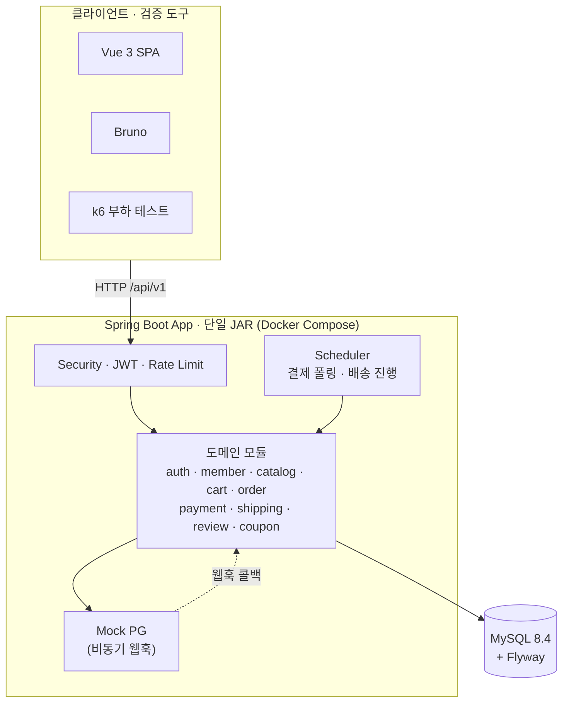
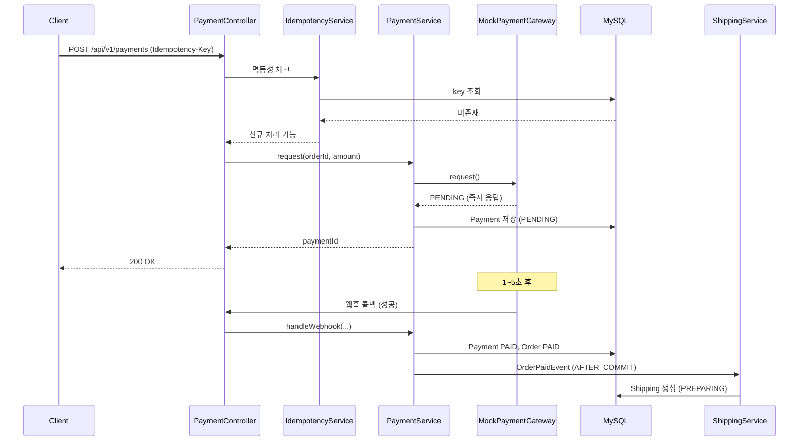
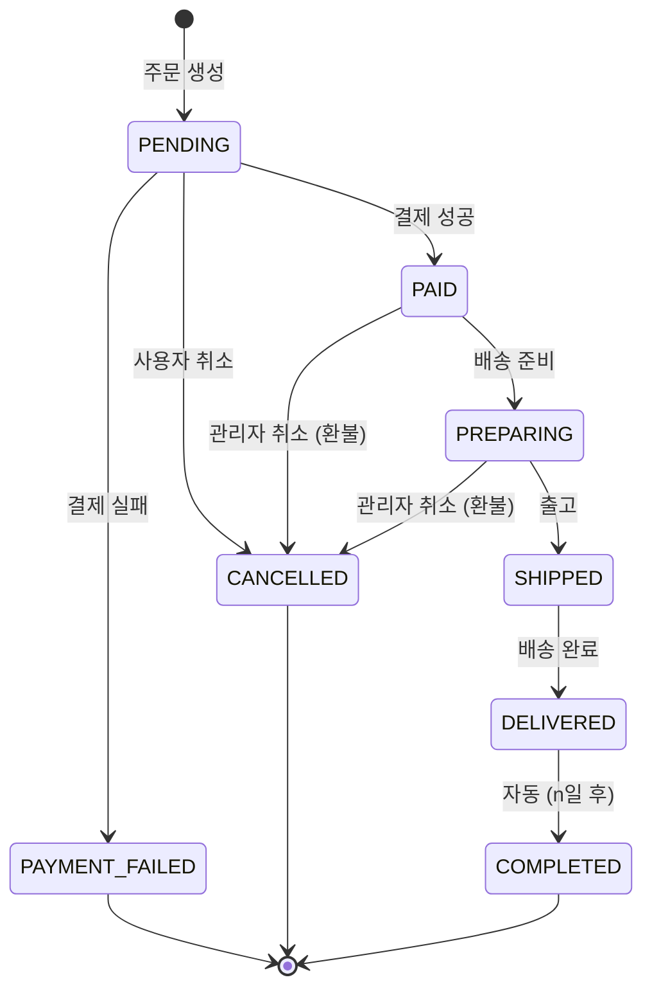
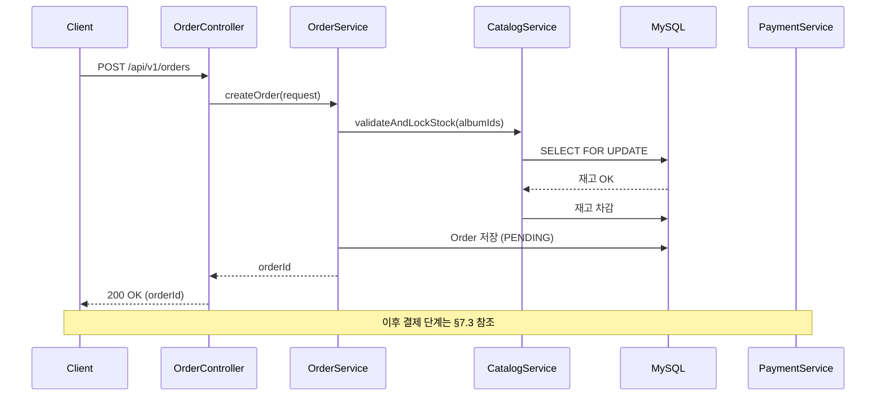

# 아키텍처 문서: Groove (LP 전문 이커머스 백엔드)

| 항목 | 값 |
|---|---|
| 버전 | 2.1 |
| 작성일 | 2026-05-05 |
| 최종 수정일 | 2026-06-12 |
| 변경 내용 | v2.1 (W12 문서화): §12 "알려진 한계 및 의도적 트레이드오프" 신설 — 코드 주석에 흩어진 의도적 한계 5종(재고 복원 last-write-wins·스케줄러 단일 인스턴스·rate-limit 인메모리·멱등성 409·Redis 미도입)과 각 도입 트리거를 한곳에 정리, 기존 §10.5·§11·§14와 상호 참조로 중복 제거. 이후 섹션 번호 +1(테스트 §13·컨벤션 §14·미해결 §15) (#226). v2.0 (W6~W7 + 확장 M13 쿠폰 + M14/M15 프론트 반영 — 전면 현행화): §4.1 패키지 구조를 현재 구현 기준으로 갱신(cart/order/payment/shipping/review/admin 구현 완료 + `coupon` 모듈 + `web`(SpaForwardConfig)·`common/scheduling` 추가), `backend/`(Spring Boot) + `frontend/`(Vue3) 형제 구조·node-gradle 통합 빌드 명시. ADR-11(쿠폰 선착순=원자적 조건부 UPDATE)·ADR-12(Vue3 SPA + node-gradle)·ADR-13(Caffeine rate-limit 저장) 추가. §5.5 쿠폰 발급 rate-limit·§5.7 쿠폰 발급 동시성 신설, §6.2 실제 이벤트(`OrderPaidEvent`·`MemberWithdrawnEvent`)로 정정, §10 프론트 빌드·프로파일(`.yaml`) 현행화. v1.2 (W5 완료 반영): catalog 4개 서브도메인 구현 완료 표기, AlbumQueryController + AlbumSpecs 동적 검색, 의도적 N+1 보존 정책(W10 시연용) 명시. v1.1 (W4 완료 반영): 패키지 내부 레이어 명을 실제 구현(`api/application/domain`) 기준으로 정정. |
| 관련 문서 | PRD.md, ERD.md, API.md, glossary.md, MILESTONE.md |

---

## 1. 아키텍처 목표

본 프로젝트의 아키텍처는 다음 우선순위로 설계된다:

1. **단순성** — 12주 단독 진행에 적합한 단일 모듈, 단일 인스턴스 구조
2. **측정 가능성** — 부하 테스트로 발견된 문제를 식별·개선할 수 있는 명확한 경계
3. **확장 가능성 (조건부)** — 측정 후 도구 도입이 필요해질 때 최소 변경으로 도입할 수 있는 인터페이스 분리
4. **도메인 응집도** — 도메인 중심 패키지로 비즈니스 로직 응집

### 비목표
- 분산 시스템 (단일 인스턴스 가정)
- 마이크로서비스
- 헥사고날/클린 아키텍처 풀 적용 (학습 비용 대비 시연 효과 낮음)

---

## 2. 아키텍처 결정 사항 (ADR 요약)

| 번호 | 결정 | 근거 | 대안 |
|---|---|---|---|
| ADR-1 | 단일 Gradle 모듈 | 12주 일정, 멀티 모듈 분리 비용 큼 | 멀티 모듈 (api / domain / infra) |
| ADR-2 | 도메인 중심 패키지 구조 | 응집도, 면접 설명 용이 | 레이어드 |
| ADR-3 | API URI 버저닝 (`/api/v1/...`) | 변경 시 라우팅 명확 | 헤더 / 없음 |
| ADR-4 | RFC 7807 ProblemDetail | Spring 6+ 표준, 클라이언트 호환성 | 자체 ErrorResponse |
| ADR-5 | JWT (Access + Refresh Rotation) | 무상태, 확장 용이 | 세션 기반 |
| ADR-6 | Spring Application Event (v1) | 외부 의존 없이 도메인 분리 | Kafka / Redis Stream (조건부 후보) |
| ADR-7 | 결제 PG: Strategy 패턴 + Mock | 확장 포인트 확보 | 직접 호출 |
| ADR-8 | 트랜잭션 경계: Service 레이어 | 표준 관례, 명확 | 도메인 레이어 |
| ADR-9 | DB 마이그레이션: Flyway | 스키마 버저닝 표준 | Liquibase / 수동 |
| ADR-10 | 동시성(재고): 비관적 락 (v1) | 단순·확실, 시연 단계적 개선 시작점 | 낙관적 락 / Redis 분산락 (조건부) |
| ADR-11 | 동시성(쿠폰 발급): 원자적 조건부 UPDATE | 핫 카운터(`issued_count`)를 행 락 길게 잡지 않고 처리 — 비관적 락 대비 처리량 우위. 베이스라인→비관적 락→원자적 UPDATE 단계적 시연 ([decisions/coupon-concurrency.md](./decisions/coupon-concurrency.md)) | 비관적 락 / Redis 카운터 (조건부) |
| ADR-12 | 프론트엔드: Vue3 SPA + node-gradle 통합 빌드 | 백엔드 시연용 단일 산출물(JAR)로 정적 서빙, `backend/`·`frontend/` 형제 구조 | 별도 배포 / 서버사이드 템플릿 |
| ADR-13 | Rate Limit 저장: Caffeine(in-memory) | 단일 인스턴스에서 외부 의존 없이 버킷 보관·만료 | Redis (멀티 인스턴스 시 전환) |

---

## 3. 시스템 컨텍스트

### 3.1 외부 시스템
**없음.** 모든 외부 의존(PG, 메일, 운송장)은 내부 모킹 컴포넌트로 처리한다. 단, Mock PG는 "외부 시스템처럼 동작"하도록 설계한다 (비동기 콜백, 지연 시뮬레이션 포함).

### 3.2 액터
- **USER** — 인증된 회원
- **GUEST** — 비회원 (주문 가능)
- **ADMIN** — 관리자
- **(시스템) Scheduler** — 배송 상태 자동 진행, 결제 폴링

### 3.3 시스템 구성도



**조건부 확장** (측정 후 트리거 발생 시):
- Redis (캐시 / 분산락 / Refresh Token)
- Prometheus + Grafana
- Kafka 또는 Redis Stream

---

## 4. 애플리케이션 내부 구조

### 4.1 패키지 구조

**저장소 레이아웃**: 루트 아래 `backend/`(Spring Boot, 본 문서 대상)와 `frontend/`(Vue3 SPA, M15)가 형제로 배치된다. `backend/build.gradle.kts` 가 node-gradle 로 프론트를 빌드해 `backend/src/main/resources/static` 으로 묶어 단일 JAR 산출물을 만든다(§10.4).

도메인 중심 + 도메인 내 `api / application / domain` 3-레이어 구조. (Controller/Service/Repository 의 역할명을 그대로 유지하되 디렉토리는 책임 단위로 명명)

```
backend/src/main/java/com.groove
├── GrooveApplication.java
│
├── auth/                       (인증/인가) — 구현 완료
│   ├── api/                    (AuthController + dto/)
│   ├── application/            (AuthService, RefreshTokenService, RefreshTokenCleanupOnMemberWithdrawnListener)
│   ├── domain/                 (RefreshToken, RefreshTokenRepository, TokenHasher)
│   └── security/               (SecurityConfig, JwtProvider/Filter/Claims/Properties, ratelimit/: Login·SignupRateLimitPolicy)
│
├── member/                     (회원) — 구현 완료
│   ├── api/, application/, domain/  (Member, MemberRole)
│   ├── event/                  (MemberWithdrawnEvent)
│   └── exception/
│
├── catalog/                    (LP 카탈로그) — 구현 완료
│   ├── album/                  (AlbumAdminController·AlbumQueryController, AlbumSpecs(JPA Specification), AlbumStatus·AlbumFormat)
│   ├── artist/ · genre/ · label/   (각 api/·application/·domain/·exception/)
│   │
│   │   ※ 의도적 N+1 보존 (W10 시연 자료): AlbumSpecs.keyword() 는 artist 와 LEFT JOIN 만 사용(fetch 조인 없음).
│   │     변환 단계에서 lazy proxy 가 풀리며 N+1 발생. ERD §5 [W10] 인덱스 누락도 함께 보존.
│
├── cart/                       (장바구니) — 구현 완료
│   └── application/            (CartService, CartCleanupOnMemberWithdrawnListener)
│
├── order/                      (주문) — 구현 완료
│   ├── api/                    (OrderController, MemberOrderController)
│   ├── application/, domain/   (Order, OrderItem, OrderStatus)
│   └── event/                  (OrderPaidEvent, OrderPaidEventListener)
│
├── payment/                    (결제) — 구현 완료
│   ├── api/, application/      (PaymentService, Idempotency 연동, PaymentReconciliationScheduler)
│   ├── domain/                 (Payment, PaymentStatus, PaymentMethod)
│   └── gateway/                (PaymentGateway 인터페이스 + mock/: MockPaymentGateway)
│
├── shipping/                   (배송) — 구현 완료
│   └── application/            (ShippingCreationListener(OrderPaidEvent 구독), ShippingProgressScheduler)
│
├── review/                     (리뷰) — 구현 완료
│
├── coupon/                     (쿠폰 — 확장 M13) — 구현 완료
│   ├── api/                    (CouponController, MyCouponController + dto/, ratelimit/: CouponIssueRateLimitPolicy)
│   ├── application/            (CouponIssueService(원자적 발급), CouponApplicationService(주문 적용/복원), MemberCouponExpirationTask)
│   ├── domain/                 (Coupon, MemberCoupon, *Repository, CouponDiscountType·CouponStatus·MemberCouponStatus)
│   └── exception/
│
├── admin/                      (관리자 전용 API 묶음) — 구현 완료
│   └── api/                    (AdminOrderController, AdminCouponController + dto/)
│
├── web/                        (SPA 정적 라우팅) — SpaForwardConfig, SpaRoutes (History 라우팅 forward)
│
└── common/                     (횡단 관심사) — 구현 완료
    ├── exception/              (GlobalExceptionHandler, BusinessException 계층, ErrorCode, ProblemDetailEnricher)
    ├── logging/                (MDC 필터, 비즈니스 이벤트 로거)
    ├── persistence/            (공용 JPA 설정·기반)
    ├── idempotency/            (IdempotencyService, IdempotencyRecord, @Idempotent, web/ 인터셉터)
    ├── scheduling/             (SchedulingConfig — @EnableScheduling 단일 진입)
    └── ratelimit/              (RateLimitFilter, RateLimitRegistry(Caffeine), 정책 인터페이스)
```

> 도메인별 layout 은 `api / application / domain` 3-레이어로 통일하되, 횡단 보조(`security`, `exception`, `ratelimit`)가 필요한 도메인은 같은 레벨에 추가한다. 이 명명은 W3~W4 구현 시 합의되었으며, 이전 controller/service/repository 명명에서 디렉토리 이름만 정리한 것으로 책임은 동일하다.

### 4.2 레이어 책임

| 레이어 | 책임 | 의존 방향 |
|---|---|---|
| `api` | HTTP 요청/응답, 입력 검증 (`@Valid`), DTO ↔ Application 변환 | → Application |
| `application` | 비즈니스 로직, 트랜잭션 경계, Command·Result 객체, 도메인 호출 | → Domain |
| `domain` | 엔티티·값 객체·Repository 인터페이스·도메인 로직 (상태 전이, 해시 등) | (내부 완결) |
| `security` (도메인 횡단 보조) | 인증·인가·정책 (필터·핸들러·정책 빈) | → Domain·Application |
| `dto` (api 하위) | API 입출력 데이터 구조 (record) | api 레이어 내부에서만 |

### 4.3 의존성 규칙
1. **도메인 객체는 Controller에 노출하지 않는다.** Service에서 DTO로 변환 후 반환한다.
2. **도메인 간 의존은 Service 레이어를 통해서만.** 다른 도메인의 Repository 직접 호출 금지.
3. 다른 도메인 데이터가 필요하면 해당 도메인의 Service를 주입받아 호출한다.
4. `common` 패키지는 모든 도메인에서 참조 가능. 반대 방향(common → 도메인) 금지.

---

## 5. 횡단 관심사

### 5.1 인증/인가 (Spring Security)

요청 처리 필터 체인:

```
[요청]
   │
   ▼
[CorsFilter]
   │
   ▼
[RateLimitFilter]            ← 로그인/회원가입/결제 IP 또는 회원 기준 제한
   │
   ▼
[MdcFilter]                  ← X-Request-Id 발급/추출, MDC 주입
   │
   ▼
[JwtAuthenticationFilter]    ← Access Token 검증, SecurityContext 주입
   │
   ▼
[SecurityFilterChain]        ← URL 패턴별 권한 체크
   │
   ▼
[Controller]
```

**엔드포인트별 권한 정책:**
- `permitAll`: 회원가입, 로그인, 토큰 갱신, 상품 조회, 게스트 주문
- `authenticated`: 장바구니, 회원 주문, 리뷰 작성
- `hasRole("ADMIN")`: `/api/v1/admin/**`

**Refresh Token Rotation 흐름:**
1. 클라이언트 → `/api/v1/auth/refresh` (refreshToken 포함)
2. 서버가 토큰 조회 → 유효성 검증
3. **이미 사용·폐기된 토큰**이면 → 해당 사용자의 모든 토큰 무효화 (탈취 의심으로 간주)
4. 정상이면 → 기존 토큰 폐기 + 새 access/refresh 발급
5. 응답 반환

### 5.2 트랜잭션 관리

- Service 메서드에 `@Transactional` 명시
- 읽기 전용은 `@Transactional(readOnly = true)` (Hibernate 1차 캐시 dirty check 생략)
- 전파(Propagation) 기본 `REQUIRED`. 보상 트랜잭션처럼 분리가 필요한 경우만 `REQUIRES_NEW`
- **재고 차감 등 정합성 민감 영역**:
  - v1 기본: 비관적 락 (`SELECT ... FOR UPDATE`)
  - 단계 (a) 시연: 락 없이 단순 차감 → 오버셀 재현 (의도적 문제 노출)
  - 단계 (b) 시연: 비관적 락 적용 → 정합성 보장, TPS 측정
  - 단계 (c) 조건부: 낙관적 락 또는 Redis 분산락 비교 (시간 여유 시)

### 5.3 에러 처리 (RFC 7807 ProblemDetail)

`@RestControllerAdvice`로 통합 처리. 모든 에러 응답은 `application/problem+json`.

응답 예시:
```json
{
  "type": "https://groove.example/errors/insufficient-stock",
  "title": "재고가 부족합니다",
  "status": 409,
  "detail": "Album ID 123의 재고 부족. 요청 5, 가능 2",
  "instance": "/api/v1/orders",
  "code": "ORDER_INSUFFICIENT_STOCK",
  "timestamp": "2026-05-05T14:23:00Z",
  "traceId": "9f1c..."
}
```

도메인 예외 계층:
```
RuntimeException
  └── BusinessException (추상)
        ├── AuthException
        ├── ValidationException
        ├── DomainException
        └── ExternalException
```

각 예외는 HTTP 상태 코드 + `code` 매핑을 보유한다.

### 5.4 로깅
- Logback + SLF4J
- MDC 키: `requestId`, `userId` (인증 시), `path`, `method`
- 로그 패턴: `%d{ISO8601} %-5level [%X{requestId}] [%X{userId:-anonymous}] %logger{36} - %msg%n`
- 비즈니스 이벤트 표준 포맷 (검색·집계 용이): `BIZ_EVENT type=ORDER_CREATED orderId=... memberId=... amount=...`

### 5.5 Rate Limiting
- 라이브러리: Bucket4j + Caffeine 저장(`common.ratelimit.RateLimitRegistry` — 버킷 보관·만료, in-memory v1)
- 정책은 각 도메인이 빈으로 등록(`common.ratelimit` 의 정책 인터페이스 구현):
  - 로그인 / 회원가입: IP당 (`auth.security.ratelimit`)
  - 결제 요청: 회원당
  - **쿠폰 발급**(`POST /coupons/{id}/issue`): 회원당 (`coupon.api.ratelimit.CouponIssueRateLimitPolicy` — 선착순 폭주 시 1인 반복요청 억제)
- v2: Redis 기반 분산 Rate Limit (Bucket4j-Redis)으로 전환 가능

### 5.6 멱등성 처리 (Idempotency-Key)
- 결제·쿠폰 발급 요청에 `Idempotency-Key` 헤더 필수 (`@Idempotent` 적용)
- 처리 컴포넌트: `common.idempotency.IdempotencyService` (도메인 공용 — 결제·쿠폰이 재사용)
- 저장: `idempotency_record` 테이블 (key + result_snapshot 매핑)
- 동작:
  1. 요청 도착 → key 조회
  2. 존재 + 처리 완료 → 기존 결과 반환 (200)
  3. 존재 + 처리 중 → `409 Conflict`
  4. 미존재 → 락 획득 후 처리 → 결과 저장 후 반환
- 적용 지점: 결제(`POST /payments`)·쿠폰 발급(`POST /coupons/{id}/issue`) — 둘 다 `@Idempotent`(`common.idempotency`)

### 5.7 쿠폰 선착순 발급 동시성 (확장 M13)
한정수량 쿠폰의 `coupon.issued_count` 는 다수 트랜잭션이 동시에 갱신하는 **핫 카운터**다. 재고 오버셀과 동형 문제이며, 단계적으로 시연한다(ADR-11, [decisions/coupon-concurrency.md](./decisions/coupon-concurrency.md)).

1. **베이스라인**(락 없음): lost-update 로 초과발급 재현 (Before)
2. **비관적 락**: 정확하지만 행 락을 길게 잡아 처리량 저하
3. **원자적 조건부 UPDATE**(최종 채택): `UPDATE coupon SET issued_count = issued_count + 1 WHERE id = ? AND (total_quantity IS NULL OR issued_count < total_quantity)` — 영향 행 수 1이면 발급 성공, 0이면 소진(409). 행 락을 짧게 잡아 처리량 우위.

- **회원당 1장**: `member_coupon` `UNIQUE(coupon_id, member_id)` 가 DB 레벨 강제 — 동시 중복요청은 409 `COUPON_ALREADY_ISSUED`.
- **발급 멱등성**: `@Idempotent`(§5.6) 로 재시도 시 같은 결과 replay.
- **발급 rate-limit**: §5.5.
- k6 부하·3종 Before/After 측정: [troubleshooting/coupon-issuance-concurrency.md](./troubleshooting/coupon-issuance-concurrency.md).

---

## 6. 도메인 간 통신

### 6.1 원칙
- **동기 + 즉시 정합성 필요** → Service 직접 호출
- **비동기 + 결과 정합성 허용** → Application Event

### 6.2 Application Event 사용 케이스

| 이벤트 | 발행자 | 구독자 | 비고 |
|---|---|---|---|
| `OrderPaidEvent` | 결제 완료 처리 | `OrderPaidEventListener`(order), `ShippingCreationListener`(shipping — 배송·운송장 생성) | 결제 완료(AFTER_COMMIT) → 배송 엔트리·운송장 생성(`orders.tracking_number` 비정규화) |
| `MemberWithdrawnEvent` | MemberService(탈퇴) | `RefreshTokenCleanupOnMemberWithdrawnListener`(auth), `CartCleanupOnMemberWithdrawnListener`(cart) | 탈퇴(AFTER_COMMIT) → 리프레시 토큰·장바구니 정리 |

> 주문 취소/환불 시 **재고·쿠폰(MemberCoupon USED→ISSUED) 복원**은 이벤트가 아니라 Service 트랜잭션 내 동기 처리(즉시 정합성). 비동기 이벤트는 결과 정합성을 허용하는 배송 생성·탈퇴 정리에만 쓴다(§6.1).

### 6.3 트랜잭션과 이벤트
- `@TransactionalEventListener(phase = AFTER_COMMIT)` 사용
- 이유: 주문 트랜잭션 롤백 시 배송이 잘못 생성되는 것 방지
- **트레이드오프 (README에 기록)**: 이벤트 발행 후 구독자 처리 실패 시 정합성 깨질 수 있음 → v2에서 Outbox 패턴 도입 후보

---

## 7. 결제 모듈 상세 설계

### 7.1 Strategy 패턴 인터페이스

```java
public interface PaymentGateway {
    PaymentResponse request(PaymentRequest request);
    PaymentStatus query(String pgTransactionId);
    RefundResponse refund(RefundRequest request);
}

@Component
@Profile({"local", "dev", "test", "docker"})
public class MockPaymentGateway implements PaymentGateway { ... }
```

실 PG 도입 시 `@Profile("prod")` 구현체만 추가하면 끝.

### 7.2 Mock 설정 파라미터
- `payment.mock.success-rate=0.95`
- `payment.mock.delay-min-ms=100`
- `payment.mock.delay-max-ms=500`
- `payment.mock.webhook-delay-min-sec=1`
- `payment.mock.webhook-delay-max-sec=5`

### 7.3 결제 처리 시퀀스



### 7.4 실패 / 보상 흐름
- **PG 응답 실패 시**: Payment FAILED 저장 → OrderService 호출 → Order PAYMENT_FAILED 전환 → 재고 복원 (단일 트랜잭션 내)
- **웹훅 미수신 시**: 별도 스케줄러가 PENDING 상태 결제를 N분마다 폴링하여 PG `query()` 호출 → 결과 동기화

---

## 8. 주문 상태 머신



구현:
- `OrderStatus` enum + `canTransitionTo(OrderStatus next)` 메서드
- 전이 위반 시 `IllegalStateTransitionException` 발생 (BusinessException 상속)
- 모든 상태 변경은 `Order.changeStatus(next)`를 통해 일원화

---

## 9. 데이터 흐름 — 주문 생성 시퀀스



---

## 10. 배포 아키텍처

### 10.1 Docker Compose 구성

```yaml
services:
  app:
    image: groove-app
    depends_on: [mysql]
    environment:
      - SPRING_PROFILES_ACTIVE=docker
      - DB_HOST=mysql
      - JWT_SECRET=${JWT_SECRET}
    ports: ["8080:8080"]

  mysql:
    image: mysql:8
    environment:
      - MYSQL_DATABASE=groove
      - MYSQL_ROOT_PASSWORD=${DB_PASSWORD}
    ports: ["3306:3306"]
    volumes: [mysql-data:/var/lib/mysql]

volumes:
  mysql-data:
```

### 10.2 Spring Profiles

설정 파일은 `backend/src/main/resources/application*.yaml` (base `application.yaml` + 프로파일별). 운영(prod) 프로파일은 두지 않는다(시연용 — 폴백 제거).

| Profile | 용도 | 특징 |
|---|---|---|
| local | 로컬 개발 | 로컬 MySQL, Mock PG 활성, 데모 시드 계정 |
| docker | Docker Compose | MySQL 컨테이너 연결, Mock PG 활성 |
| test | 통합 테스트 | Testcontainers MySQL, 시간 가속(스케줄러) |

### 10.3 환경 변수 (`.env`)
- `DB_PASSWORD`
- `JWT_SECRET`
- `JWT_ACCESS_TTL_MINUTES`
- `JWT_REFRESH_TTL_DAYS`
- `PAYMENT_MOCK_SUCCESS_RATE`

→ 저장소 미포함, `.env.example`만 커밋

> **시크릿 fail-fast (#165)**: `JWT_SECRET`·`PAYMENT_MOCK_WEBHOOK_SECRET` 은 `.env.example` 의 플레이스홀더(`change-this-*`) 또는 `change-this`/`change-me`/`changeme` 마커를 포함하면 `SecretPlaceholderGuard` 가 기동을 거부한다. 길이 검증만으로는 49바이트 플레이스홀더의 복붙 배포(관리자 JWT 위조)를 막지 못해 값 블랙리스트를 추가했다. local/test 더미값(`local-dev-*`/`test-*`)은 영향 없음.

### 10.4 빌드 (Gradle + 프론트 통합)

- 빌드 스크립트: `backend/build.gradle.kts` (Kotlin DSL), Java 21 toolchain, Spring Boot.
- 프론트 통합: `com.github.node-gradle.node` 플러그인이 `frontend/`(Vue3 + Vite)를 빌드해 산출물을 `backend/src/main/resources/static` 으로 묶는다 → **단일 실행 JAR** 로 SPA 정적 서빙.
- SPA History 라우팅: `com.groove.web.SpaForwardConfig`(`SpaRoutes`)가 비정적·비 API 경로를 `index.html` 로 forward.
- 명령:
  - `./gradlew build` — 백+프론트 함께 빌드
  - `./gradlew build -PskipFrontend` — 백엔드만(빠른 빌드)
  - `./gradlew bootRun` — 로컬 실행(local 프로파일)
- 품질 게이트: JaCoCo 라인 커버리지 80% (`auth`/`member`/`catalog`/`coupon`), CI(`.github/workflows/ci.yml`)에서 Testcontainers 로 검증([plans/ci-pipeline.md](./plans/ci-pipeline.md)).

### 10.5 수평 확장 제약 (Rate Limit) — #164

현 배포는 **단일 인스턴스를 전제**한다(§1 비목표: 분산 시스템). Rate Limit 버킷은 인스턴스 로컬 Caffeine 캐시에 저장되므로(ADR-13, `common.ratelimit.RateLimitRegistry`), 로드밸런서 뒤에 N대를 두고 수평 확장하면 인스턴스마다 독립 버킷을 유지하여 **동일 IP/회원의 실효 한도가 N배**가 된다. 그 결과 로그인 무차별 대입·계정 열거(signup)·비밀번호 변경·쿠폰 사재기 억제력이 인스턴스 수에 비례해 약화된다(단일 인스턴스 배포면 무해).

따라서 **수평 확장(예: `docker-compose` `deploy.replicas` 증설) 시에는 분산 버킷(Bucket4j 분산 백엔드 — `Bucket4jLettuce`/`LettuceBasedProxyManager`, CAS 기반)으로 전환하거나 게이트웨이/WAF 계층 rate limit 으로 이관하는 것이 필수**다. 도입 트리거·위치는 §11.1·§11.3 참조. 이 제약은 §12에 정리한 알려진 한계 #3의 상세 다룸이다.

---

## 11. 확장 포인트 (조건부 도입)

각 확장 포인트는 "지금 무엇을 의도적으로 안 했는가"의 이면이다 — 대응하는 **현재 한계와 도입 판단 기준**은 §12에 한곳으로 정리했다.

### 11.1 Redis 도입 트리거 및 위치

| 트리거 (측정 결과) | Redis 적용 영역 |
|---|---|
| Refresh Token DB 부하 증가 | `RefreshTokenRepository` → Redis 기반 구현 교체 |
| 인기 상품 조회 응답 지연 | `CatalogService`에 Cache-Aside 적용 |
| 한정반 동시성 시연 강화 | `InventoryService`에 Redisson 분산락 |
| Rate Limit 분산 환경 | Bucket4j-Redis로 전환 |

### 11.2 메시지 큐 도입 트리거

| 트리거 | 적용 영역 |
|---|---|
| 배송 생성 비동기 부하 측정 시 | `OrderPaidEvent` → 외부 큐로 이전 |
| 알림 발송 도입 시 | 별도 Notification 토픽 |

### 11.3 멀티 인스턴스 도입 시 고려사항
- Refresh Token: Redis 또는 DB 공유 (이미 DB 기반이라 영향 적음)
- Rate Limit: 반드시 Redis 기반 필요
- 스케줄러 중복 실행: Quartz 클러스터 모드 또는 ShedLock 도입
- 세션: Stateless JWT 사용으로 영향 없음

---

## 12. 알려진 한계 및 의도적 트레이드오프

아래 항목들은 **누락이 아니라 범위 결정**이다. §1의 우선순위(단순성 · 측정 가능성 · 조건부 확장)와 비목표(분산 시스템 · 단일 인스턴스 가정)의 직접적 귀결로, **정합성(안전성)은 유지하면서 확장·운영 강화만 "측정된 필요"가 생길 때까지 의도적으로 유보**했다. 각 한계는 코드 주석에 근거가 남아 있고, 도입 트리거와 도입 시 위치(§10.5·§11)를 함께 명시한다.

| # | 한계 | 근거 (코드) | 의도적 선택 / 도입 트리거 |
|---|------|-------------|---------------------------|
| 1 | ~~재고 **복원 경로** 비관락 미적용 — last-write-wins~~ → **해소(#234)** | `catalog/album/domain/AlbumRepository.java#restoreStock` · `order/application/OrderService.java` javadoc | place(#205 비관락)에 더해 복원 경로(취소·환불·결제실패·반품)는 **원자적 가산 UPDATE**(`stock=stock+:delta`), admin 단건 조정은 **대칭 비관락**(`findByIdForUpdate` 재사용)으로 place↔복원 lost-update 창을 제거. 트레이드오프(비관 vs 낙관 vs 원자적) → §12 보충 / `concurrency.md §7` |
| 2 | 스케줄러 **단일 인스턴스 가정** — 분산락 없음 | `common.scheduling.SchedulingConfig`(단일 `@EnableScheduling`) + `@Scheduled` 배치 6종 | 단일 인스턴스 배포 전제(§1 비목표). 다중화 시 **ShedLock**(`@EnableSchedulerLock` + `JdbcTemplateLockProvider`)로 각 배치를 노드 간 1회 실행 보장 → §11.3 |
| 3 | rate-limit **인메모리** Caffeine — 단일 인스턴스 | `common/ratelimit/RateLimitRegistry.java` "수평 확장 제약(#164)" javadoc | 단일 인스턴스면 무해. 다중화 시 실효 한도 N배 → Bucket4j 분산 백엔드 또는 게이트웨이/WAF로 이관 → **상세 §10.5**, 위치 §11.1 |
| 4 | 멱등성 **재시도 소진 시 409** — 응답 유실 가능 | `common/idempotency/IdempotencyService.java` "알려진 한계" javadoc | action 커밋 후 완료갱신 트랜잭션이 실패하면 키가 `IN_PROGRESS`로 남아 `ttl + in-progress-grace` 동안 409 → `IdempotencyRecordCleanupTask`가 회수. **부수효과는 이미 반영 → 같은 키 재시도 금지(새 키 사용)**. TTL/grace 상수 조정 또는 분산 합의로 강화 |
| 5 | **Redis/캐싱 미도입** | Redis 의존성·`@Cacheable`/`@EnableCaching` 부재, #210(분산락 비교) 컷(NOT_PLANNED) | 단일 인스턴스 + MySQL 비관락(#205)으로 oversell 0·목표 TPS 달성 → 한계 효용 낮고 운영 복잡도가 범위 초과. 카탈로그 read 부하 실측 시 도입 → **트리거·위치 §11.1** |

**보충**

- **#1 (재고 복원, 해소 #234):** 핫경로(동시 주문)의 oversell 는 비관락(#205)으로, **복원 경로의 lost-update 는 #234** 로 닫았다. 복원 경로(취소·환불·결제실패 보상·반품 재입고)는 **원자적 가산 UPDATE**(`AlbumRepository.restoreStock` — `UPDATE album SET stock=stock+:delta WHERE id=:id`, 쿠폰 #90 패턴 재사용)로 둔다 — DB 가 행 X-락 안에서 상대 증분을 적용해 place(`FOR UPDATE`)·동시 복원과 직렬화되므로 lost-update 창이 사라진다. admin 단건 재고조정(`AlbumService.adjustStock`, delta 음수 가능)은 갱신값을 응답에 써야 하고 음수 가드를 `Album.adjustStock` 한 곳에 유지하려 **대칭 비관락**(`findByIdForUpdate` 재사용)을 택했다. **비관 vs 낙관(`@Version`) vs 원자적 UPDATE** 트레이드오프와 Before/After(JUnit `StockRestoreConcurrencyTest` · k6 `loadtest/stock-restore.js`)는 `docs/improvements/concurrency.md §7`. 락 미적용 baseline 은 `placeWithoutLock` + `@Disabled` 복원 baseline 으로 보존된다.
- **#2 (스케줄러):** 만료·정리·reconciliation·진행·익명화 배치 6종(`MemberCouponExpirationTask`·`IdempotencyRecordCleanupTask`·`PaymentReconciliationScheduler`·`ShippingReconciliationScheduler`·`ShippingProgressScheduler`·`OrderPiiAnonymizationScheduler`)이 모두 `common.scheduling.SchedulingConfig` 의 단일 `@EnableScheduling` 으로 구동된다 — 노드가 하나면 중복 실행이 없다. 다중 인스턴스로 가면 각 배치가 노드마다 동시에 돌므로, ShedLock 의 `@EnableSchedulerLock` + `JdbcTemplateLockProvider` 로 락을 **기존 MySQL 에 두면**(새 인프라 불필요) "노드 간 최대 1회"가 보장된다. reconciliation·익명화는 멱등(중복 방어 `existsBy…`·`uk_…`)이라 안전망이 한 번 더 겹친다.
- **#4 (멱등성 409):** `execute(key, …, action)` 은 같은 키를 정확히 한 번 실행하고 결과를 캐싱하지만, "action 커밋 → 마커 COMPLETED 커밋" 사이에 후자가 실패하면 마커가 `IN_PROGRESS` 로 남는다. 이 구간의 같은-키 요청은 409이며, 이는 **이중 실행을 막기 위한 의도된 보수적 동작**이다 — action 부수효과는 이미 반영됐으므로 호출자는 같은 키로 재시도하지 말고 새 `Idempotency-Key` 를 써야 한다. 잔류 마커는 `IdempotencyRecordCleanupTask` 가 `ttl + in-progress-grace` 경과 후 회수한다.

---

## 13. 테스트 아키텍처

### 13.1 테스트 피라미드

```
       ┌──────────────┐
       │ E2E (소량)   │  Bruno 컬렉션, 시드 후 수동/헤드리스 시연
       ├──────────────┤
       │ 통합 테스트  │  @SpringBootTest + Testcontainers MySQL
       │  (중심축)    │  도메인 흐름, Repository, 트랜잭션, 동시성
       ├──────────────┤
       │ 단위 테스트  │  도메인 로직 (상태 전이, 검증 규칙)
       │   (다수)     │
       └──────────────┘
```

### 13.2 통합 테스트 전략
- Testcontainers MySQL 8.4 사용 (실 환경 동일)
- `@Sql`로 시드 데이터 주입
- **동시성 테스트**: `CountDownLatch` + `ExecutorService`로 동시 요청 시뮬레이션 → 핵심 시연 포인트
- 기본은 트랜잭션 자동 롤백, 동시성 테스트는 명시적 cleanup

### 13.3 부하 테스트 (k6)
- 폴더: `loadtest/`
- 시나리오:
  - `search.js` — 상품 검색
  - `order.js` — 주문 생성
  - `flash-sale.js` — 한정반 동시 주문 (핵심 시연)
  - `payment.js` — 결제 처리 (멱등성 포함)
- 결과 출력: JSON 결과 + 비교표 (Before/After)

---

## 14. 코드 컨벤션

- 패키지명: 전 소문자, 단수형 (`order`, `payment`)
- 클래스명: PascalCase, 역할 접미사 명확 (`OrderService`, `OrderController`, `OrderRepository`)
- 인터페이스: `Impl` 접미사 사용 안 함. 구현체에 구체적 이름 사용 (`PaymentGateway` ↔ `MockPaymentGateway`)
- DTO: `Request` / `Response` 접미사 (`CreateOrderRequest`, `OrderResponse`)
- 도메인 예외: 도메인 패키지 내 `exception/` 서브패키지

---

## 15. 미해결 결정 / 향후 검토

- ~~**시드 데이터 출처**~~: **결정됨** — 카탈로그는 Discogs 덤프, 트랜잭션은 Python Faker 하이브리드([decisions/seed-data.md](./decisions/seed-data.md)). 시드 스크립트 적용은 W8.
- ~~**한정반 시연 시 Redis 도입 여부**~~: **종결** — W9 측정 결과 MySQL 비관락(#205)으로 oversell 0·목표 TPS 달성, Redis 분산락 비교(#210)는 한계 효용 낮아 컷(NOT_PLANNED). 쿠폰 핫 로우는 ADR-11 원자적 UPDATE 로 v1 해소. 상세는 §12 #5(Redis/캐싱 미도입).
- **가상 스레드(Virtual Threads) 활성화**: 통합 테스트 안정화 후 옵션으로 시도, 효과 측정 후 채택 여부 결정
