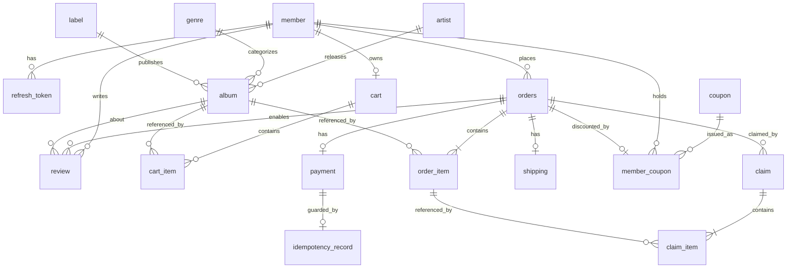

# ERD: Groove (LP 전문 이커머스 백엔드)

| 항목 | 값 |
|---|---|
| 버전 | 1.9 |
| 최초 작성일 | 2026-05-05 |
| 최종 수정일 | 2026-06-18 |
| 변경 내용 | v1.9 (V29~V30 반영 — 아웃박스 재시도 상한/DLQ): 영구 실패(poison) 이벤트가 릴레이 슬롯을 영구 점유하는 문제를 막기 위해 `outbox_event.attempt_count`(V29) 컬럼을 추가하고, 릴레이 조회를 `published_at IS NULL AND attempt_count < N`(기본 5)으로 제한해 임계값 초과 이벤트를 DLQ(격리)로 자동 제외. `idx_outbox_unpublished` 를 `(published_at, attempt_count, id)`(V30)로 재구성해 격리 행을 인덱스 레벨에서 제외(#268). §7 마이그레이션 표를 V30 까지 현행화. v1.8 (V23~V28 반영 — 클레임/아웃박스 확장): 취소(CANCEL)/반품(RETURN) 통합 클레임을 위한 `claim`(§4.17)·`claim_item`(§4.18) 테이블과 `ClaimType`(CANCEL/RETURN)·`ClaimStatus`(REQUESTED→APPROVED→IN_TRANSIT→INSPECTING→REFUNDED/REJECTED) enum 신설. 트랜잭셔널 아웃박스 `outbox_event`(§4.19, V26) 추가. `payment.refunded_amount`(V24)·`orders.returned_at`(V24) 컬럼과 `PaymentStatus.PARTIALLY_REFUNDED` 반영, `payment.pg_transaction_id` 를 `idx_payment_pg_tx` → `uk_payment_pg_tx` UNIQUE 로 승격(V28). §2 테이블 목록 15→18개, §3 ER 다이어그램에 claim 관계 추가, §6 enum·§7 마이그레이션 표를 V28 까지 현행화, §9.1 FK CASCADE·CHECK 제약 보강. v1.7 (V18~V22 반영): 회원 PII 익명화·재가입 차단 해시를 위한 `member.email_hash`(V18 CHAR(64) → V19 VARCHAR(72), #170/#186)·`uk_member_email_hash` UNIQUE, `phone` NULL 허용(탈퇴 익명화), `orders`/`shipping` 의 `anonymized_at` 마커(V18) 반영. 검색 인덱스(`artist_name` 비정규화 + FULLTEXT, V21/#204)를 §4.6 컬럼 표에 정식 편입하고, 주문/리뷰 목록 복합 인덱스(`idx_orders_member_created`·`idx_orders_status_created`·`idx_review_album_created`, V22/#225)를 "예정/후속"에서 "적용 완료"로 갱신. §7 마이그레이션 표를 V1~V22 로 현행화하고 V20(member HMAC 백필 Java 마이그레이션)을 명시. DB 표기를 실제 이미지(MySQL 8.4)에 맞춤. v1.6 (M13 쿠폰 구현 완료 반영): §4.15 `coupon`·§4.16 `member_coupon` 을 **계획 → 구현 완료**(V14/V16)로 갱신, `orders.discount_amount`(V15)·`tracking_number`(V17, 배송 운송장 비정규화) 반영. 선착순 발급 동시성은 원자적 조건부 UPDATE 로 구현([decisions/coupon-concurrency.md](./decisions/coupon-concurrency.md)). §7 마이그레이션 표를 실제 적용분(V1~V17)으로 현행화. 백엔드 소스 경로를 `backend/` 이동에 맞춰 정정. v1.5 (확장: 쿠폰 시스템 — V14/V15 계획 반영): `coupon`·`member_coupon` 2개 테이블 신설(§4.15/§4.16) — §8 v2 후보였던 `coupon`/`coupon_issue` 를 정식 도메인으로 승격. `orders` 에 `discount_amount` 컬럼 추가(주문 총액 대비 할인액, payable = total_amount − discount_amount 파생) — `applied_member_coupon_id` 대신 `member_coupon.order_id` 역참조로 순환 FK 회피. 선착순 발급 동시성은 [decisions/coupon-concurrency.md](./decisions/coupon-concurrency.md) ADR(DB 단계적: 베이스라인→비관적 락→원자적 조건부 UPDATE)에 따른다. 본 변경은 **계획 단계** — 구현/마이그레이션 적용 시점에 상태 갱신. v1.4 (W7-6 / V12 반영): `orders` 에 배송지 스냅샷 6개 컬럼 추가(주문 생성 요청 `shipping` 블록 → 결제 완료 후 `shipping` 행으로 복사). `shipping` 의 `idx_shipping_status` 를 (status, created_at) 복합으로 자동 진행 스케줄러와 함께 선반영(원래 [W10] 표기). v1.3 (W5 완료 반영): 카탈로그 4개 테이블(genre/label/artist/album)의 실제 마이그레이션(V4/V5/V6) 반영 — 컬럼 길이·NULL·CHECK·FK·기본 인덱스 명시. §4.6 album 비즈니스 룰의 `AlbumStatus.canTransitionTo()` 는 W5-3 범위 미포함이며 W6+ 도입 예정으로 표기 정정. v1.2 (W4 완료 반영): refresh_token 실제 스키마(`issued_at` 추가, `revoked` 컬럼 제거 — `revoked_at NULL` 단일 컬럼으로 표현), `idx_refresh_member_revoked` 복합 인덱스 명시, Flyway 마이그레이션 파일 계획을 실제 분리 적용 방식(V1 placeholder + V2 member + V3 refresh_token)으로 정정. v1.1 (Issue #2): W5/W10 인덱스 단계 표기 확정, [DB]/[APP] 비즈니스 룰 위치 명시, orders 상태 추적 컬럼 추가. |
| DB | MySQL 8.4 (InnoDB, utf8mb4) |
| 마이그레이션 도구 | Flyway |
| 관련 문서 | ARCHITECTURE.md |

---

## 1. 명명 / 설계 규칙

| 항목 | 규칙 |
|---|---|
| 테이블명 | snake_case, 단수형. `order`는 예약어이므로 `orders` 사용 |
| 컬럼명 | snake_case |
| PK | `id BIGINT AUTO_INCREMENT PRIMARY KEY` |
| FK | `{대상_테이블_단수}_id` (예: `member_id`, `album_id`) |
| 감사 컬럼 | 모든 테이블에 `created_at DATETIME(6)`, `updated_at DATETIME(6)` |
| 금액 타입 | `BIGINT` (원 단위 정수) |
| Enum 저장 | `VARCHAR(30)` (`EnumType.STRING`) |
| 시간 타입 | `DATETIME(6)` (마이크로초 정밀도) |
| 문자셋 | utf8mb4 / utf8mb4_unicode_ci |
| Soft delete | 기본 미사용. `member`에만 `deleted_at` 적용 |

### 인덱스 표기 규칙
- PK 외 인덱스는 `idx_{table}_{column[_column...]}` 형식
- 유니크 제약: `uk_{table}_{column[_column...]}`
- **[W5]** — 초기 마이그레이션(W4~W7)에서 적용되는 필수 인덱스
- **[W10]** — W9 슬로우 쿼리 측정 후 W10 시연 시 추가하는 성능 인덱스

### 비즈니스 룰 위치 표기
- **[DB]** — DB 제약(CHECK, UNIQUE, FK ON DELETE RESTRICT)으로 강제
- **[APP]** — 애플리케이션 서비스/도메인 레이어에서 검증
- **[DB+APP]** — DB 제약 + 애플리케이션 이중 검증

---

## 2. 테이블 목록 (전체 18개)

> 13개(W1~W7) + 쿠폰 확장 2개(`coupon`, `member_coupon`, M13 — V14) + 클레임/아웃박스 확장 3개(`claim`, `claim_item`, `outbox_event`, M16 — V23~V27). 확장 5개 모두 **구현 완료**.

| 도메인 | 테이블 | 용도 |
|---|---|---|
| 회원 | `member` | 회원 정보 |
| 인증 | `refresh_token` | Refresh Token 저장 |
| 카탈로그 | `artist` | 아티스트 |
| 카탈로그 | `genre` | 장르 |
| 카탈로그 | `label` | 음반 레이블 |
| 카탈로그 | `album` | LP 상품 |
| 장바구니 | `cart` | 회원별 장바구니 (회원당 1개) |
| 장바구니 | `cart_item` | 장바구니 항목 |
| 주문 | `orders` | 주문 |
| 주문 | `order_item` | 주문 항목 |
| 결제 | `payment` | 결제 트랜잭션 |
| 결제 | `idempotency_record` | 멱등성 키 저장 |
| 배송 | `shipping` | 배송 정보 |
| 리뷰 | `review` | 상품 리뷰 |
| 쿠폰 | `coupon` | 쿠폰 정책/캠페인 (할인 규칙 + 선착순 한정수량) |
| 쿠폰 | `member_coupon` | 회원 보유 쿠폰 (발급 인스턴스 + 사용 이력) |
| 클레임 | `claim` | 취소(CANCEL)/반품(RETURN) 통합 클레임 (M16) |
| 클레임 | `claim_item` | 클레임 항목 (취소·반품 대상 주문 항목 + 수량) |
| 이벤트 | `outbox_event` | 트랜잭셔널 아웃박스 (결제 후속 처리 at-least-once 발행) |

---

## 3. ER 다이어그램



> 쿠폰 관계: `coupon`(정책) 1건이 다수 `member_coupon`(회원 발급분)으로 발급되고, 각 `member_coupon` 은 한 회원 소유이며 사용 시 한 `orders` 에 1:0..1 로 연결된다. `orders` 가 `coupon` 을 직접 참조하지 않는 이유는 §4.16 비고 참조.

> 클레임 관계: 한 `orders` 는 0개 이상의 `claim`(취소/반품)을 가질 수 있고(거부 후 재요청 허용 — `order_id` 비유니크), 각 `claim` 은 1개 이상의 `claim_item` 으로 구성되며 각 항목은 한 `order_item` 을 참조한다. `outbox_event` 는 특정 테이블과 FK 로 묶이지 않는 독립 발행 로그라 다이어그램에서 생략한다(§4.19).

---

## 4. 테이블 상세

### 4.1 `member` — 회원

| 컬럼 | 타입 | 제약 | 설명 |
|---|---|---|---|
| id | BIGINT | PK, AUTO_INCREMENT | |
| email | VARCHAR(255) | NOT NULL, UNIQUE | 로그인 식별자 |
| email_hash | VARCHAR(72) | NOT NULL, UNIQUE | 이메일 점유 해시 — 탈퇴 익명화 후에도 재가입을 차단(V18). #186 에서 결정적 SHA-256 → 서버 키 HMAC(키버전 prefix 포함)으로 전환하며 CHAR(64) → VARCHAR(72) 로 확장(V19) |
| password | VARCHAR(255) | NOT NULL | BCrypt 해시 (cost 12) |
| name | VARCHAR(50) | NOT NULL | |
| phone | VARCHAR(20) | NULL | 숫자만 10~11자 [APP]. 가입 시 도메인 검증으로 항상 non-null, 탈퇴 익명화 시 NULL 로 비움(V18) |
| role | VARCHAR(20) | NOT NULL, DEFAULT 'USER' | enum: USER, ADMIN |
| email_verified | BOOLEAN | NOT NULL, DEFAULT FALSE | 이메일 인증 여부 |
| deleted_at | DATETIME(6) | NULL | 탈퇴 시각 (soft delete) |
| created_at | DATETIME(6) | NOT NULL | |
| updated_at | DATETIME(6) | NOT NULL | |

**인덱스**

[W5]:
- `uk_member_email` UNIQUE (email)
- `idx_member_role` (role) — ADMIN 필터링용

[V18]:
- `uk_member_email_hash` UNIQUE (email_hash) — 탈퇴 익명화 후 재가입 차단(평문 email 은 마스킹되지만 해시는 점유 유지)

[W10] 추가 후보 없음.

**비즈니스 룰**

| 규칙 | 위치 | 비고 |
|---|---|---|
| email 중복 불가 | [DB] | uk_member_email UNIQUE |
| 비밀번호 BCrypt 해시 저장 (cost 12) | [APP] | 평문 저장 금지, @Bean PasswordEncoder |
| 탈퇴는 soft delete만 허용 (물리 삭제 없음) | [APP] | deleted_at 설정 후 저장 |
| 탈퇴 즉시 PII 익명화 (email 마스킹·name·phone 비움) | [APP] | Member.anonymize() — email_hash 는 보존해 재가입 차단(#170) |

---

### 4.2 `refresh_token` — 리프레시 토큰

| 컬럼 | 타입 | 제약 | 설명 |
|---|---|---|---|
| id | BIGINT | PK, AUTO_INCREMENT | |
| member_id | BIGINT | NOT NULL, FK → member.id | |
| token_hash | CHAR(64) | NOT NULL, UNIQUE | 토큰 평문이 아닌 SHA-256 hex 64자 |
| issued_at | DATETIME(6) | NOT NULL | 발급 시각 |
| expires_at | DATETIME(6) | NOT NULL | |
| revoked_at | DATETIME(6) | NULL | NULL = 활성, NOT NULL = 폐기됨 (별도 boolean 미사용) |
| replaced_by_token_id | BIGINT | NULL, FK → refresh_token.id ON DELETE SET NULL | Rotation 시 다음 토큰 ID (탈취 추적용 self-FK) |
| created_at | DATETIME(6) | NOT NULL | |
| updated_at | DATETIME(6) | NOT NULL | |

**인덱스**

[W5]:
- `uk_refresh_token_hash` UNIQUE (token_hash)
- `idx_refresh_member_revoked` (member_id, revoked_at) — 회원 활성 토큰 조회·일괄 폐기용 복합 인덱스

[W10] 추가 후보 없음.

**비즈니스 룰**

| 규칙 | 위치 | 비고 |
|---|---|---|
| 토큰 해시 중복 불가 | [DB] | uk_refresh_token_hash UNIQUE |
| 토큰 평문 미저장 | [APP] | SHA-256 해시 후 저장 |
| Rotation: 기존 토큰 폐기 + 신규 발급 | [APP] | revoked_at 기록 + replaced_by_token_id 연결 |
| 탈취 감지: 폐기된 토큰 재사용 시 member 전체 토큰 무효화 | [APP] | RefreshTokenAdmin 이 별도 트랜잭션으로 일괄 revoke |

**비고**
- 토큰 평문은 절대 저장하지 않음. `TokenHasher.sha256Hex` 로 hex 64자 해시 후 저장.
- Rotation: 사용 시 기존 행에 `revoked_at` 기록 + 새 행 발급 + `replaced_by_token_id` 연결. atomic CAS(`revokeIfActive`) 0 행이면 동시 회전 race 패배로 단순 거부.
- 탈취 감지: `revoked_at IS NOT NULL` 토큰이 다시 사용되면 해당 member 의 모든 활성 토큰 무효화. 단, JWT 만료가 먼저 검출되면 전체 무효화 없이 단순 만료 응답.
- self-FK `replaced_by_token_id` 의 `ON DELETE SET NULL`: 회전 체인 행 삭제 시 후방 참조가 자동 해제되어 운영/테스트 batch 삭제 순서 의존성을 제거.

---

### 4.3 `artist` — 아티스트

| 컬럼 | 타입 | 제약 | 설명 |
|---|---|---|---|
| id | BIGINT | PK, AUTO_INCREMENT | |
| name | VARCHAR(200) | NOT NULL | |
| description | TEXT | NULL | |
| created_at | DATETIME(6) | NOT NULL | |
| updated_at | DATETIME(6) | NOT NULL | |

**인덱스**

[W5]:
- (PK만 — 동명이인 존재 가능, UNIQUE 미적용)

[W10] (슬로우 쿼리 측정 후 추가):
- `idx_artist_name` (name) — 아티스트 이름 검색용

**비즈니스 룰**

| 규칙 | 위치 | 비고 |
|---|---|---|
| 동명이인 허용 (name UNIQUE 미적용) | — | 동일 아티스트명 중복 등록 가능, ID로 식별 |

---

### 4.4 `genre` — 장르

| 컬럼 | 타입 | 제약 | 설명 |
|---|---|---|---|
| id | BIGINT | PK, AUTO_INCREMENT | |
| name | VARCHAR(50) | NOT NULL, UNIQUE | Rock, Jazz, K-Pop, ... |
| created_at | DATETIME(6) | NOT NULL | |
| updated_at | DATETIME(6) | NOT NULL | |

**인덱스**

[W5]:
- `uk_genre_name` UNIQUE (name)

[W10] 추가 후보 없음.

**비즈니스 룰**

| 규칙 | 위치 | 비고 |
|---|---|---|
| 장르명 중복 불가 | [DB] | uk_genre_name UNIQUE |

---

### 4.5 `label` — 음반 레이블

| 컬럼 | 타입 | 제약 | 설명 |
|---|---|---|---|
| id | BIGINT | PK, AUTO_INCREMENT | |
| name | VARCHAR(100) | NOT NULL, UNIQUE | |
| created_at | DATETIME(6) | NOT NULL | |
| updated_at | DATETIME(6) | NOT NULL | |

**인덱스**

[W5]:
- `uk_label_name` UNIQUE (name)

[W10] 추가 후보 없음.

**비즈니스 룰**

| 규칙 | 위치 | 비고 |
|---|---|---|
| 레이블명 중복 불가 | [DB] | uk_label_name UNIQUE |

---

### 4.6 `album` — LP 상품 ★

가장 핵심 테이블. 검색·시연이 모두 이 테이블 기준으로 이루어진다.

| 컬럼 | 타입 | 제약 | 설명 |
|---|---|---|---|
| id | BIGINT | PK, AUTO_INCREMENT | |
| title | VARCHAR(300) | NOT NULL | 앨범명 |
| artist_name | VARCHAR(200) | NOT NULL | artist.name 비정규화 (V21). FULLTEXT 검색 전용 — cross-table OR 제거용이며 API 응답엔 노출하지 않음. 동기화는 §4.6 인덱스 비고 참조 |
| artist_id | BIGINT | NOT NULL, FK → artist.id | |
| genre_id | BIGINT | NOT NULL, FK → genre.id | |
| label_id | BIGINT | NULL, FK → label.id | 레이블 정보 없는 경우 NULL |
| release_year | SMALLINT | NOT NULL | |
| format | VARCHAR(30) | NOT NULL | enum: LP_12, LP_DOUBLE, EP, SINGLE_7 |
| price | BIGINT | NOT NULL, CHECK (price >= 0) | 원 단위 |
| stock | INT | NOT NULL, DEFAULT 0, CHECK (stock >= 0) | |
| status | VARCHAR(20) | NOT NULL, DEFAULT 'SELLING' | enum: SELLING, SOLD_OUT, HIDDEN |
| is_limited | BOOLEAN | NOT NULL, DEFAULT FALSE | 한정반 여부 — 시연 시나리오 핵심 플래그 |
| cover_image_url | VARCHAR(500) | NULL | |
| description | TEXT | NULL | |
| created_at | DATETIME(6) | NOT NULL | |
| updated_at | DATETIME(6) | NOT NULL | |

**인덱스**

[W5] (FK 기본 인덱스만):
- `idx_album_artist` (artist_id)
- `idx_album_genre` (genre_id)
- `idx_album_label` (label_id)

[W10] **도입 완료 (V21, #204)** — 슬로우 쿼리 측정(#196) 후 추가:
- `ft_album_keyword` FULLTEXT (title, artist_name) WITH PARSER ngram — 키워드 검색. `idx_album_title`(단일 B-Tree) 대신 FULLTEXT 채택: 선행 와일드카드(`%k%`) 부분일치는 B-Tree 로 해소 불가하고, title·artist.name 의 cross-table OR 가 인덱스를 무력화하므로 artist 이름을 `artist_name` 으로 비정규화해 단일 테이블 FULLTEXT 로 구동(`type=ALL → fulltext`).
- `idx_album_search` (genre_id, status, price) — 카테고리 + 상태 + 가격 필터
- `idx_album_status_created` (status, created_at) — 기본 목록(SELLING + createdAt 정렬) 조기 종료
- `idx_album_year` (release_year) — 연도 필터
- `idx_album_limited` (is_limited, status) — 한정반 목록

> `artist_name VARCHAR(200) NOT NULL` 비정규화 컬럼(V21)은 FULLTEXT 검색 전용이며 API 응답엔 노출하지 않는다. 동기화: `AlbumService.create/update`(artist 로부터 파생) + `ArtistService.update`(이름 변경 시 `album` 벌크 UPDATE).

**비즈니스 룰**

| 규칙 | 위치 | 비고 |
|---|---|---|
| stock ≥ 0 | [DB+APP] | CHECK CONSTRAINT (MySQL 8) + @Min(0) |
| price ≥ 0 | [DB+APP] | CHECK CONSTRAINT (MySQL 8) + @Min(0) |
| status 전이 (SELLING→SOLD_OUT 등) | [APP] | W5-3 범위 미포함 — `AlbumStatus.canTransitionTo()` 는 W6+ 주문/재고 흐름 도입 시 추가 예정. 현재는 단순 set 만 허용 |
| FK 참조 무결성 (artist, genre, label) | [DB] | ON DELETE RESTRICT |
| Public 검색에서 status=HIDDEN 거부 | [APP] | `AlbumQueryController.rejectHiddenStatusFromPublic()` — 단건 GET 은 status 무관 허용 |
| 정렬 키 화이트리스트 | [APP] | `id, createdAt, price, releaseYear` 만 허용 — 인덱스 없는 컬럼 정렬로 인한 부하 차단. `salesCount` 는 W7 주문 도메인 도입 후 활성화 |

---

### 4.7 `cart` — 장바구니 (회원당 1개)

| 컬럼 | 타입 | 제약 | 설명 |
|---|---|---|---|
| id | BIGINT | PK, AUTO_INCREMENT | |
| member_id | BIGINT | NOT NULL, UNIQUE, FK → member.id | 회원당 1개 |
| created_at | DATETIME(6) | NOT NULL | |
| updated_at | DATETIME(6) | NOT NULL | |

**인덱스**

[W5]:
- `uk_cart_member` UNIQUE (member_id)

[W10] 추가 후보 없음.

**비즈니스 룰**

| 규칙 | 위치 | 비고 |
|---|---|---|
| 회원당 장바구니 1개 | [DB] | uk_cart_member UNIQUE |

---

### 4.8 `cart_item` — 장바구니 항목

| 컬럼 | 타입 | 제약 | 설명 |
|---|---|---|---|
| id | BIGINT | PK, AUTO_INCREMENT | |
| cart_id | BIGINT | NOT NULL, FK → cart.id | |
| album_id | BIGINT | NOT NULL, FK → album.id | |
| quantity | INT | NOT NULL, CHECK (quantity > 0) | |
| created_at | DATETIME(6) | NOT NULL | |
| updated_at | DATETIME(6) | NOT NULL | |

**인덱스**

[W5]:
- `uk_cart_item_cart_album` UNIQUE (cart_id, album_id) — 동일 상품 중복 방지
- `idx_cart_item_album` (album_id) — FK 기본

[W10] 추가 후보 없음.

**비즈니스 룰**

| 규칙 | 위치 | 비고 |
|---|---|---|
| 동일 상품 중복 추가 불가 | [DB] | uk_cart_item_cart_album UNIQUE |
| quantity > 0 | [DB+APP] | CHECK CONSTRAINT (MySQL 8) + @Min(1) |

---

### 4.9 `orders` — 주문 ★

게스트 주문은 `member_id` NULL + `guest_*` 컬럼으로 처리한다.

| 컬럼 | 타입 | 제약 | 설명 |
|---|---|---|---|
| id | BIGINT | PK, AUTO_INCREMENT | |
| order_number | VARCHAR(30) | NOT NULL, UNIQUE | 외부 노출용 (예: ORD-20260505-XXXX) |
| member_id | BIGINT | NULL, FK → member.id | NULL이면 게스트 주문 |
| guest_email | VARCHAR(255) | NULL | 게스트 주문 시 사용 |
| guest_phone | VARCHAR(20) | NULL | 게스트 주문 시 사용 |
| status | VARCHAR(30) | NOT NULL | enum: PENDING, PAID, PREPARING, SHIPPED, DELIVERED, COMPLETED, CANCELLED, PAYMENT_FAILED |
| total_amount | BIGINT | NOT NULL, CHECK (total_amount >= 0) | 원 단위 |
| paid_at | DATETIME(6) | NULL | 결제 완료 시각 (status=PAID 전환 시 기록) |
| cancelled_at | DATETIME(6) | NULL | 취소 시각 (status=CANCELLED 전환 시 기록) |
| cancelled_reason | VARCHAR(500) | NULL | 취소 사유 |
| recipient_name | VARCHAR(50) | NOT NULL (DEFAULT '') | 배송지 스냅샷 — 수령인 이름 (V12) |
| recipient_phone | VARCHAR(20) | NOT NULL (DEFAULT '') | 배송지 스냅샷 — 수령인 연락처 (V12) |
| address | VARCHAR(500) | NOT NULL (DEFAULT '') | 배송지 스냅샷 — 기본 주소 (V12) |
| address_detail | VARCHAR(200) | NULL | 배송지 스냅샷 — 상세 주소 (V12) |
| zip_code | VARCHAR(20) | NOT NULL (DEFAULT '') | 배송지 스냅샷 — 우편번호 (V12) |
| safe_packaging_requested | BOOLEAN | NOT NULL, DEFAULT FALSE | 배송지 스냅샷 — LP 안전 포장 요청 (V12) |
| discount_amount | BIGINT | NOT NULL, DEFAULT 0, CHECK (0 ≤ discount_amount ≤ total_amount) | 쿠폰 할인액 (V15). 미사용 주문은 0 |
| tracking_number | VARCHAR(64) | NULL | 배송 운송장번호 비정규화 (V17). 배송 생성 시 `OrderPaidOutboxHandler`(ORDER_PAID 아웃박스 컨슈머, #237) 가 기록, 결제 전 NULL |
| anonymized_at | DATETIME(6) | NULL | 주문 PII 익명화 마커 (V18, #170). 배송 완료 + 보존기간 경과 주문을 배치가 익명화한 뒤 기록, 멱등 처리용 |
| returned_at | DATETIME(6) | NULL | 전량 반품 완료 마커 (V24, M16). 모든 `order_item` 이 반품 환불되어 결제 전액이 환불됐을 때만 기록. `OrderStatus` 는 DELIVERED/COMPLETED 로 유지해 "배송된 사실"을 보존하고(상태 폭발 회피) 환불 여부만 표식한다. 부분 반품만 있으면 NULL |
| created_at | DATETIME(6) | NOT NULL | |
| updated_at | DATETIME(6) | NOT NULL | |

> **`discount_amount` (V15, 쿠폰 확장)**: 적용된 쿠폰의 할인액. **결제 금액(payable) = `total_amount − discount_amount`** 로 파생하며 별도 컬럼으로 저장하지 않는다(`payment.amount` 가 결제 시점 스냅샷). `total_amount` 는 할인 전 정가 합계 그대로 유지된다. 어떤 쿠폰이 적용됐는지는 `member_coupon.order_id` 역참조로 추적한다 — `orders` 에 `coupon_id`/`applied_member_coupon_id` FK 를 두지 않아 `orders ↔ member_coupon` 순환 FK 를 피한다(§4.16 비고). 기존 행 호환을 위해 DEFAULT 0.

> 배송지 6개 컬럼은 주문 생성 요청(API.md §3.5 `shipping` 블록)을 주문 시점 스냅샷으로 저장한다 — `album_title_snapshot` 과 같은 이유. 결제 완료 후 `shipping` 행(§4.13)으로 그대로 복사된다. 기존 행 호환을 위해 NOT NULL 컬럼에는 빈 문자열/FALSE 기본값을 둔다(신규 주문은 항상 도메인 검증 통과 값).

**인덱스**

[W5]:
- `uk_orders_number` UNIQUE (order_number)
- `idx_orders_guest_email` (guest_email) — 게스트 주문 조회

[W10] **도입 완료 (V22, #225)** — 슬로우 쿼리 측정 후 추가:
- `idx_orders_member_created` (member_id, created_at) — 회원 주문 목록(member_id ref + created_at 정렬 커버, filesort 제거)
- `idx_orders_status_created` (status, created_at) — 관리자 상태별 조회(status 인덱스 부재로 인한 풀스캔 + filesort 제거)

**비즈니스 룰**

| 규칙 | 위치 | 비고 |
|---|---|---|
| order_number 중복 불가 | [DB] | uk_orders_number UNIQUE |
| member_id XOR guest_email (둘 중 하나만 NOT NULL) | [APP] | OrderService 생성 시점 검증 |
| status 전이 (PENDING→PAID→PREPARING→…) | [APP] | OrderStatus.canTransitionTo() |
| total_amount ≥ 0 | [DB+APP] | CHECK CONSTRAINT (MySQL 8) + @Min(0) |
| paid_at: PAID 전환 시 기록, CANCELLED 시 cancelled_at/reason 기록 | [APP] | 상태 전환 메서드 내부에서 처리 |
| 배송지 6개 컬럼 = 주문 시점 스냅샷 (요청 `shipping` 블록 복사) | [APP] | OrderShippingInfo 불변식 + Order 정적 팩토리에서 캡처 |
| 0 ≤ discount_amount ≤ total_amount (V15) | [DB+APP] | CHECK + `Coupon.calculateDiscount` 결과를 주문총액으로 캡 |
| 쿠폰은 회원 주문에만 적용 (게스트 불가, V15) | [APP] | OrderService.place — 게스트 주문에 `memberCouponId` 동반 시 거부 |
| 전액 할인(payable=0)은 v1 범위 외 | [APP] | 결제는 `amount > 0` 계약 — 0원 자동결제(PG 우회)는 후속 과제. [decisions/coupon-concurrency.md](./decisions/coupon-concurrency.md) §Consequences |
| tracking_number = 배송 생성 시 운송장 비정규화 (V17) | [APP] | `OrderPaidOutboxHandler`(ORDER_PAID 아웃박스 컨슈머, #237) 가 기록 — `OrderResponse` 가 별도 매핑 없이 운송장 노출 |
| 발송 전 부분 취소는 주문 상태 유지, 전량 취소 시에만 PAID/PREPARING → CANCELLED (V27, M16) | [APP] | `ClaimService.cancelPartially` — 취소·반품은 `OrderStatus` 에 섞지 않고 `claim` aggregate(§4.17)로 분리 |
| returned_at: 전량 반품 환불 완료 시에만 기록 (V24, M16) | [APP] | DELIVERED/COMPLETED 유지 + 환불 표식만 (상태 폭발 회피) |

---

### 4.10 `order_item` — 주문 항목

| 컬럼 | 타입 | 제약 | 설명 |
|---|---|---|---|
| id | BIGINT | PK, AUTO_INCREMENT | |
| order_id | BIGINT | NOT NULL, FK → orders.id | |
| album_id | BIGINT | NOT NULL, FK → album.id | |
| quantity | INT | NOT NULL, CHECK (quantity > 0) | |
| unit_price | BIGINT | NOT NULL, CHECK (unit_price >= 0) | 주문 시점의 가격 (스냅샷) |
| album_title_snapshot | VARCHAR(300) | NOT NULL | 주문 시점의 앨범명 (이력 보존) |
| created_at | DATETIME(6) | NOT NULL | |
| updated_at | DATETIME(6) | NOT NULL | |

**인덱스**

[W5]:
- `idx_order_item_order` (order_id) — 주문 상세 조회용
- `idx_order_item_album` (album_id) — FK 기본

[W10] 추가 후보 없음.

**비즈니스 룰**

| 규칙 | 위치 | 비고 |
|---|---|---|
| quantity > 0 | [DB+APP] | CHECK CONSTRAINT (MySQL 8) + @Min(1) |
| unit_price ≥ 0 | [DB+APP] | CHECK CONSTRAINT (MySQL 8) + @Min(0) |
| 가격·앨범명 스냅샷 저장 | [APP] | 주문 시점 값 복사, 이후 album 수정과 무관 |

**비고**
- 가격·앨범명을 스냅샷으로 저장하는 이유: 주문 후 상품 정보가 변경되어도 주문 이력은 그대로 보존되어야 함.

---

### 4.11 `payment` — 결제

| 컬럼 | 타입 | 제약 | 설명 |
|---|---|---|---|
| id | BIGINT | PK, AUTO_INCREMENT | |
| order_id | BIGINT | NOT NULL, UNIQUE, FK → orders.id | 주문당 1결제 (재시도는 새 row가 아닌 상태 갱신) |
| amount | BIGINT | NOT NULL, CHECK (amount > 0) | 0원 결제 불가 — 게이트웨이 계약(PaymentRequest)·도메인(Payment.initiate)과 정합 |
| refunded_amount | BIGINT | NOT NULL, DEFAULT 0, CHECK (refunded_amount >= 0) | 누적 환불액 (V24, M16). 부분 반품·부분 취소가 claim 환불액을 누적, `refunded_amount == amount` 가 되면 REFUNDED(종착), 그 전엔 PARTIALLY_REFUNDED |
| status | VARCHAR(20) | NOT NULL | enum: PENDING, PAID, FAILED, PARTIALLY_REFUNDED, REFUNDED (PARTIALLY_REFUNDED 는 V24, M16 — DDL 없이 기존 컬럼에 저장) |
| method | VARCHAR(20) | NOT NULL | enum: CARD, BANK_TRANSFER, MOCK |
| pg_provider | VARCHAR(20) | NOT NULL, DEFAULT 'MOCK' | |
| pg_transaction_id | VARCHAR(100) | NULL, UNIQUE (V28) | PG 측 거래 ID. 'PG 거래 1건 = 결제 1건' 을 `uk_payment_pg_tx` UNIQUE 로 강제(V28, #252) — 다중 NULL 은 허용되나 앱은 항상 non-null 주입 |
| paid_at | DATETIME(6) | NULL | 결제 완료 시각 |
| failure_reason | VARCHAR(500) | NULL | 실패 사유 |
| created_at | DATETIME(6) | NOT NULL | |
| updated_at | DATETIME(6) | NOT NULL | |

**인덱스**

[W5]:
- `uk_payment_order` UNIQUE (order_id)
- ~~`idx_payment_pg_tx` (pg_transaction_id)~~ → **`uk_payment_pg_tx` UNIQUE (pg_transaction_id)** 로 승격 (V28, #252) — PG 거래 1:1 결제 불변식을 DB 레벨에서 강제

[W7-4] (폴링 스케줄러 도입과 함께 추가, V11):
- `idx_payment_status_created` (status, created_at) — 폴링 스케줄러용 (PENDING 결제 `created_at < cutoff` 조회)

**비즈니스 룰**

| 규칙 | 위치 | 비고 |
|---|---|---|
| 주문당 결제 1건 | [DB] | uk_payment_order UNIQUE |
| PG 거래 1건 = 결제 1건 (V28) | [DB+APP] | uk_payment_pg_tx UNIQUE — 단건 조회 계약(`findByPgTransactionId…`) 보호 |
| amount > 0 | [DB+APP] | CHECK CONSTRAINT (MySQL 8) + Payment.initiate / PaymentRequest |
| status 전이 (PENDING→PAID/FAILED, PAID→PARTIALLY_REFUNDED/REFUNDED, PARTIALLY_REFUNDED→REFUNDED) | [APP] | PaymentStatus.canTransitionTo() |
| refunded_amount 누적, == amount 도달 시 REFUNDED (V24) | [DB+APP] | CHECK (≥0) + Payment 부분환불 메서드 — 부분 취소·반품 공용 |
| paid_at: PAID 전환 시 기록 | [APP] | status=PAID 전환 메서드 내부 처리 |
| 멱등성 키 이중 보호 | [DB+APP] | idempotency_record UNIQUE + Service 레이어 |

---

### 4.12 `idempotency_record` — 멱등성 키 저장

| 컬럼 | 타입 | 제약 | 설명 |
|---|---|---|---|
| id | BIGINT | PK, AUTO_INCREMENT | |
| idempotency_key | VARCHAR(100) | NOT NULL, UNIQUE | 클라이언트 발급 키 |
| endpoint | VARCHAR(200) | NOT NULL | 적용된 API 경로 |
| status | VARCHAR(20) | NOT NULL | enum: PROCESSING, COMPLETED, FAILED |
| response_status_code | INT | NULL | 응답 HTTP 상태 |
| response_body | TEXT | NULL | 응답 바디 스냅샷 (JSON 직렬화) |
| created_at | DATETIME(6) | NOT NULL | |
| updated_at | DATETIME(6) | NOT NULL | |

**인덱스**

[W5]:
- `uk_idempotency_key` UNIQUE (idempotency_key)
- `idx_idempotency_created` (created_at) — 만료된 레코드 정리용 (TTL 스케줄러)

[W10] 추가 후보 없음.

**비즈니스 룰**

| 규칙 | 위치 | 비고 |
|---|---|---|
| 멱등성 키 중복 불가 | [DB] | uk_idempotency_key UNIQUE |
| TTL 24시간 만료 처리 | [APP] | 스케줄러 cron으로 expired 레코드 삭제 |
| 동시 요청 처리 | [DB+APP] | INSERT IGNORE + 조회 패턴 또는 SELECT FOR UPDATE |

**비고**
- TTL: 24시간 (스케줄러로 정리). v1은 cron 기반.
- 동시 요청에 안전하게 처리하기 위해 INSERT IGNORE + 조회 패턴 또는 SELECT FOR UPDATE 사용.

---

### 4.13 `shipping` — 배송

| 컬럼 | 타입 | 제약 | 설명 |
|---|---|---|---|
| id | BIGINT | PK, AUTO_INCREMENT | |
| order_id | BIGINT | NOT NULL, UNIQUE, FK → orders.id | |
| tracking_number | VARCHAR(50) | NOT NULL, UNIQUE | UUID 기반 발급 |
| status | VARCHAR(20) | NOT NULL, DEFAULT 'PREPARING' | enum: PREPARING, SHIPPED, DELIVERED |
| recipient_name | VARCHAR(50) | NOT NULL | |
| recipient_phone | VARCHAR(20) | NOT NULL | |
| address | VARCHAR(500) | NOT NULL | |
| address_detail | VARCHAR(200) | NULL | |
| zip_code | VARCHAR(20) | NOT NULL | |
| safe_packaging_requested | BOOLEAN | NOT NULL, DEFAULT FALSE | LP 안전 포장 요청 |
| shipped_at | DATETIME(6) | NULL | |
| delivered_at | DATETIME(6) | NULL | |
| anonymized_at | DATETIME(6) | NULL | 배송 PII 익명화 마커 (V18, #170). 주문 익명화 배치가 수령인 정보를 비운 뒤 기록, 멱등 처리용 |
| created_at | DATETIME(6) | NOT NULL | |
| updated_at | DATETIME(6) | NOT NULL | |

**인덱스**

[W5]:
- `uk_shipping_order` UNIQUE (order_id)
- `uk_shipping_tracking` UNIQUE (tracking_number)

[W12] (자동 진행 스케줄러와 함께 선반영 — 원래 [W10] 표기였으나 V11 `idx_payment_status_created` 와 같은 결정):
- `idx_shipping_status` (status, created_at) — PREPARING→SHIPPED 스캔(created_at 필터)을 받치고, SHIPPED→DELIVERED 스캔은 status 프리픽스로 좁힌다

**비즈니스 룰**

| 규칙 | 위치 | 비고 |
|---|---|---|
| 주문당 배송 1건 | [DB] | uk_shipping_order UNIQUE |
| tracking_number 중복 불가 | [DB] | uk_shipping_tracking UNIQUE |
| status 전이 (PREPARING→SHIPPED→DELIVERED) | [APP] | ShippingStatus.canTransitionTo() |
| shipped_at: SHIPPED 전환 시 기록 | [APP] | status=SHIPPED 전환 메서드 내부 처리 |
| delivered_at: DELIVERED 전환 시 기록 | [APP] | status=DELIVERED 전환 메서드 내부 처리 |

---

### 4.14 `review` — 상품 리뷰

| 컬럼 | 타입 | 제약 | 설명 |
|---|---|---|---|
| id | BIGINT | PK, AUTO_INCREMENT | |
| member_id | BIGINT | NOT NULL, FK → member.id | |
| album_id | BIGINT | NOT NULL, FK → album.id | |
| order_id | BIGINT | NOT NULL, FK → orders.id | 어떤 주문에 대한 리뷰인지 |
| rating | TINYINT | NOT NULL, CHECK (rating BETWEEN 1 AND 5) | 1~5 |
| content | TEXT | NULL | |
| created_at | DATETIME(6) | NOT NULL | |
| updated_at | DATETIME(6) | NOT NULL | |

**인덱스**

[W5]:
- `uk_review_order_album` UNIQUE (order_id, album_id) — 1주문-1상품-1리뷰
- `idx_review_member` (member_id) — 내 리뷰 목록용

[W10] **도입 완료 (V22, #225)** — 슬로우 쿼리 측정 후 추가:
- `idx_review_album_created` (album_id, created_at) — 상품별 리뷰 조회(album_id ref + created_at 정렬 커버, filesort 제거)

**비즈니스 룰**

| 규칙 | 위치 | 비고 |
|---|---|---|
| 1주문-1상품-1리뷰 | [DB+APP] | uk_review_order_album UNIQUE + ReviewService.existsByOrderIdAndAlbumId 선검증 |
| rating 1~5 | [DB+APP] | ck_review_rating_range CHECK (MySQL 8) + @Min(1) @Max(5) + Review.write 재검증 |
| 배송 완료(DELIVERED 이상) 주문에만 리뷰 허용 | [APP] | ReviewService — orders.status ∈ {DELIVERED, COMPLETED} (glossary §2.10, API.md §3.8) |
| 본인 주문에만 리뷰 작성 / 본인 리뷰만 삭제 | [APP] | ReviewService — order.member_id / review.member_id == 인증 memberId |
| 리뷰 대상 album 이 주문에 포함 | [APP] | ReviewService — order.items 중 album 존재 |

---

### 4.15 `coupon` — 쿠폰 정책/캠페인 ★ (확장 M13, V14)

할인 규칙 + 발급 제약을 정의하는 **정책** 엔티티. 회원이 실제 보유하는 인스턴스는 `member_coupon`(§4.16). 선착순 동시성 시연의 핵심 테이블 — `issued_count` 가 핫 카운터다.

| 컬럼 | 타입 | 제약 | 설명 |
|---|---|---|---|
| id | BIGINT | PK, AUTO_INCREMENT | |
| name | VARCHAR(100) | NOT NULL | 쿠폰/캠페인 이름 (예: "신규가입 5천원", "블프 10%") |
| discount_type | VARCHAR(30) | NOT NULL | enum: FIXED_AMOUNT, PERCENTAGE |
| discount_value | BIGINT | NOT NULL, CHECK (discount_value > 0) | 정액=원, 정률=퍼센트(1~100) |
| max_discount_amount | BIGINT | NULL | 정률 할인 상한(원). 정액은 NULL |
| min_order_amount | BIGINT | NOT NULL, DEFAULT 0, CHECK (≥ 0) | 최소 주문금액 조건 |
| total_quantity | INT | NULL, CHECK (NULL OR ≥ 0) | 선착순 한정수량. **NULL = 무제한**(직접지급 전용) |
| issued_count | INT | NOT NULL, DEFAULT 0, CHECK (≥ 0) | 발급 누계 (**핫 카운터**) |
| per_member_limit | INT | NOT NULL, DEFAULT 1, CHECK (> 0) | 회원당 발급 한도. v1=1 은 `member_coupon` UNIQUE 로 강제 |
| valid_from | DATETIME(6) | NOT NULL | 발급·사용 시작 |
| valid_until | DATETIME(6) | NOT NULL | 발급·사용 종료 |
| status | VARCHAR(30) | NOT NULL, DEFAULT 'ACTIVE' | enum: ACTIVE, SUSPENDED, ENDED |
| created_at | DATETIME(6) | NOT NULL | |
| updated_at | DATETIME(6) | NOT NULL | |

**인덱스**

[V14]:
- `idx_coupon_status` (status) — 발급 가능/관리자 쿠폰 목록 조회

[V16]:
- `idx_coupon_valid_until` (valid_until) — 관리자 목록 `valid_until` 정렬(정렬 화이트리스트 정합, filesort 회피)

**비즈니스 룰**

| 규칙 | 위치 | 비고 |
|---|---|---|
| discount_value > 0 | [DB+APP] | CHECK + 도메인 검증 |
| 정률은 discount_value ∈ 1~100 | [DB+APP] | CHECK `(discount_type<>'PERCENTAGE' OR discount_value BETWEEN 1 AND 100)` + 도메인 |
| 정액은 max_discount_amount 무의미 (NULL) | [APP] | 정률만 상한 캡 적용 |
| issued_count ≤ total_quantity (한정수량 시) | [DB+APP] | CHECK `(total_quantity IS NULL OR issued_count <= total_quantity)` + **원자적 조건부 UPDATE** 가 1차 방어 |
| valid_until > valid_from | [DB+APP] | CHECK + 도메인 |
| status 전이 (ACTIVE→SUSPENDED/ENDED) | [APP] | `CouponStatus.canTransitionTo()` |
| 발급 가능 = ACTIVE & now ∈ [valid_from, valid_until] & (무제한 OR issued_count<total_quantity) | [APP] | CouponIssueService |

**비고**
- **선착순 동시성**: 발급은 `UPDATE coupon SET issued_count = issued_count + 1 WHERE id = ? AND (total_quantity IS NULL OR issued_count < total_quantity)` 원자적 조건부 UPDATE(affected rows=1 → 성공)로 처리한다. 베이스라인(락 없음)→비관적 락→원자적 UPDATE 단계적 시연은 [decisions/coupon-concurrency.md](./decisions/coupon-concurrency.md). `재고`(album.stock)와 동일한 오버셀 베이스라인 서사의 쿠폰판.
- `total_quantity` NULL = 무제한: 관리자/이벤트 직접지급 전용 쿠폰. 선착순 쿠폰은 양수 한정수량 지정.

---

### 4.16 `member_coupon` — 회원 보유 쿠폰 (확장 M13, V14)

`coupon`(정책) 1건이 회원별로 발급된 인스턴스. 발급·사용·만료 이력을 보유한다.

| 컬럼 | 타입 | 제약 | 설명 |
|---|---|---|---|
| id | BIGINT | PK, AUTO_INCREMENT | |
| coupon_id | BIGINT | NOT NULL, FK → coupon.id | 발급 출처 정책 |
| member_id | BIGINT | NOT NULL, FK → member.id | 보유 회원 |
| status | VARCHAR(30) | NOT NULL, DEFAULT 'ISSUED' | enum: ISSUED, USED, EXPIRED, CANCELLED |
| issued_at | DATETIME(6) | NOT NULL | 발급 시각 |
| expires_at | DATETIME(6) | NOT NULL | 만료 시각 — 발급 시 `coupon.valid_until` 스냅샷 |
| used_at | DATETIME(6) | NULL | 사용 시각 (status=USED 전환 시 기록) |
| order_id | BIGINT | NULL, FK → orders.id ON DELETE SET NULL | 사용된 주문 (USED 시 연결) |
| created_at | DATETIME(6) | NOT NULL | |
| updated_at | DATETIME(6) | NOT NULL | |

**인덱스**

[V14]:
- `uk_member_coupon_coupon_member` UNIQUE (coupon_id, member_id) — **회원당 1장**(선착순 중복발급 방지 + per_member_limit=1 강제)
- `idx_member_coupon_member_status` (member_id, status) — 내 쿠폰 목록(상태 필터)
- `idx_member_coupon_order` (order_id) — 사용 주문 역참조 + FK 인덱스

[V16]:
- `idx_member_coupon_status_expires` (status, expires_at) — 만료 배치(`MemberCouponExpirationTask`) 검색 커버(풀스캔 회피)

**비즈니스 룰**

| 규칙 | 위치 | 비고 |
|---|---|---|
| 회원당 동일 쿠폰 1장 (v1) | [DB+APP] | uk_member_coupon_coupon_member UNIQUE — 중복발급 시 409 `COUPON_ALREADY_ISSUED` |
| status 전이 (ISSUED→USED/EXPIRED/CANCELLED) | [APP] | `MemberCouponStatus.canTransitionTo()` |
| 사용 가능 = ISSUED & now ≤ expires_at | [APP] | OrderService.place 적용 시 검증 |
| 주문 취소/환불 시 USED→ISSUED 복원 | [APP] | OrderService.cancel + AdminOrderService 환불 양쪽 — 재고 복원과 대칭 |
| FK 참조 무결성 | [DB] | coupon ON DELETE RESTRICT, member ON DELETE CASCADE, orders ON DELETE SET NULL |

**비고**
- **순환 FK 회피**: 사용된 주문 추적은 `member_coupon.order_id` 한 방향으로만 둔다. `orders` 에 `applied_member_coupon_id` 를 두면 `orders ↔ member_coupon` 양방향 FK 가 되어 삽입 순서 의존성이 생기므로 채택하지 않는다. 주문의 할인액은 `orders.discount_amount`(§4.9)로 충분하고, "어떤 쿠폰을 썼나"는 `member_coupon WHERE order_id=?` 로 해소된다.
- **만료 스케줄러**: `expires_at < now` 이고 `status=ISSUED` 인 행을 주기적으로 `EXPIRED` 전환(`MemberCouponExpirationTask`, [common/scheduling](../backend/src/main/java/com/groove/common/scheduling) — `IdempotencyRecordCleanupTask` 패턴 재사용).
- **member ON DELETE CASCADE**: member 는 soft delete(`deleted_at`)라 실제로는 거의 발화하지 않으나, 물리 삭제 대비 개인 보유 데이터를 동반 삭제하는 방어적 설정.

---

### 4.17 `claim` — 취소/반품 통합 클레임 ★ (확장 M16, V23/V24/V27)

취소·반품을 `OrderStatus` 에 섞지 않고 주문을 참조하는 별도 aggregate 로 분리한다(상태 폭발 회피, 네이버 커머스의 통합 클레임 모델과 동일). `claim_type` 으로 두 유스케이스를 구분한다.

- **CANCEL** (V27, 발송 전 PAID/PREPARING 관리자 부분취소): 회수·검수 없이 `REQUESTED → REFUNDED` 1-스텝 즉시 환불.
- **RETURN** (V23, 발송 후 DELIVERED/COMPLETED 반품): `REQUESTED → APPROVED → IN_TRANSIT → INSPECTING → REFUNDED/REJECTED` 역물류 상태머신.

| 컬럼 | 타입 | 제약 | 설명 |
|---|---|---|---|
| id | BIGINT | PK, AUTO_INCREMENT | |
| order_id | BIGINT | NOT NULL, FK → orders.id ON DELETE CASCADE | `order_id` 비유니크 — 거부(REJECTED) 후 재요청 허용 |
| claim_type | VARCHAR(20) | NOT NULL, DEFAULT 'RETURN' | enum: CANCEL, RETURN (V27). 기존 행은 RETURN 으로 백필 |
| status | VARCHAR(20) | NOT NULL, DEFAULT 'REQUESTED' | enum: REQUESTED, APPROVED, IN_TRANSIT, INSPECTING, REFUNDED, REJECTED |
| reason | VARCHAR(500) | NOT NULL | 취소/반품 사유 |
| rejection_reason | VARCHAR(500) | NULL | 거부 사유 (REJECTED 시) |
| refund_amount | BIGINT | NOT NULL, DEFAULT 0, CHECK (refund_amount >= 0) | 확정 환불액 — 할인 안분(`payable × 취소·반품정가/총정가`)으로 계산 |
| approved_at | DATETIME(6) | NULL | 승인 시각 (RETURN) |
| in_transit_at | DATETIME(6) | NULL | 회수 시작 시각 |
| inspecting_at | DATETIME(6) | NULL | 검수 시작 시각 |
| completed_at | DATETIME(6) | NULL | 종착(환불/거부) 시각 |
| created_at | DATETIME(6) | NOT NULL | 접수 시각 |
| updated_at | DATETIME(6) | NOT NULL | |

**인덱스**

[V23]:
- `idx_claim_order` (order_id) — 주문별 클레임 조회 + FK 인덱스
- `idx_claim_status` (status, updated_at) — 자동 진행 스케줄러가 status 기준 시간경과 후보를 주기 조회 (`idx_shipping_status` 패턴)

**비즈니스 룰**

| 규칙 | 위치 | 비고 |
|---|---|---|
| status 전이 (위 상태머신) | [APP] | `ClaimStatus.canTransitionTo` + Claim 단일 진입점 |
| 타입별 자격 윈도우 (CANCEL=PAID/PREPARING, RETURN=DELIVERED/COMPLETED) | [APP] | ClaimService |
| 반품 기한 (delivered_at + return-window) | [APP] | ClaimService — `Shipping.deliveredAt` anchor |
| 항목 잔여 수량 가드 (비-REJECTED claim 수량 합) | [APP] | ClaimService |
| 검수통과 시 부분환불 + 재입고 + 전량 시 쿠폰 복원 | [APP] | `ClaimService.completeRefund` / `cancellationRefund` — AdminOrderService.refund 미러 |
| refund_amount >= 0 | [DB+APP] | ck_claim_refund_amount CHECK |
| FK 무결성 (order ON DELETE CASCADE) | [DB] | fk_claim_order — 주문 삭제 시 클레임 동반 삭제 |

---

### 4.18 `claim_item` — 클레임 항목 (확장 M16, V23)

한 클레임에서 취소·반품할 주문 항목과 수량. 단가는 주문 시점 스냅샷을 복사한다.

| 컬럼 | 타입 | 제약 | 설명 |
|---|---|---|---|
| id | BIGINT | PK, AUTO_INCREMENT | |
| claim_id | BIGINT | NOT NULL, FK → claim.id ON DELETE CASCADE | |
| order_item_id | BIGINT | NOT NULL, FK → order_item.id ON DELETE CASCADE | |
| quantity | INT | NOT NULL, CHECK (quantity > 0) | 취소·반품 수량 |
| unit_price_snapshot | BIGINT | NOT NULL, CHECK (unit_price_snapshot >= 0) | 주문 시점 단가 스냅샷 |
| created_at | DATETIME(6) | NOT NULL | |
| updated_at | DATETIME(6) | NOT NULL | |

**인덱스**

[V23]:
- `uk_claim_item_order_item` UNIQUE (claim_id, order_item_id) — 한 클레임 안에서 같은 주문 항목 중복 방지 (APP 수량 합산의 DB 방어선)
- `idx_claim_item_claim` (claim_id) — 클레임 상세 조회 + FK 인덱스

**비즈니스 룰**

| 규칙 | 위치 | 비고 |
|---|---|---|
| quantity > 0 | [DB+APP] | ck_claim_item_quantity CHECK + @Min(1) |
| unit_price_snapshot >= 0 | [DB+APP] | ck_claim_item_unit_price CHECK |
| 클레임 내 동일 주문 항목 1줄 | [DB+APP] | uk_claim_item_order_item UNIQUE — 요청 라인 수량은 APP 가 합산 |

---

### 4.19 `outbox_event` — 트랜잭셔널 아웃박스 (확장 M16, V26)

결제 완료 후속 처리(배송 생성·알림 등)를 인프로세스 이벤트로 발행하면 커밋과 리스너 실행 사이에 프로세스가 죽을 때 유실된다. 상태 변경과 같은 트랜잭션에서 이벤트를 이 테이블에 기록(원자 커밋)하고, 릴레이 스케줄러(`OutboxRelayScheduler`)가 미발행 행을 주기 발행(at-least-once)한다. 컨슈머는 멱등(예: `ShippingProvisioner.existsByOrderId`)이라 중복 발행·재기동에도 정확히 1회 효과다.

| 컬럼 | 타입 | 제약 | 설명 |
|---|---|---|---|
| id | BIGINT | PK, AUTO_INCREMENT | |
| aggregate_type | VARCHAR(50) | NOT NULL | 발행 출처 aggregate (예: ORDER) |
| aggregate_id | BIGINT | NOT NULL | aggregate 식별자 |
| event_type | VARCHAR(100) | NOT NULL | 이벤트 종류 |
| payload | TEXT | NOT NULL | 이벤트 본문 JSON (`idempotency_record.response_body` 선례) |
| published_at | DATETIME(6) | NULL | NULL = 미발행. 발행 완료 시 기록 |
| created_at | DATETIME(6) | NOT NULL | |
| updated_at | DATETIME(6) | NOT NULL | |

**인덱스**

[V26]:
- `idx_outbox_unpublished` (published_at, id) — 릴레이가 미발행 행을 id FIFO 로 스캔 + 정리 스케줄러가 published_at 범위로 회수, 두 접근을 한 인덱스로 흡수

**비즈니스 룰**

| 규칙 | 위치 | 비고 |
|---|---|---|
| 발행 = 상태 변경 트랜잭션 안에서 INSERT | [APP] | `OutboxEventPublisher` |
| 릴레이 (미발행 → 발행 완료) | [APP] | `OutboxRelayScheduler` — published_at IS NULL 배치 조회 후 디스패치 |
| 멱등 컨슈머 | [APP] | `OutboxEventHandler` 구현 (배송은 existsByOrderId) |
| TTL 정리 (발행 완료 행 회수) | [APP] | `OutboxEventCleanupTask` — published_at < now − retention 삭제 |

---

## 5. 인덱스 전략 요약

### 5.1 W5 시점 (W10 시연 위해 의도적 최소 인덱스)

| 테이블 | 인덱스 |
|---|---|
| 모든 테이블 | PK + FK 자동 인덱스 |
| `member` | `uk_member_email`, `idx_member_role` |
| `refresh_token` | `uk_refresh_token_hash`, `idx_refresh_member_revoked` (member_id, revoked_at) |
| `album` | `idx_album_artist`, `idx_album_genre`, `idx_album_label` |
| `genre`, `label` | `uk_*_name` |
| `cart` | `uk_cart_member` |
| `cart_item` | `uk_cart_item_cart_album`, `idx_cart_item_album` |
| `orders` | `uk_orders_number`, `idx_orders_guest_email` |
| `order_item` | `idx_order_item_order`, `idx_order_item_album` |
| `payment` | `uk_payment_order`, `idx_payment_pg_tx`, `idx_payment_status_created` (V11) |
| `idempotency_record` | `uk_idempotency_key`, `idx_idempotency_created` |
| `shipping` | `uk_shipping_order`, `uk_shipping_tracking`, `idx_shipping_status` (status, created_at) (V12) |
| `review` | `uk_review_order_album`, `idx_review_member` |

검색·정렬·필터 인덱스는 **의도적으로 누락** → W9 측정 시 슬로우 쿼리 재현 → W10 시연용 인덱스 추가.

### 5.2 W10 시점 추가 인덱스 (시연 산출물 — 검색 V21/#204 + 주문·리뷰 목록 V22/#225 적용 완료)

키워드 풀스캔(`type=ALL`)은 단일 B-Tree 로 해소 불가(선행 와일드카드 + cross-table OR)라 artist 이름을 비정규화한 단일 테이블 FULLTEXT 로 전환했다.

```sql
-- (V21) 키워드 검색 비정규화 + FULLTEXT (idx_album_title 단일 B-Tree 대체)
ALTER TABLE album ADD COLUMN artist_name VARCHAR(200) NOT NULL DEFAULT '';
UPDATE album a JOIN artist ar ON a.artist_id = ar.id SET a.artist_name = ar.name;
ALTER TABLE album ADD FULLTEXT INDEX ft_album_keyword (title, artist_name) WITH PARSER ngram;

-- (V21) 필터/정렬 경로 복합 인덱스
ALTER TABLE album ADD INDEX idx_album_status_created (status, created_at);
ALTER TABLE album ADD INDEX idx_album_search (genre_id, status, price);
ALTER TABLE album ADD INDEX idx_album_year (release_year);
ALTER TABLE album ADD INDEX idx_album_limited (is_limited, status);

-- (V22, #225) 회원 주문 목록 + 관리자 상태별 조회 (본 #204 범위 밖, 별도 마이그레이션으로 도입)
ALTER TABLE orders ADD INDEX idx_orders_member_created (member_id, created_at), ALGORITHM=INPLACE, LOCK=NONE;
ALTER TABLE orders ADD INDEX idx_orders_status_created (status, created_at),     ALGORITHM=INPLACE, LOCK=NONE;

-- (idx_payment_status_created 는 W7-4 / V11, idx_shipping_status 는 W7-6 / V12 에서 이미 추가)

-- (V22, #225) 상품별 리뷰 목록
ALTER TABLE review ADD INDEX idx_review_album_created (album_id, created_at), ALGORITHM=INPLACE, LOCK=NONE;
```

각 인덱스 추가 전후로 `EXPLAIN` 결과·응답시간을 비교하여 README에 기록.

---

## 6. enum 타입 정의

코드에서 정의되는 enum (DB는 VARCHAR로 저장):

| enum | 값 |
|---|---|
| `MemberRole` | USER, ADMIN |
| `AlbumStatus` | SELLING, SOLD_OUT, HIDDEN |
| `AlbumFormat` | LP_12, LP_DOUBLE, EP, SINGLE_7 |
| `OrderStatus` | PENDING, PAID, PREPARING, SHIPPED, DELIVERED, COMPLETED, CANCELLED, PAYMENT_FAILED |
| `PaymentStatus` | PENDING, PAID, FAILED, PARTIALLY_REFUNDED, REFUNDED |
| `PaymentMethod` | CARD, BANK_TRANSFER, MOCK |
| `ShippingStatus` | PREPARING, SHIPPED, DELIVERED |
| `IdempotencyStatus` | PROCESSING, COMPLETED, FAILED |
| `CouponDiscountType` | FIXED_AMOUNT, PERCENTAGE |
| `CouponStatus` | ACTIVE, SUSPENDED, ENDED |
| `MemberCouponStatus` | ISSUED, USED, EXPIRED, CANCELLED |
| `ClaimType` | CANCEL, RETURN |
| `ClaimStatus` | REQUESTED, APPROVED, IN_TRANSIT, INSPECTING, REFUNDED, REJECTED |

---

## 7. Flyway 마이그레이션 파일

실제 적용 파일은 `backend/src/main/resources/db/migration/`(SQL)과 `backend/src/main/java/com/groove/member/migration/`(Java). 현재 V1~V30 적용 완료.

| 버전 | 파일명 | 내용 | 적용 시점 | 상태 |
|---|---|---|---|---|
| V1 | `V1__init.sql` | 스키마 초기화 placeholder (`SELECT 1`) | W3 | 적용 완료 |
| V2 | `V2__member.sql` | member | W4 | 적용 완료 |
| V3 | `V3__refresh_token.sql` | refresh_token (self-FK 포함) | W4 | 적용 완료 |
| V4 | `V4__init_catalog.sql` | genre, label | W5-1 | 적용 완료 |
| V5 | `V5__init_artist.sql` | artist (UNIQUE 미적용) | W5-2 | 적용 완료 |
| V6 | `V6__init_album.sql` | album | W5-3 | 적용 완료 |
| V7 | `V7__init_cart.sql` | cart, cart_item | W6 | 적용 완료 |
| V8 | `V8__init_order.sql` | orders, order_item | W6 | 적용 완료 |
| V9 | `V9__idempotency_record.sql` | idempotency_record | W7 | 적용 완료 |
| V10 | `V10__init_payment.sql` | payment | W7 | 적용 완료 |
| V11 | `V11__payment_status_idx.sql` | payment 상태 인덱스 | W7 | 적용 완료 |
| V12 | `V12__init_shipping.sql` | shipping (+ orders 배송지 스냅샷 6컬럼) | W7 | 적용 완료 |
| V13 | `V13__init_review.sql` | review | W7 | 적용 완료 |
| V14 | `V14__init_coupon.sql` | coupon, member_coupon (확장) | 확장 M13 | 적용 완료 |
| V15 | `V15__order_coupon_columns.sql` | orders `discount_amount` ALTER + CHECK | 확장 M13 | 적용 완료 |
| V16 | `V16__member_coupon_expiration_index.sql` | member_coupon 만료 배치·coupon 정렬 인덱스 | 확장 M13 | 적용 완료 |
| V17 | `V17__order_tracking_number.sql` | orders `tracking_number` 비정규화 (#116) | M15 | 적용 완료 |
| V18 | `V18__member_email_hash_and_pii_anonymization.sql` | member `email_hash`(CHAR(64)) + `uk_member_email_hash`, `phone` NULL 허용, orders/shipping `anonymized_at` (#170) | 보안/익명화 | 적용 완료 |
| V19 | `V19__widen_email_hash_column.sql` | member `email_hash` 폭 확장 CHAR(64) → VARCHAR(72) — HMAC 키버전 prefix 수용 (#186) | 보안/익명화 | 적용 완료 |
| V20 | `V20__email_hash_hmac_backfill.java` (Java 마이그레이션) | 활성 회원 `email_hash` 를 HMAC 으로 재계산·백필 — MySQL 내장 HMAC 부재로 `EmailHasher` DI 사용 (#186) | 보안/익명화 | 적용 완료 |
| V21 | `V21__add_search_indexes.sql` | album `artist_name` 비정규화 + `ft_album_keyword` FULLTEXT(ngram) + 필터/정렬 복합 인덱스 4종 (#204) | W10 | 적용 완료 |
| V22 | `V22__add_order_review_list_indexes.sql` | orders/review 목록 복합 인덱스 3종 — V8/V13 의 [W10] 누락분 보완 (#225) | W10 | 적용 완료 |
| V23 | `V23__init_claim.sql` | claim, claim_item (반품 역물류 상태머신, #239) | 확장 M16 | 적용 완료 |
| V24 | `V24__claim_refund_support.sql` | payment `refunded_amount` + orders `returned_at` (부분 환불 지원, #239) | 확장 M16 | 적용 완료 |
| V25 | `V25__keyset_covering_indexes.sql` | album `(status,price)`·`(status,release_year)` + orders `(member_id,status,created_at)` keyset 커버링 인덱스 (#244) | M16 | 적용 완료 |
| V26 | `V26__init_outbox.sql` | outbox_event (트랜잭셔널 아웃박스, #237) | 확장 M16 | 적용 완료 |
| V27 | `V27__claim_type.sql` | claim `claim_type` ALTER — 취소(CANCEL)/반품(RETURN) 통합 (#238) | 확장 M16 | 적용 완료 |
| V28 | `V28__payment_pg_tx_unique.sql` | payment `idx_payment_pg_tx` → `uk_payment_pg_tx` UNIQUE 승격 (#252) | M16 | 적용 완료 |
| V29 | `V29__outbox_attempt_count.sql` | outbox_event `attempt_count` 추가 — 릴레이 재시도 상한·DLQ 격리(조회를 `published_at IS NULL AND attempt_count < N` 으로 제한, ALGORITHM=INSTANT) (#268) | M16 | 적용 완료 |
| V30 | `V30__outbox_relay_index.sql` | `idx_outbox_unpublished` → `(published_at, attempt_count, id)` 재구성 — DLQ 격리 행을 인덱스 레벨에서 제외 (#268) | M16 | 적용 완료 |

> **W10 검색·목록 인덱스**: §5의 카탈로그 검색·정렬 인덱스(`idx_album_*`·`ft_album_keyword`)는 슬로우 쿼리 Before/After 시연(W10)을 위해 V6 시점에 의도적으로 누락해 두었다가 V21(#204)에서 도입했고, 주문/리뷰 목록 복합 인덱스는 V8/V13 헤더가 약속했으나 누락돼 있던 것을 V22(#225)에서 보완했다. 한 번 적용된 마이그레이션은 수정 금지 원칙을 유지한다(V8/V13 본문은 손대지 않고 V22 와 본 표에만 기록).

> **V4 범위**: 당초 1회로 묶었던 catalog 마이그레이션을 W5-1(genre/label, V4) → W5-2(artist, V5) → W5-3(album, V6) 으로 분리 도입(#31). 모두 적용 완료.

마이그레이션 원칙:
- 운영 DB가 없는 단계여도 Flyway로 관리. 시연 때 "초기 스키마부터 인덱스 추가까지의 진화 과정"이 그대로 남음
- 한 번 적용된 마이그레이션은 수정 금지 (필요 시 새 버전 추가)

---

## 8. 향후(v2) 확장 포인트

ERD에 미리 자리만 잡아두는 후보:

| 추가 테이블 | 용도 | 시점 |
|---|---|---|
| `album_used_listing` | 중고 LP 등록 (컨디션 등급별) | v2 |
| `album_pre_order` | 발매 전 예약 주문 | v2 |
| ~~`coupon`, `coupon_issue`~~ → `coupon`, `member_coupon` | 쿠폰 관리 | **확장 M13 으로 구현 완료** — §4.15/§4.16 정식 반영 |
| `point_history` | 적립금 이력 | v2 |
| `wish_list` | 위시리스트 | v2 |

v1 단계에서는 만들지 않고, ERD 문서에 후보로만 기재. 단 `coupon`/`member_coupon` 은 W7 완료 후 **확장 도메인으로 승격**되어 §4.15/§4.16 에 정식 스키마로 편입되었다(테이블명은 `coupon_issue` → `member_coupon` 으로 정정).

---

## 9. 정합성 / 무결성 정책

### 9.1 DB 레벨
- 기본 FK 정책은 `ON DELETE RESTRICT` (참조되는 데이터 삭제 방지). 단 생명주기가 부모에 종속된 경우 CASCADE — `claim → orders`, `claim_item → claim`, `claim_item → order_item`(생명주기 일치), `member_coupon → member`(개인 보유 동반 삭제). `member_coupon → orders` 는 SET NULL.
- UNIQUE 제약은 비즈니스 핵심 룰에 모두 적용 (중복 방지) — `uk_payment_pg_tx`(V28, PG 거래 1:1), `uk_claim_item_order_item`(클레임 내 항목 중복 방지) 포함
- `CHECK` 제약 (MySQL 8 지원): `quantity > 0`, `rating BETWEEN 1 AND 5`, `stock >= 0`, `price >= 0`, `total_amount >= 0`, `unit_price >= 0`, `amount >= 0`, `payment.refunded_amount >= 0`(V24), `claim.refund_amount >= 0`·`claim_item.unit_price_snapshot >= 0`(V23)
- 쿠폰 확장(V14) `CHECK`: `discount_value > 0`, 정률 `discount_value BETWEEN 1 AND 100`, `min_order_amount >= 0`, `issued_count >= 0`, `issued_count <= total_quantity`(한정수량 시), `total_quantity >= 0`, `per_member_limit > 0`, `valid_until > valid_from`, `orders.discount_amount BETWEEN 0 AND total_amount`

### 9.2 애플리케이션 레벨
- 상태 전이는 enum 메서드(`canTransitionTo`)로 검증 (DB 트리거 미사용)
- 게스트 주문 검증(member_id XOR guest_email)은 Service 레이어
- 멱등성 키 처리는 Service 레이어 + DB UNIQUE 제약 이중
- 리뷰는 배송 완료(DELIVERED 이상) 상태의 본인 회원 주문에만 허용 (ReviewService)

### 9.3 트랜잭션 경계
- 주문 생성: 재고 차감 + Order 저장 + OrderItem 저장 → 단일 트랜잭션
- 결제 완료 처리: Payment 갱신 + Order 상태 변경(paid_at 기록) → 단일 트랜잭션
- 배송 생성은 **트랜잭셔널 아웃박스**(#237)로 별도 트랜잭션 — 결제 PAID 전이와 같은 트랜잭션에 `ORDER_PAID` 이벤트를 `outbox_event`(§4.19)에 기록하고, `OutboxRelayScheduler` 가 at-least-once 발행, `OrderPaidOutboxHandler` 가 멱등 소비(`existsByOrderId`)

---

## 10. 시드 데이터 계획 (W8)

| 테이블 | 건수 | 비고 |
|---|---|---|
| genre | 10~15개 | Rock, Jazz, Classical, K-Pop, Hip-Hop, Electronic, Indie, R&B, Folk, Country, Soul, Reggae, World, Metal, Pop |
| label | 50~100개 | 가상 레이블 또는 실제 레이블명 |
| artist | 1,000~3,000명 | |
| album | 50,000~100,000건 | 검색 시연 임팩트 확보 |
| 한정반 | 30~50건 | `is_limited=true` |
| 단일 재고(stock=1) | 5~10건 | 보너스 시연용 |
| member (테스트) | 50~100명 | 부하 테스트 시 다중 사용자 시뮬레이션 |
| ADMIN 계정 | 1개 | seed에 포함 |

시드 스크립트는 `db/seed/` 디렉토리에 SQL 또는 JSON 형식으로 보존, Spring CLI 또는 별도 임포트 도구로 실행.
