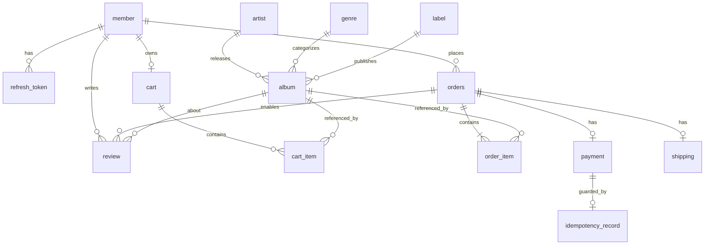

# ERD: Groove (LP 전문 이커머스 백엔드)

| 항목 | 값 |
|---|---|
| 버전 | 1.4 |
| 최초 작성일 | 2026-05-05 |
| 최종 수정일 | 2026-05-12 |
| 변경 내용 | v1.4 (W7-6 / V12 반영): `orders` 에 배송지 스냅샷 6개 컬럼 추가(주문 생성 요청 `shipping` 블록 → 결제 완료 후 `shipping` 행으로 복사). `shipping` 의 `idx_shipping_status` 를 (status, created_at) 복합으로 자동 진행 스케줄러와 함께 선반영(원래 [W10] 표기). v1.3 (W5 완료 반영): 카탈로그 4개 테이블(genre/label/artist/album)의 실제 마이그레이션(V4/V5/V6) 반영 — 컬럼 길이·NULL·CHECK·FK·기본 인덱스 명시. §4.6 album 비즈니스 룰의 `AlbumStatus.canTransitionTo()` 는 W5-3 범위 미포함이며 W6+ 도입 예정으로 표기 정정. v1.2 (W4 완료 반영): refresh_token 실제 스키마(`issued_at` 추가, `revoked` 컬럼 제거 — `revoked_at NULL` 단일 컬럼으로 표현), `idx_refresh_member_revoked` 복합 인덱스 명시, Flyway 마이그레이션 파일 계획을 실제 분리 적용 방식(V1 placeholder + V2 member + V3 refresh_token)으로 정정. v1.1 (Issue #2): W5/W10 인덱스 단계 표기 확정, [DB]/[APP] 비즈니스 룰 위치 명시, orders 상태 추적 컬럼 추가. |
| DB | MySQL 8 (InnoDB, utf8mb4) |
| 마이그레이션 도구 | Flyway |
| 관련 문서 | PRD.md, ARCHITECTURE.md |

---

## 1. 명명 / 설계 규칙

| 항목 | 규칙 |
|---|---|
| 테이블명 | snake_case, 단수형. `order`는 예약어이므로 `orders` 사용 |
| 컬럼명 | snake_case |
| PK | `id BIGINT AUTO_INCREMENT PRIMARY KEY` |
| FK | `{대상_테이블_단수}_id` (예: `member_id`, `album_id`) |
| 감사 컬럼 | 모든 테이블에 `created_at DATETIME(6)`, `updated_at DATETIME(6)` |
| 금액 타입 | `BIGINT` (원 단위 정수) |
| Enum 저장 | `VARCHAR(30)` (`EnumType.STRING`) |
| 시간 타입 | `DATETIME(6)` (마이크로초 정밀도) |
| 문자셋 | utf8mb4 / utf8mb4_unicode_ci |
| Soft delete | 기본 미사용. `member`에만 `deleted_at` 적용 |

### 인덱스 표기 규칙
- PK 외 인덱스는 `idx_{table}_{column[_column...]}` 형식
- 유니크 제약: `uk_{table}_{column[_column...]}`
- **[W5]** — 초기 마이그레이션(W4~W7)에서 적용되는 필수 인덱스
- **[W10]** — W9 슬로우 쿼리 측정 후 W10 시연 시 추가하는 성능 인덱스

### 비즈니스 룰 위치 표기
- **[DB]** — DB 제약(CHECK, UNIQUE, FK ON DELETE RESTRICT)으로 강제
- **[APP]** — 애플리케이션 서비스/도메인 레이어에서 검증
- **[DB+APP]** — DB 제약 + 애플리케이션 이중 검증

---

## 2. 테이블 목록 (전체 13개)

| 도메인 | 테이블 | 용도 |
|---|---|---|
| 회원 | `member` | 회원 정보 |
| 인증 | `refresh_token` | Refresh Token 저장 |
| 카탈로그 | `artist` | 아티스트 |
| 카탈로그 | `genre` | 장르 |
| 카탈로그 | `label` | 음반 레이블 |
| 카탈로그 | `album` | LP 상품 |
| 장바구니 | `cart` | 회원별 장바구니 (회원당 1개) |
| 장바구니 | `cart_item` | 장바구니 항목 |
| 주문 | `orders` | 주문 |
| 주문 | `order_item` | 주문 항목 |
| 결제 | `payment` | 결제 트랜잭션 |
| 결제 | `idempotency_record` | 멱등성 키 저장 |
| 배송 | `shipping` | 배송 정보 |
| 리뷰 | `review` | 상품 리뷰 |

---

## 3. ER 다이어그램



---

## 4. 테이블 상세

### 4.1 `member` — 회원

| 컬럼 | 타입 | 제약 | 설명 |
|---|---|---|---|
| id | BIGINT | PK, AUTO_INCREMENT | |
| email | VARCHAR(255) | NOT NULL, UNIQUE | 로그인 식별자 |
| password | VARCHAR(255) | NOT NULL | BCrypt 해시 (cost 12) |
| name | VARCHAR(50) | NOT NULL | |
| phone | VARCHAR(20) | NOT NULL | 숫자만 10~11자 [APP] |
| role | VARCHAR(20) | NOT NULL, DEFAULT 'USER' | enum: USER, ADMIN |
| email_verified | BOOLEAN | NOT NULL, DEFAULT FALSE | 이메일 인증 여부 |
| deleted_at | DATETIME(6) | NULL | 탈퇴 시각 (soft delete) |
| created_at | DATETIME(6) | NOT NULL | |
| updated_at | DATETIME(6) | NOT NULL | |

**인덱스**

[W5]:
- `uk_member_email` UNIQUE (email)
- `idx_member_role` (role) — ADMIN 필터링용

[W10] 추가 후보 없음.

**비즈니스 룰**

| 규칙 | 위치 | 비고 |
|---|---|---|
| email 중복 불가 | [DB] | uk_member_email UNIQUE |
| 비밀번호 BCrypt 해시 저장 (cost 12) | [APP] | 평문 저장 금지, @Bean PasswordEncoder |
| 탈퇴는 soft delete만 허용 (물리 삭제 없음) | [APP] | deleted_at 설정 후 저장 |

---

### 4.2 `refresh_token` — 리프레시 토큰

| 컬럼 | 타입 | 제약 | 설명 |
|---|---|---|---|
| id | BIGINT | PK, AUTO_INCREMENT | |
| member_id | BIGINT | NOT NULL, FK → member.id | |
| token_hash | CHAR(64) | NOT NULL, UNIQUE | 토큰 평문이 아닌 SHA-256 hex 64자 |
| issued_at | DATETIME(6) | NOT NULL | 발급 시각 |
| expires_at | DATETIME(6) | NOT NULL | |
| revoked_at | DATETIME(6) | NULL | NULL = 활성, NOT NULL = 폐기됨 (별도 boolean 미사용) |
| replaced_by_token_id | BIGINT | NULL, FK → refresh_token.id ON DELETE SET NULL | Rotation 시 다음 토큰 ID (탈취 추적용 self-FK) |
| created_at | DATETIME(6) | NOT NULL | |
| updated_at | DATETIME(6) | NOT NULL | |

**인덱스**

[W5]:
- `uk_refresh_token_hash` UNIQUE (token_hash)
- `idx_refresh_member_revoked` (member_id, revoked_at) — 회원 활성 토큰 조회·일괄 폐기용 복합 인덱스

[W10] 추가 후보 없음.

**비즈니스 룰**

| 규칙 | 위치 | 비고 |
|---|---|---|
| 토큰 해시 중복 불가 | [DB] | uk_refresh_token_hash UNIQUE |
| 토큰 평문 미저장 | [APP] | SHA-256 해시 후 저장 |
| Rotation: 기존 토큰 폐기 + 신규 발급 | [APP] | revoked_at 기록 + replaced_by_token_id 연결 |
| 탈취 감지: 폐기된 토큰 재사용 시 member 전체 토큰 무효화 | [APP] | RefreshTokenAdmin 이 별도 트랜잭션으로 일괄 revoke |

**비고**
- 토큰 평문은 절대 저장하지 않음. `TokenHasher.sha256Hex` 로 hex 64자 해시 후 저장.
- Rotation: 사용 시 기존 행에 `revoked_at` 기록 + 새 행 발급 + `replaced_by_token_id` 연결. atomic CAS(`revokeIfActive`) 0 행이면 동시 회전 race 패배로 단순 거부.
- 탈취 감지: `revoked_at IS NOT NULL` 토큰이 다시 사용되면 해당 member 의 모든 활성 토큰 무효화. 단, JWT 만료가 먼저 검출되면 전체 무효화 없이 단순 만료 응답.
- self-FK `replaced_by_token_id` 의 `ON DELETE SET NULL`: 회전 체인 행 삭제 시 후방 참조가 자동 해제되어 운영/테스트 batch 삭제 순서 의존성을 제거.

---

### 4.3 `artist` — 아티스트

| 컬럼 | 타입 | 제약 | 설명 |
|---|---|---|---|
| id | BIGINT | PK, AUTO_INCREMENT | |
| name | VARCHAR(200) | NOT NULL | |
| description | TEXT | NULL | |
| created_at | DATETIME(6) | NOT NULL | |
| updated_at | DATETIME(6) | NOT NULL | |

**인덱스**

[W5]:
- (PK만 — 동명이인 존재 가능, UNIQUE 미적용)

[W10] (슬로우 쿼리 측정 후 추가):
- `idx_artist_name` (name) — 아티스트 이름 검색용

**비즈니스 룰**

| 규칙 | 위치 | 비고 |
|---|---|---|
| 동명이인 허용 (name UNIQUE 미적용) | — | 동일 아티스트명 중복 등록 가능, ID로 식별 |

---

### 4.4 `genre` — 장르

| 컬럼 | 타입 | 제약 | 설명 |
|---|---|---|---|
| id | BIGINT | PK, AUTO_INCREMENT | |
| name | VARCHAR(50) | NOT NULL, UNIQUE | Rock, Jazz, K-Pop, ... |
| created_at | DATETIME(6) | NOT NULL | |
| updated_at | DATETIME(6) | NOT NULL | |

**인덱스**

[W5]:
- `uk_genre_name` UNIQUE (name)

[W10] 추가 후보 없음.

**비즈니스 룰**

| 규칙 | 위치 | 비고 |
|---|---|---|
| 장르명 중복 불가 | [DB] | uk_genre_name UNIQUE |

---

### 4.5 `label` — 음반 레이블

| 컬럼 | 타입 | 제약 | 설명 |
|---|---|---|---|
| id | BIGINT | PK, AUTO_INCREMENT | |
| name | VARCHAR(100) | NOT NULL, UNIQUE | |
| created_at | DATETIME(6) | NOT NULL | |
| updated_at | DATETIME(6) | NOT NULL | |

**인덱스**

[W5]:
- `uk_label_name` UNIQUE (name)

[W10] 추가 후보 없음.

**비즈니스 룰**

| 규칙 | 위치 | 비고 |
|---|---|---|
| 레이블명 중복 불가 | [DB] | uk_label_name UNIQUE |

---

### 4.6 `album` — LP 상품 ★

가장 핵심 테이블. 검색·시연이 모두 이 테이블 기준으로 이루어진다.

| 컬럼 | 타입 | 제약 | 설명 |
|---|---|---|---|
| id | BIGINT | PK, AUTO_INCREMENT | |
| title | VARCHAR(300) | NOT NULL | 앨범명 |
| artist_id | BIGINT | NOT NULL, FK → artist.id | |
| genre_id | BIGINT | NOT NULL, FK → genre.id | |
| label_id | BIGINT | NULL, FK → label.id | 레이블 정보 없는 경우 NULL |
| release_year | SMALLINT | NOT NULL | |
| format | VARCHAR(30) | NOT NULL | enum: LP_12, LP_DOUBLE, EP, SINGLE_7 |
| price | BIGINT | NOT NULL, CHECK (price >= 0) | 원 단위 |
| stock | INT | NOT NULL, DEFAULT 0, CHECK (stock >= 0) | |
| status | VARCHAR(20) | NOT NULL, DEFAULT 'SELLING' | enum: SELLING, SOLD_OUT, HIDDEN |
| is_limited | BOOLEAN | NOT NULL, DEFAULT FALSE | 한정반 여부 — 시연 시나리오 핵심 플래그 |
| cover_image_url | VARCHAR(500) | NULL | |
| description | TEXT | NULL | |
| created_at | DATETIME(6) | NOT NULL | |
| updated_at | DATETIME(6) | NOT NULL | |

**인덱스**

[W5] (FK 기본 인덱스만):
- `idx_album_artist` (artist_id)
- `idx_album_genre` (genre_id)
- `idx_album_label` (label_id)

[W10] (슬로우 쿼리 측정 후 추가):
- `idx_album_search` (genre_id, status, price) — 카테고리 + 상태 + 가격 필터
- `idx_album_year` (release_year) — 연도 필터
- `idx_album_title` (title) — 키워드 검색 (FULLTEXT 검토 후보)
- `idx_album_limited` (is_limited, status) — 한정반 목록

**비즈니스 룰**

| 규칙 | 위치 | 비고 |
|---|---|---|
| stock ≥ 0 | [DB+APP] | CHECK CONSTRAINT (MySQL 8) + @Min(0) |
| price ≥ 0 | [DB+APP] | CHECK CONSTRAINT (MySQL 8) + @Min(0) |
| status 전이 (SELLING→SOLD_OUT 등) | [APP] | W5-3 범위 미포함 — `AlbumStatus.canTransitionTo()` 는 W6+ 주문/재고 흐름 도입 시 추가 예정. 현재는 단순 set 만 허용 |
| FK 참조 무결성 (artist, genre, label) | [DB] | ON DELETE RESTRICT |
| Public 검색에서 status=HIDDEN 거부 | [APP] | `AlbumQueryController.rejectHiddenStatusFromPublic()` — 단건 GET 은 status 무관 허용 |
| 정렬 키 화이트리스트 | [APP] | `id, createdAt, price, releaseYear` 만 허용 — 인덱스 없는 컬럼 정렬로 인한 부하 차단. `salesCount` 는 W7 주문 도메인 도입 후 활성화 |

---

### 4.7 `cart` — 장바구니 (회원당 1개)

| 컬럼 | 타입 | 제약 | 설명 |
|---|---|---|---|
| id | BIGINT | PK, AUTO_INCREMENT | |
| member_id | BIGINT | NOT NULL, UNIQUE, FK → member.id | 회원당 1개 |
| created_at | DATETIME(6) | NOT NULL | |
| updated_at | DATETIME(6) | NOT NULL | |

**인덱스**

[W5]:
- `uk_cart_member` UNIQUE (member_id)

[W10] 추가 후보 없음.

**비즈니스 룰**

| 규칙 | 위치 | 비고 |
|---|---|---|
| 회원당 장바구니 1개 | [DB] | uk_cart_member UNIQUE |

---

### 4.8 `cart_item` — 장바구니 항목

| 컬럼 | 타입 | 제약 | 설명 |
|---|---|---|---|
| id | BIGINT | PK, AUTO_INCREMENT | |
| cart_id | BIGINT | NOT NULL, FK → cart.id | |
| album_id | BIGINT | NOT NULL, FK → album.id | |
| quantity | INT | NOT NULL, CHECK (quantity > 0) | |
| created_at | DATETIME(6) | NOT NULL | |
| updated_at | DATETIME(6) | NOT NULL | |

**인덱스**

[W5]:
- `uk_cart_item_cart_album` UNIQUE (cart_id, album_id) — 동일 상품 중복 방지
- `idx_cart_item_album` (album_id) — FK 기본

[W10] 추가 후보 없음.

**비즈니스 룰**

| 규칙 | 위치 | 비고 |
|---|---|---|
| 동일 상품 중복 추가 불가 | [DB] | uk_cart_item_cart_album UNIQUE |
| quantity > 0 | [DB+APP] | CHECK CONSTRAINT (MySQL 8) + @Min(1) |

---

### 4.9 `orders` — 주문 ★

게스트 주문은 `member_id` NULL + `guest_*` 컬럼으로 처리한다.

| 컬럼 | 타입 | 제약 | 설명 |
|---|---|---|---|
| id | BIGINT | PK, AUTO_INCREMENT | |
| order_number | VARCHAR(30) | NOT NULL, UNIQUE | 외부 노출용 (예: ORD-20260505-XXXX) |
| member_id | BIGINT | NULL, FK → member.id | NULL이면 게스트 주문 |
| guest_email | VARCHAR(255) | NULL | 게스트 주문 시 사용 |
| guest_phone | VARCHAR(20) | NULL | 게스트 주문 시 사용 |
| status | VARCHAR(30) | NOT NULL | enum: PENDING, PAID, PREPARING, SHIPPED, DELIVERED, COMPLETED, CANCELLED, PAYMENT_FAILED |
| total_amount | BIGINT | NOT NULL, CHECK (total_amount >= 0) | 원 단위 |
| paid_at | DATETIME(6) | NULL | 결제 완료 시각 (status=PAID 전환 시 기록) |
| cancelled_at | DATETIME(6) | NULL | 취소 시각 (status=CANCELLED 전환 시 기록) |
| cancelled_reason | VARCHAR(500) | NULL | 취소 사유 |
| recipient_name | VARCHAR(50) | NOT NULL (DEFAULT '') | 배송지 스냅샷 — 수령인 이름 (W12) |
| recipient_phone | VARCHAR(20) | NOT NULL (DEFAULT '') | 배송지 스냅샷 — 수령인 연락처 (W12) |
| address | VARCHAR(500) | NOT NULL (DEFAULT '') | 배송지 스냅샷 — 기본 주소 (W12) |
| address_detail | VARCHAR(200) | NULL | 배송지 스냅샷 — 상세 주소 (W12) |
| zip_code | VARCHAR(20) | NOT NULL (DEFAULT '') | 배송지 스냅샷 — 우편번호 (W12) |
| safe_packaging_requested | BOOLEAN | NOT NULL, DEFAULT FALSE | 배송지 스냅샷 — LP 안전 포장 요청 (W12) |
| created_at | DATETIME(6) | NOT NULL | |
| updated_at | DATETIME(6) | NOT NULL | |

> 배송지 6개 컬럼은 주문 생성 요청(API.md §3.5 `shipping` 블록)을 주문 시점 스냅샷으로 저장한다 — `album_title_snapshot` 과 같은 이유. 결제 완료 후 `shipping` 행(§4.13)으로 그대로 복사된다. 기존 행 호환을 위해 NOT NULL 컬럼에는 빈 문자열/FALSE 기본값을 둔다(신규 주문은 항상 도메인 검증 통과 값).

**인덱스**

[W5]:
- `uk_orders_number` UNIQUE (order_number)
- `idx_orders_guest_email` (guest_email) — 게스트 주문 조회

[W10] (슬로우 쿼리 측정 후 추가):
- `idx_orders_member_created` (member_id, created_at) — 회원 주문 조회용
- `idx_orders_status_created` (status, created_at) — 관리자 상태별 조회

**비즈니스 룰**

| 규칙 | 위치 | 비고 |
|---|---|---|
| order_number 중복 불가 | [DB] | uk_orders_number UNIQUE |
| member_id XOR guest_email (둘 중 하나만 NOT NULL) | [APP] | OrderService 생성 시점 검증 |
| status 전이 (PENDING→PAID→PREPARING→…) | [APP] | OrderStatus.canTransitionTo() |
| total_amount ≥ 0 | [DB+APP] | CHECK CONSTRAINT (MySQL 8) + @Min(0) |
| paid_at: PAID 전환 시 기록, CANCELLED 시 cancelled_at/reason 기록 | [APP] | 상태 전환 메서드 내부에서 처리 |
| 배송지 6개 컬럼 = 주문 시점 스냅샷 (요청 `shipping` 블록 복사) | [APP] | OrderShippingInfo 불변식 + Order 정적 팩토리에서 캡처 |

---

### 4.10 `order_item` — 주문 항목

| 컬럼 | 타입 | 제약 | 설명 |
|---|---|---|---|
| id | BIGINT | PK, AUTO_INCREMENT | |
| order_id | BIGINT | NOT NULL, FK → orders.id | |
| album_id | BIGINT | NOT NULL, FK → album.id | |
| quantity | INT | NOT NULL, CHECK (quantity > 0) | |
| unit_price | BIGINT | NOT NULL, CHECK (unit_price >= 0) | 주문 시점의 가격 (스냅샷) |
| album_title_snapshot | VARCHAR(300) | NOT NULL | 주문 시점의 앨범명 (이력 보존) |
| created_at | DATETIME(6) | NOT NULL | |
| updated_at | DATETIME(6) | NOT NULL | |

**인덱스**

[W5]:
- `idx_order_item_order` (order_id) — 주문 상세 조회용
- `idx_order_item_album` (album_id) — FK 기본

[W10] 추가 후보 없음.

**비즈니스 룰**

| 규칙 | 위치 | 비고 |
|---|---|---|
| quantity > 0 | [DB+APP] | CHECK CONSTRAINT (MySQL 8) + @Min(1) |
| unit_price ≥ 0 | [DB+APP] | CHECK CONSTRAINT (MySQL 8) + @Min(0) |
| 가격·앨범명 스냅샷 저장 | [APP] | 주문 시점 값 복사, 이후 album 수정과 무관 |

**비고**
- 가격·앨범명을 스냅샷으로 저장하는 이유: 주문 후 상품 정보가 변경되어도 주문 이력은 그대로 보존되어야 함.

---

### 4.11 `payment` — 결제

| 컬럼 | 타입 | 제약 | 설명 |
|---|---|---|---|
| id | BIGINT | PK, AUTO_INCREMENT | |
| order_id | BIGINT | NOT NULL, UNIQUE, FK → orders.id | 주문당 1결제 (재시도는 새 row가 아닌 상태 갱신) |
| amount | BIGINT | NOT NULL, CHECK (amount > 0) | 0원 결제 불가 — 게이트웨이 계약(PaymentRequest)·도메인(Payment.initiate)과 정합 |
| status | VARCHAR(20) | NOT NULL | enum: PENDING, PAID, FAILED, REFUNDED |
| method | VARCHAR(20) | NOT NULL | enum: CARD, BANK_TRANSFER, MOCK |
| pg_provider | VARCHAR(20) | NOT NULL, DEFAULT 'MOCK' | |
| pg_transaction_id | VARCHAR(100) | NULL | PG 측 거래 ID |
| paid_at | DATETIME(6) | NULL | 결제 완료 시각 |
| failure_reason | VARCHAR(500) | NULL | 실패 사유 |
| created_at | DATETIME(6) | NOT NULL | |
| updated_at | DATETIME(6) | NOT NULL | |

**인덱스**

[W5]:
- `uk_payment_order` UNIQUE (order_id)
- `idx_payment_pg_tx` (pg_transaction_id) — PG 웹훅 검증용

[W7-4] (폴링 스케줄러 도입과 함께 추가, V11):
- `idx_payment_status_created` (status, created_at) — 폴링 스케줄러용 (PENDING 결제 `created_at < cutoff` 조회)

**비즈니스 룰**

| 규칙 | 위치 | 비고 |
|---|---|---|
| 주문당 결제 1건 | [DB] | uk_payment_order UNIQUE |
| amount > 0 | [DB+APP] | CHECK CONSTRAINT (MySQL 8) + Payment.initiate / PaymentRequest |
| status 전이 (PENDING→PAID/FAILED, PAID→REFUNDED) | [APP] | PaymentStatus.canTransitionTo() |
| paid_at: PAID 전환 시 기록 | [APP] | status=PAID 전환 메서드 내부 처리 |
| 멱등성 키 이중 보호 | [DB+APP] | idempotency_record UNIQUE + Service 레이어 |

---

### 4.12 `idempotency_record` — 멱등성 키 저장

| 컬럼 | 타입 | 제약 | 설명 |
|---|---|---|---|
| id | BIGINT | PK, AUTO_INCREMENT | |
| idempotency_key | VARCHAR(100) | NOT NULL, UNIQUE | 클라이언트 발급 키 |
| endpoint | VARCHAR(200) | NOT NULL | 적용된 API 경로 |
| status | VARCHAR(20) | NOT NULL | enum: PROCESSING, COMPLETED, FAILED |
| response_status_code | INT | NULL | 응답 HTTP 상태 |
| response_body | TEXT | NULL | 응답 바디 스냅샷 (JSON 직렬화) |
| created_at | DATETIME(6) | NOT NULL | |
| updated_at | DATETIME(6) | NOT NULL | |

**인덱스**

[W5]:
- `uk_idempotency_key` UNIQUE (idempotency_key)
- `idx_idempotency_created` (created_at) — 만료된 레코드 정리용 (TTL 스케줄러)

[W10] 추가 후보 없음.

**비즈니스 룰**

| 규칙 | 위치 | 비고 |
|---|---|---|
| 멱등성 키 중복 불가 | [DB] | uk_idempotency_key UNIQUE |
| TTL 24시간 만료 처리 | [APP] | 스케줄러 cron으로 expired 레코드 삭제 |
| 동시 요청 처리 | [DB+APP] | INSERT IGNORE + 조회 패턴 또는 SELECT FOR UPDATE |

**비고**
- TTL: 24시간 (스케줄러로 정리). v1은 cron 기반.
- 동시 요청에 안전하게 처리하기 위해 INSERT IGNORE + 조회 패턴 또는 SELECT FOR UPDATE 사용.

---

### 4.13 `shipping` — 배송

| 컬럼 | 타입 | 제약 | 설명 |
|---|---|---|---|
| id | BIGINT | PK, AUTO_INCREMENT | |
| order_id | BIGINT | NOT NULL, UNIQUE, FK → orders.id | |
| tracking_number | VARCHAR(50) | NOT NULL, UNIQUE | UUID 기반 발급 |
| status | VARCHAR(20) | NOT NULL, DEFAULT 'PREPARING' | enum: PREPARING, SHIPPED, DELIVERED |
| recipient_name | VARCHAR(50) | NOT NULL | |
| recipient_phone | VARCHAR(20) | NOT NULL | |
| address | VARCHAR(500) | NOT NULL | |
| address_detail | VARCHAR(200) | NULL | |
| zip_code | VARCHAR(20) | NOT NULL | |
| safe_packaging_requested | BOOLEAN | NOT NULL, DEFAULT FALSE | LP 안전 포장 요청 |
| shipped_at | DATETIME(6) | NULL | |
| delivered_at | DATETIME(6) | NULL | |
| created_at | DATETIME(6) | NOT NULL | |
| updated_at | DATETIME(6) | NOT NULL | |

**인덱스**

[W5]:
- `uk_shipping_order` UNIQUE (order_id)
- `uk_shipping_tracking` UNIQUE (tracking_number)

[W12] (자동 진행 스케줄러와 함께 선반영 — 원래 [W10] 표기였으나 V11 `idx_payment_status_created` 와 같은 결정):
- `idx_shipping_status` (status, created_at) — PREPARING→SHIPPED 스캔(created_at 필터)을 받치고, SHIPPED→DELIVERED 스캔은 status 프리픽스로 좁힌다

**비즈니스 룰**

| 규칙 | 위치 | 비고 |
|---|---|---|
| 주문당 배송 1건 | [DB] | uk_shipping_order UNIQUE |
| tracking_number 중복 불가 | [DB] | uk_shipping_tracking UNIQUE |
| status 전이 (PREPARING→SHIPPED→DELIVERED) | [APP] | ShippingStatus.canTransitionTo() |
| shipped_at: SHIPPED 전환 시 기록 | [APP] | status=SHIPPED 전환 메서드 내부 처리 |
| delivered_at: DELIVERED 전환 시 기록 | [APP] | status=DELIVERED 전환 메서드 내부 처리 |

---

### 4.14 `review` — 상품 리뷰

| 컬럼 | 타입 | 제약 | 설명 |
|---|---|---|---|
| id | BIGINT | PK, AUTO_INCREMENT | |
| member_id | BIGINT | NOT NULL, FK → member.id | |
| album_id | BIGINT | NOT NULL, FK → album.id | |
| order_id | BIGINT | NOT NULL, FK → orders.id | 어떤 주문에 대한 리뷰인지 |
| rating | TINYINT | NOT NULL, CHECK (rating BETWEEN 1 AND 5) | 1~5 |
| content | TEXT | NULL | |
| created_at | DATETIME(6) | NOT NULL | |
| updated_at | DATETIME(6) | NOT NULL | |

**인덱스**

[W5]:
- `uk_review_order_album` UNIQUE (order_id, album_id) — 1주문-1상품-1리뷰
- `idx_review_member` (member_id) — 내 리뷰 목록용

[W10] (슬로우 쿼리 측정 후 추가):
- `idx_review_album_created` (album_id, created_at) — 상품별 리뷰 조회

**비즈니스 룰**

| 규칙 | 위치 | 비고 |
|---|---|---|
| 1주문-1상품-1리뷰 | [DB+APP] | uk_review_order_album UNIQUE + ReviewService.existsByOrderIdAndAlbumId 선검증 |
| rating 1~5 | [DB+APP] | ck_review_rating_range CHECK (MySQL 8) + @Min(1) @Max(5) + Review.write 재검증 |
| 배송 완료(DELIVERED 이상) 주문에만 리뷰 허용 | [APP] | ReviewService — orders.status ∈ {DELIVERED, COMPLETED} (glossary §2.10, API.md §3.8) |
| 본인 주문에만 리뷰 작성 / 본인 리뷰만 삭제 | [APP] | ReviewService — order.member_id / review.member_id == 인증 memberId |
| 리뷰 대상 album 이 주문에 포함 | [APP] | ReviewService — order.items 중 album 존재 |

---

## 5. 인덱스 전략 요약

### 5.1 W5 시점 (W10 시연 위해 의도적 최소 인덱스)

| 테이블 | 인덱스 |
|---|---|
| 모든 테이블 | PK + FK 자동 인덱스 |
| `member` | `uk_member_email`, `idx_member_role` |
| `refresh_token` | `uk_refresh_token_hash`, `idx_refresh_member_revoked` (member_id, revoked_at) |
| `album` | `idx_album_artist`, `idx_album_genre`, `idx_album_label` |
| `genre`, `label` | `uk_*_name` |
| `cart` | `uk_cart_member` |
| `cart_item` | `uk_cart_item_cart_album`, `idx_cart_item_album` |
| `orders` | `uk_orders_number`, `idx_orders_guest_email` |
| `order_item` | `idx_order_item_order`, `idx_order_item_album` |
| `payment` | `uk_payment_order`, `idx_payment_pg_tx`, `idx_payment_status_created` (V11) |
| `idempotency_record` | `uk_idempotency_key`, `idx_idempotency_created` |
| `shipping` | `uk_shipping_order`, `uk_shipping_tracking`, `idx_shipping_status` (status, created_at) (V12) |
| `review` | `uk_review_order_album`, `idx_review_member` |

검색·정렬·필터 인덱스는 **의도적으로 누락** → W9 측정 시 슬로우 쿼리 재현 → W10 시연용 인덱스 추가.

### 5.2 W10 시점 추가 인덱스 (시연 산출물)

```sql
-- 아티스트 이름 검색
CREATE INDEX idx_artist_name ON artist(name);

-- 검색 시연용 복합 인덱스
CREATE INDEX idx_album_search ON album(genre_id, status, price);
CREATE INDEX idx_album_year ON album(release_year);
CREATE INDEX idx_album_title ON album(title);
CREATE INDEX idx_album_limited ON album(is_limited, status);

-- 회원 주문 조회 최적화
CREATE INDEX idx_orders_member_created ON orders(member_id, created_at);
CREATE INDEX idx_orders_status_created ON orders(status, created_at);

-- (idx_payment_status_created 는 W7-4 / V11, idx_shipping_status 는 W7-6 / V12 에서 이미 추가)

-- 상품별 리뷰
CREATE INDEX idx_review_album_created ON review(album_id, created_at);
```

각 인덱스 추가 전후로 `EXPLAIN` 결과·응답시간을 비교하여 README에 기록.

---

## 6. enum 타입 정의

코드에서 정의되는 enum (DB는 VARCHAR로 저장):

| enum | 값 |
|---|---|
| `MemberRole` | USER, ADMIN |
| `AlbumStatus` | SELLING, SOLD_OUT, HIDDEN |
| `AlbumFormat` | LP_12, LP_DOUBLE, EP, SINGLE_7 |
| `OrderStatus` | PENDING, PAID, PREPARING, SHIPPED, DELIVERED, COMPLETED, CANCELLED, PAYMENT_FAILED |
| `PaymentStatus` | PENDING, PAID, FAILED, REFUNDED |
| `PaymentMethod` | CARD, BANK_TRANSFER, MOCK |
| `ShippingStatus` | PREPARING, SHIPPED, DELIVERED |
| `IdempotencyStatus` | PROCESSING, COMPLETED, FAILED |

---

## 7. Flyway 마이그레이션 파일 계획

| 버전 | 파일명 | 내용 | 적용 시점 | 상태 |
|---|---|---|---|---|
| V1 | `V1__init.sql` | 스키마 초기화 placeholder (`SELECT 1`) | W3 | 적용 완료 |
| V2 | `V2__member.sql` | member | W4 | 적용 완료 |
| V3 | `V3__refresh_token.sql` | refresh_token (self-FK 포함) | W4 | 적용 완료 |
| V4 | `V4__init_catalog.sql` | genre, label | W5-1 | 적용 완료 |
| V5 | `V5__init_artist.sql` | artist (UNIQUE 미적용) | W5-2 | 적용 완료 |
| V6+ | (W5-3 별도 이슈) | album | W5-3 | 예정 |
| V7+ | `V*__init_cart_orders.sql` | cart, cart_item, orders, order_item | W6 | 예정 |
| V8+ | `V*__init_payment_shipping.sql` | payment, idempotency_record, shipping | W7 | 예정 |
| V13 | `V13__init_review.sql` | review | W7 | 적용 완료 |
| V10+ | `V*__add_search_indexes.sql` | W10 시연용 검색·정렬 인덱스 | W10 | 예정 |

> V4 범위 정정: 당초 1회로 묶어 계획했던 artist+genre+label+album 마이그레이션을 W5-1(genre/label) → W5-2(artist) → W5-3(album) 순서대로 분리 도입한다 (#31 에서 결정). W5-2(#32) 까지 적용 완료. W5-3(album) 의 정확한 버전 번호는 후속 이슈가 확정한다.

마이그레이션 원칙:
- 운영 DB가 없는 단계여도 Flyway로 관리. 시연 때 "초기 스키마부터 인덱스 추가까지의 진화 과정"이 그대로 남음
- 한 번 적용된 마이그레이션은 수정 금지 (필요 시 새 버전 추가)

---

## 8. 향후(v2) 확장 포인트

ERD에 미리 자리만 잡아두는 후보:

| 추가 테이블 | 용도 | 시점 |
|---|---|---|
| `album_used_listing` | 중고 LP 등록 (컨디션 등급별) | v2 |
| `album_pre_order` | 발매 전 예약 주문 | v2 |
| `coupon`, `coupon_issue` | 쿠폰 관리 | v2 |
| `point_history` | 적립금 이력 | v2 |
| `wish_list` | 위시리스트 | v2 |

v1 단계에서는 만들지 않고, ERD 문서에 후보로만 기재.

---

## 9. 정합성 / 무결성 정책

### 9.1 DB 레벨
- 모든 FK는 `ON DELETE RESTRICT` (참조되는 데이터 삭제 방지)
- UNIQUE 제약은 비즈니스 핵심 룰에 모두 적용 (중복 방지)
- `CHECK` 제약 (MySQL 8 지원): `quantity > 0`, `rating BETWEEN 1 AND 5`, `stock >= 0`, `price >= 0`, `total_amount >= 0`, `unit_price >= 0`, `amount >= 0`

### 9.2 애플리케이션 레벨
- 상태 전이는 enum 메서드(`canTransitionTo`)로 검증 (DB 트리거 미사용)
- 게스트 주문 검증(member_id XOR guest_email)은 Service 레이어
- 멱등성 키 처리는 Service 레이어 + DB UNIQUE 제약 이중
- 리뷰는 배송 완료(DELIVERED 이상) 상태의 본인 회원 주문에만 허용 (ReviewService)

### 9.3 트랜잭션 경계
- 주문 생성: 재고 차감 + Order 저장 + OrderItem 저장 → 단일 트랜잭션
- 결제 완료 처리: Payment 갱신 + Order 상태 변경(paid_at 기록) → 단일 트랜잭션
- 배송 생성은 `OrderPaidEvent` AFTER_COMMIT으로 별도 트랜잭션 (실패 시 README에 트레이드오프 명시)

---

## 10. 시드 데이터 계획 (W8)

| 테이블 | 건수 | 비고 |
|---|---|---|
| genre | 10~15개 | Rock, Jazz, Classical, K-Pop, Hip-Hop, Electronic, Indie, R&B, Folk, Country, Soul, Reggae, World, Metal, Pop |
| label | 50~100개 | 가상 레이블 또는 실제 레이블명 |
| artist | 1,000~3,000명 | |
| album | 50,000~100,000건 | 검색 시연 임팩트 확보 |
| 한정반 | 30~50건 | `is_limited=true` |
| 단일 재고(stock=1) | 5~10건 | 보너스 시연용 |
| member (테스트) | 50~100명 | 부하 테스트 시 다중 사용자 시뮬레이션 |
| ADMIN 계정 | 1개 | seed에 포함 |

시드 스크립트는 `db/seed/` 디렉토리에 SQL 또는 JSON 형식으로 보존, Spring CLI 또는 별도 임포트 도구로 실행.
